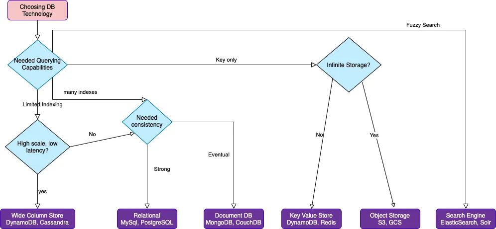

# Compare DBs and Choose the best that fits your usecase

| Data model | When would you use it? | What is it optimized for? | Related database engines or services |
|-------------------|---------------------------------|---------------------------------|-------------------|
Relational | Use when you're migrating or modernizing an on- premises relational workload, or if your workload has less predictable query patterns | Optimized for structured data that is stored in tables, rows, and columns. Relational databases support complex queries through joins. | Amazon Aurora & Amazon RDS
Key-value | Use for workloads such as session stores or shopping carts. Key-value databases can scale to large amounts of data and extremely high throughput of requests, while servicing millions of simultaneous users through distributed processing and storage. | Optimized to provide a serverless, NoSQL, fully managed database with single-digit millisecond performance at any scale. | Amazon DynamoDB
In-memory | Use Amazon ElastiCache when you need a caching layer to improve read performance. Use Amazon MemoryDB when you need full data persistence, but still need sub-millisecond read latencies. | Optimized to support microsecond reads and sub-millisecond writes. MemoryDB supports microsecond reads and single-digit millisecond writes. ElastiCache is an ephemeral cache, while MemoryDB is an in-memory database. | Amazon ElastiCache & Amazon MemoryDB
Document | Use when you want to store JSON-like documents with rich querying abilities across the fields of the documents. | Optimized for storing semi-structured data as documents with multilayered attributes. | Amazon DocumentDB (with MongoDB compatibility)
Wide-column	| Use when you need to migrate your on-premises Cassandra workloads, or when you need to process data at high speeds for applications that require single-digit millisecond latency. | Optimized for workloads that require heavy reads/writes and high throughput, coupled with low latency and linear scalability. | Amazon Keyspaces (for Apache Cassandra)
Graph | Use when you have to model complex networks of objects, such as social networks, fraud detection, and recommendation engine use cases. | Optimized for traversing and evaluating large numbers of relationships, and identifying patterns with minimal latency. | Amazon Neptune
Time series	| Use when you have a large amount of time series data, potentially from a number of sources, such as Internet of Things (IoT) data, application metrics, and asset tracking. | Optimized for storing and querying data that is associated with timestamps and trend lines. | Amazon Timestream

A summary (not including ALL the latest DBs services fromvided by AWS) below:

# DynamoDB

See https://medium.com/@christopheradamson253/deep-dive-into-aws-dynamodb-a-nosql-database-for-high-performance-applications-4c80d1410533

DynamoDB scales by increasing the number of partitions. Each item is stored on a partition. Each partition can handle:
- up to 3000 Read Capacity Units
- up to 1000 Write Capacity Units
- up to 10 GB of data
As soon as any of these limits is reached, the partition is split into two and the items are redistributed. 
This happens until there is sufficient capacity available to meet demand. You don't control how that happens, it's a managed service that does this in the background. The number of partitions only ever grows.