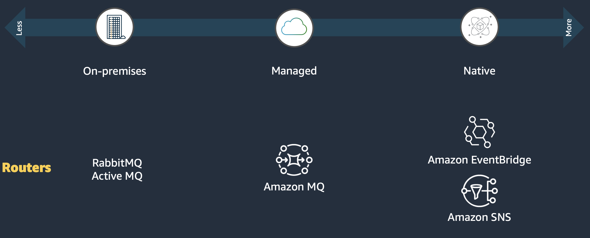
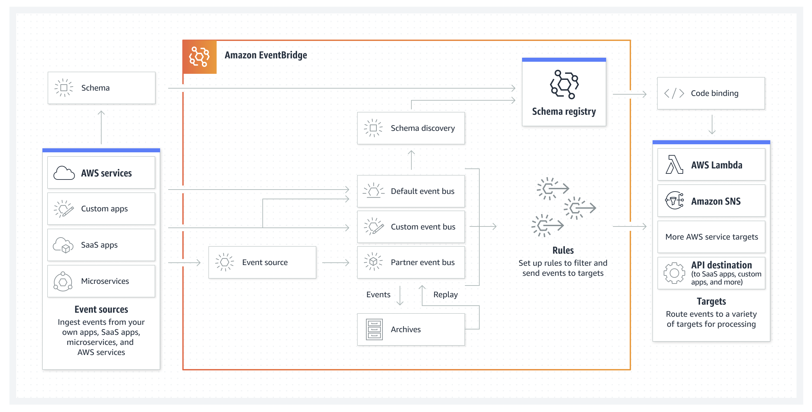
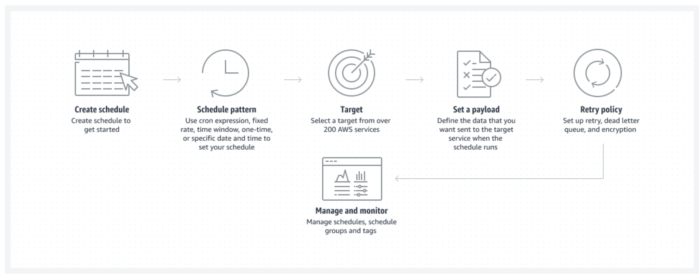
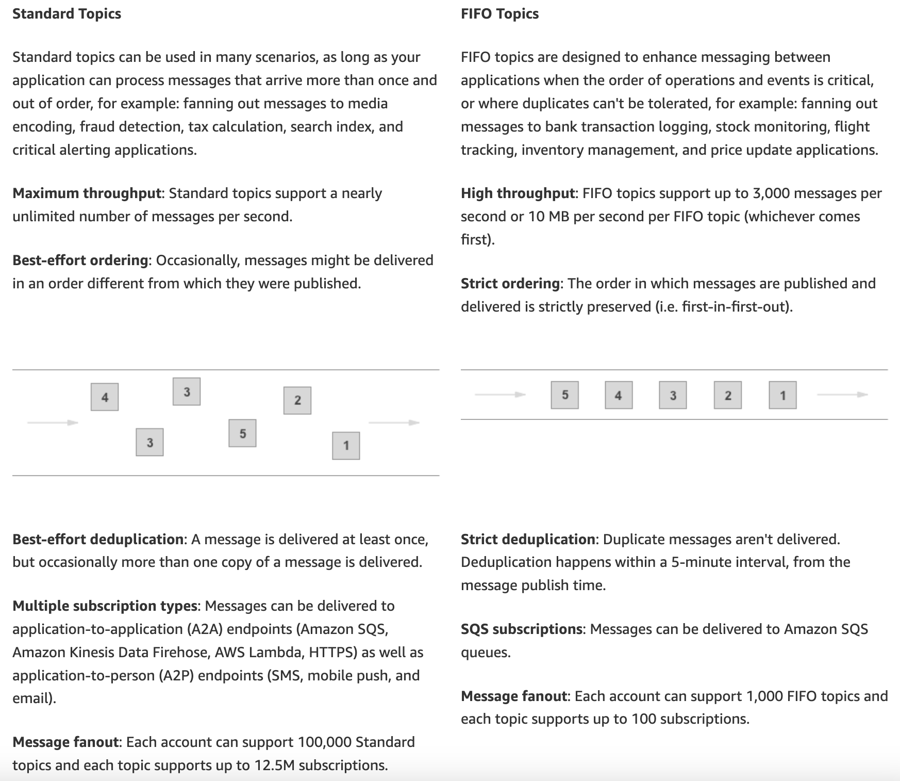
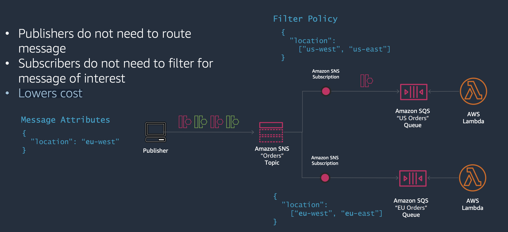
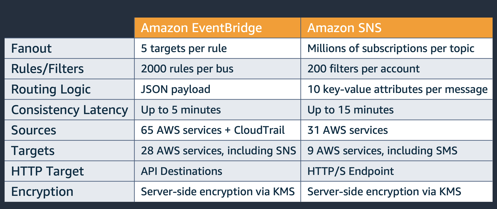
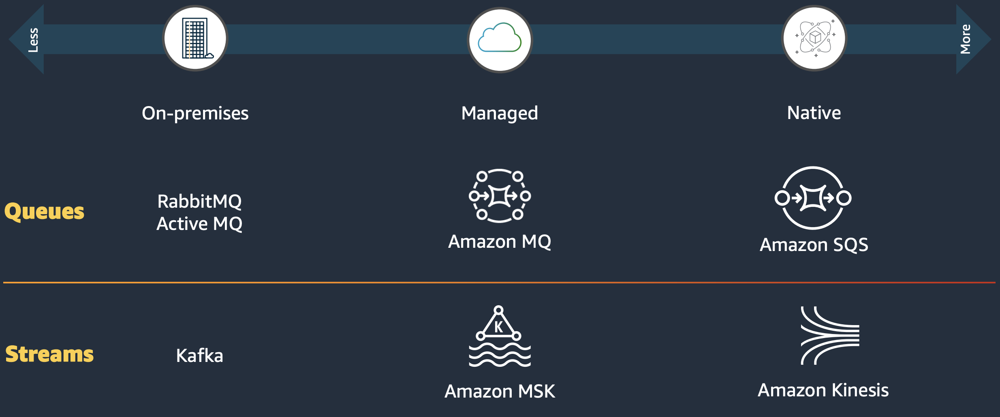

# AWS

# Compare DBs and Choose the best that fits your usecase

| Data model | When would you use it? | What is it optimized for? | Related database engines or services |
|-------------------|---------------------------------|---------------------------------|-------------------|
Relational | Use when you're migrating or modernizing an on- premises relational workload, or if your workload has less predictable query patterns | Optimized for structured data that is stored in tables, rows, and columns. Relational databases support complex queries through joins. | Amazon Aurora & Amazon RDS
Key-value | Use for workloads such as session stores or shopping carts. Key-value databases can scale to large amounts of data and extremely high throughput of requests, while servicing millions of simultaneous users through distributed processing and storage. | Optimized to provide a serverless, NoSQL, fully managed database with single-digit millisecond performance at any scale. | Amazon DynamoDB
In-memory | Use Amazon ElastiCache when you need a caching layer to improve read performance. Use Amazon MemoryDB when you need full data persistence, but still need sub-millisecond read latencies. | Optimized to support microsecond reads and sub-millisecond writes. MemoryDB supports microsecond reads and single-digit millisecond writes. ElastiCache is an ephemeral cache, while MemoryDB is an in-memory database. | Amazon ElastiCache & Amazon MemoryDB
Document | Use when you want to store JSON-like documents with rich querying abilities across the fields of the documents. | Optimized for storing semi-structured data as documents with multilayered attributes. | Amazon DocumentDB (with MongoDB compatibility)
Wide-column	| Use when you need to migrate your on-premises Cassandra workloads, or when you need to process data at high speeds for applications that require single-digit millisecond latency. | Optimized for workloads that require heavy reads/writes and high throughput, coupled with low latency and linear scalability. | Amazon Keyspaces (for Apache Cassandra)
Graph | Use when you have to model complex networks of objects, such as social networks, fraud detection, and recommendation engine use cases. | Optimized for traversing and evaluating large numbers of relationships, and identifying patterns with minimal latency. | Amazon Neptune
Time series	| Use when you have a large amount of time series data, potentially from a number of sources, such as Internet of Things (IoT) data, application metrics, and asset tracking. | Optimized for storing and querying data that is associated with timestamps and trend lines. | Amazon Timestream

A summary (not including ALL the latest DBs services fromvided by AWS) below:

# DynamoDB

See https://medium.com/@christopheradamson253/deep-dive-into-aws-dynamodb-a-nosql-database-for-high-performance-applications-4c80d1410533

DynamoDB scales by increasing the number of partitions. Each item is stored on a partition. Each partition can handle:
- up to 3000 Read Capacity Units
- up to 1000 Write Capacity Units
- up to 10 GB of data
As soon as any of these limits is reached, the partition is split into two and the items are redistributed. 
This happens until there is sufficient capacity available to meet demand. You don't control how that happens, it's a managed service that does this in the background. The number of partitions only ever grows.

# Compare Event-Driven Architecture Solutions on AWS

Resources about generic concepts for Event-Driven Architectures:
https://d1.awsstatic.com/SMB/building-event-driven-architectures-aws-guide-2022-smb-build-websites-and-apps-resource.pdf 

For comparison of AWS services:
https://pages.awscloud.com/rs/112-TZM-766/images/APMWQ3D3S2%20Building%20event-driven%20architectures%20on%20AWS.pdf

## Events Routers

| AWS Technology | Native or Based on Open Source? | What is it? | Cool Capabilities | Use Cases |
| ------------------| ---------------| ------------------| ------------------------- | ------------------------- |
| Amazon MQ | Based on Open Source | It is a Managed message broker service. It is based on Apache ActiveMQ or RabbitMQ. | Reduces operational work, because it is a managed system. It provides provisioning, setup, and maintenance of ActiveMQ/RabbitMQ open-source message brokers. | - Migration from on-prem solutions to AWS cloud solutions, i.e support application replatforming to AWS. - Integrate applications and use Lambda functions to poll the Amazon MQ message broker.
| EventBride | AWS Native | Simple, flexible, fully managed, pay as you go, event bus service that makes it easy to ingest and process (and pull/push) data from AWS services, your own applications, and SaaS applications. It makes it easier to build event-driven applications at scale. | - Create point-to-point integrations between event producers and consumers without needing to write custom code or managing and provisioning servers. - 28 Targets including Lambda, SQS, SNS, REST API, Kinesis, Step Functions, and API Destinations. - Schema Registry stores a collection of schemas and allows developers to SEARCH/FIND/TRACK different schemas that are used for applications. - EventBridge Scheduler: is a serverless scheduler that makes it easy to create, execute, and manage scheduled tasks at scale (i.e. delay actions). You can reliably schedule millions of events and tasks that can invoke over 200 AWS services as a target. EventBridge Scheduler provides a central location to manage all of your scheduled jobs across the cloud. - Event Replay: you can reprocess past events back to an event bus or a specific EventBridge rule. Event Replay on Amazon EventBridge is suitable for: 1) Developers looking to add more durability to their applications. 2) Developers needing to store their data for compliance reasons. 3)Developers wanting to test and debug their events using events from their archive to simulate real world usage | - Routing of events without a single line of code, based on some properties in the events itself. -Remove friction of having to write point-to-point integrations between services. Take actions on SaaS messages, run workflows, apply intelligence, audit and analyze, and synchronize data.
| Amazon Simple Notification Service (SNS) | AWS Native | SNS is a publish-subscribe messaging service that facilitates the broadcasting of messages (events) to multiple subscribers (components) simultaneously. It uses an event PUSH approach. | - Highly reliable delivery of any volume of messages to any number of recipients across multiple protocols. - Allows to deliver notifications/events to both other applications/services and people (throught SMS texts, push notifications, and email). - Increase message durability with archiving, replay, delivery retries, and dead-letter queues (DLQs). - You can choose between delivering messages in a strictly ordered first in-first out (FIFO) manner or deliverying messages in a standard queues (i.e applications that can process messages that arrive more than once and out of order). | - Send events to applications where you have to maintain accuracy and consistency across independent applications (i.e. when you need a FIFO topic because the order of operations and events is critical, or where duplicates can't be tolerated).  - Fan out (spread) events across AWS categories, such as analytics, compute, containers, databases, IoT, machine learning (ML), security, and storage. - Send worldwide SMS (240 countries) and Push Notifications to customers. |

### EventBridge

Summary of Features: https://aws.amazon.com/eventbridge/features/

Amazon EventBridge is a serverless event bus that helps you receive, filter, transform, route, and deliver events. How does it work? See below:

Amazon EventBridge allows to apply a schedule to your events and program actions to apply - i.e. not in real time bu after X time that the even is injected in EventBridge. It basically allows to manage all your scheduled jobs from one central location with an easy to use list view.

### SNS 

Summary of Features: https://aws.amazon.com/sns/features/

SNS supports two types of Topics.

**Message Publishing and Batch of events:**
Message publishing enables you to send data, in the form of messages, to an Amazon SNS topic which delivers the messages asynchronously to the applications that are subscribed to the topic. **You can publish from 1 to 10 messages per API request**. You may choose to **batch messages together to reduce your Amazon SNS costs**. Each message can contain up to 256KB of data. If your use case requires larger data payloads, the Amazon SNS Extended Client Library stores the payload (up to 2GB) in an Amazon S3 bucket and publishes the reference of the stored Amazon S3 object to the Amazon SNS topic.

**Message Filtering:**
Message filtering empowers your subscriber applications to create filter policies, so that these applications can receive only the notifications that they are interested in, as opposed to receiving every message published to the topic. This enables you to simplify your architecture, offloading (ridurre/alleviare) the message filtering logic from subscriber applications as well as the message routing logic from publisher applications.

You can use SNS similarly to EventBridge.

**Message Fanout and Delivery:**
When you publish a message to a topic, Amazon SNS replicates and delivers the message to applications subscribed to the topic. Amazon SNS supports application-to-application (A2A) and application-to-person (A2P) message delivery. Amazon SNS also supports cross-region and cross-account message delivery, in addition to message delivery status logging with Amazon CloudWatch.

**Message Durability:**
Amazon SNS uses a number of mechanisms that work together to provide message durability. To start, published messages are **stored across multiple, geographically-separated servers and data centers**. If a subscribed endpoint isn't available, Amazon SNS executes a message delivery retry policy. To **preserve any messages that aren't delivered** before the delivery retry policy ends, you can use a dead-letter queue powered by Amazon SQS. Moreover, you can subscribe Amazon Kinesis Data Firehose delivery streams to Amazon SNS topics, which allows messages to be sent to durable endpoints such as Amazon S3 buckets or Amazon Redshift tables.

### EventBridge vs SNS

# Events Stores

| AWS Technology | Native or Based on Open Source? | What is it? | Cool Capabilities | Use Cases |
| ------------------| ---------------| ------------------| ------------------------- | ------------------------- |
| Amazon MQ | Based on Open Source | n/a | n/a | n/a |
| Amazon MSK | Based on Open Source | n/a | n/a | n/a |
| Amazon SQS | AWS Native | SQS is a fully managed message queuing service that enables decoupled communication between components in an event-driven system. It allows components to asynchronously send and receive messages (events) through queues, ensuring reliable and scalable message delivery. It uses an event PULL approach | - Decouple microservices and process event-driven applications. - Nearly infinite scalability without pre-provisioning capacity. - Allows to use both FIFI and standard queus. It also allows to maintain the message order in case of on-purpose duplicated events. | - Separate frontend from backend systems, such as in a banking application. Customers immediately get a response, but the bill payments are processed in the background. - Buulding High scalable architectures or servless architectures. |
| Amazon Kinesis | AWS Native | Enables you to ingest, buffer, and process streaming data in real-time, so you can derive insights in seconds or minutes instead of hours or days. It handle any amount of streaming data from thousands of sources and process it with low latencies. It is similar to Kafka. | - The amount of data that can be injested and processed is HUGE. - Automatic provisioning and scaling. No server to mantain and scale is done "on-demand" by AWS (Don't worry about over-provisioning). | - Create Real-Time Applications: Build apps for application monitoring, fraud detection, and live leaderboards. - Analyze IoT device data and then use the data to programmatically send real-time alerts and respond when a sensor exceeds certain operating thresholds. - Build video analytics applications: Securely stream video from camera-equipped devices. Use streams for video playback, security monitoring, face detection, ML, and other analytics. - Stream log and event data: ingest and collect terabytes of data per day from application and service logs, clickstream data, sensor data, and in-app user events to power live dashboards, generate metrics, and deliver data into data lakes. |

### Amazon SQS

Summary of Features: https://aws.amazon.com/sqs/features/

### Amazon Kinesis

There are "two types" of Amazon Kinesis:
- Amazon Kinesis Data Streams: https://aws.amazon.com/kinesis/data-streams/features/?nc=sn&loc=2
- Amazon Kinesis Video Streams: https://aws.amazon.com/kinesis/video-streams/features/?nc=sn&loc=2

