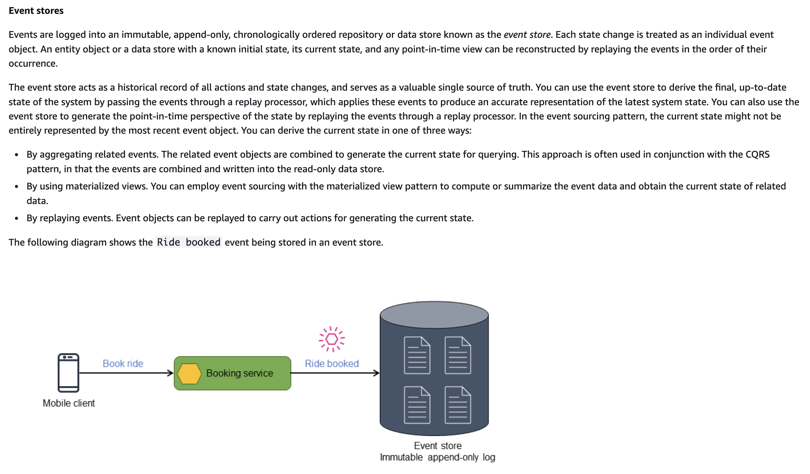
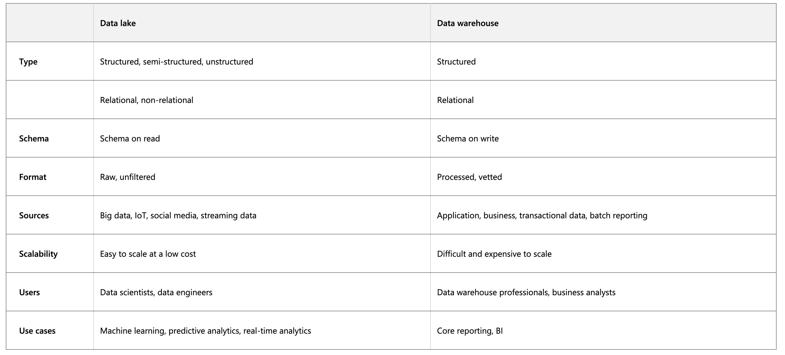

# System Design

Hey, welcome to the course. I hope this course provides a great learning experience.

_This course is also available on my [website](https://karanpratapsingh.com/courses/system-design) and as an ebook on [leanpub](https://leanpub.com/systemdesign). Please leave a ⭐ as motivation if this was helpful!_

# Table of contents

- **Getting Started**

  - [What is system design?](#what-is-system-design)

- **Chapter I**

  - [IP](#ip)
  - [OSI Model](#osi-model)
  - [TCP and UDP](#tcp-and-udp)
  - [Domain Name System (DNS)](#domain-name-system-dns)
  - [Load Balancing](#load-balancing)
  - [Clustering](#clustering)
  - [Caching](#caching)
  - [Content Delivery Network (CDN)](#content-delivery-network-cdn)
  - [Proxy](#proxy)
  - [Availability](#availability)
  - [Scalability](#scalability)
  - [Fault Tolerance vs Resiliancy](#fault-tolerance-vs-resiliancy)
  - [Latency vs Throughput vs Bandwidth](#latency-vs-throughput-vs-bandwidth)
  - [Storage](#storage)
  - [Global vs Local Service](#global-vs-local-service)

- **Chapter II**

  - [Databases and DBMS](#databases-and-dbms)
  - [SQL databases](#sql-databases)
  - [NoSQL databases](#nosql-databases)
  - [SQL vs NoSQL databases](#sql-vs-nosql-databases)
  - [Database Replication](#database-replication)
  - [Indexes](#indexes)
  - [Normalization and Denormalization](#normalization-and-denormalization)
  - [ACID and BASE consistency models](#acid-and-base-consistency-models)
  - [CAP theorem](#cap-theorem)
  - [PACELC Theorem](#pacelc-theorem)
  - [Concurrency Control in DBs](#concurrency-control-in-dbs)
      - [Transactions: on one single DB](#transactions-on-one-single-db)
      - [Distributed Transactions](#distributed-transactions)
          - [Two Phase Commit](#two-phase-commit)
          - [Three Phase Commit](#three-phase-commit)
          - [SAGA](#sagas)
      - [DB Locking Mechanisms](#db-locking-mechanisms)
      - [Isolation](#isolation)
          - [Dirty Reads](#dirty-reads)
          - [Unrepeatable Reads](#unrepeatable-reads)
          - [Phantom Reads](#phantom-reads)
          - [Resolution of concurrency issues using isolation levels and locking mechanisms](#resolution-of-concurrency-issues-using-isolation-levels-and-locking-mechanisms)
      - [Concurrency Control Mechanisms: Pessimistic Concurrency Control vs Optimistic Concurrency Control](#concurrency-control-mechanisms-pessimistic-concurrency-control-vs-optimistic-concurrency-control)
          - [Optimistic Concurrency Control](#optimistic-concurrency-control-occ)
          - [Pessimistic Concurrency Control](#pessimistic-concurrency-control-pcc)
  - [Data Partitioning](#data-partitioning)
      - [Sharding](#sharding)
      - [Consistent Hashing](#consistent-hashing)
  - [Database Federation](#database-federation)
  - [How to Choose the Right Database?](#how-to-choose-the-right-database)

- **Chapter III**

  - [N-tier architecture](#n-tier-architecture)
  - [Message Brokers](#message-brokers)
  - [Messaging Pattern: Message Queues](#messaging-pattern-message-queues-aka-point-to-point)
  - [Messaging Pattern: Publish-Subscribe](#messaging-pattern-publish-subscribe)
  - [Enterprise Service Bus (ESB)](#enterprise-service-bus-esb)
  - [Monoliths and Microservices](#monoliths-and-microservices)
  - [Event-Driven Architecture (EDA)](#event-driven-architecture-eda)
  - [Messaging Pattern: Event Bus](#messaging-pattern-event-bus)
  - [Messaging Pattern: Event Streaming](#messaging-pattern-event-streaming)
  - [Messaging Pattern: Event Sourcing](#messaging-pattern-event-sourcing)
  - [Messaging Pattern: Choreography and Orchestration](#messaging-pattern-choreography-and-orchestration)
  - [Messaging Pattern: Event Sourcing](#event-sourcing)
  - [Messaging Pattern: Command and Query Responsibility Segregation (CQRS)](#command-and-query-responsibility-segregation-cqrs)
  - [API Gateway](#api-gateway)
  - [REST, GraphQL, gRPC](#rest-graphql-grpc)
  - [Long polling, WebSockets, Server-Sent Events (SSE)](#long-polling-websockets-server-sent-events-sse)

- **Chapter IV**

  - [ETL vs ELT](#etl-extract-transform-load-vs-elt-extract-load-transform)
  - [Geohashing and Quadtrees](#geohashing-and-quadtrees)
  - [Circuit breaker](#circuit-breaker)
  - [Rate Limiting](#rate-limiting)
  - [Service Discovery](#service-discovery)
  - [SLA, SLO, SLI](#sla-slo-sli)
  - [Disaster recovery](#disaster-recovery)
  - [Virtual Machines (VMs) and Containers](#virtual-machines-vms-and-containers)
  - [Scaling Applications: Give Me Numbers](#scaling-applications-give-me-numbers)
  - [Response Time: give me numbers](#response-time-give-me-numbers)
  - [API Pagination and Filtering](#api-pagination-and-filtering)
  - [Design Patterns](#design-patterns)

- **Chapter V**

  - [OAuth 2.0 and OpenID Connect (OIDC)](#oauth-20-and-openid-connect-oidc)
  - [Single Sign-On (SSO)](#single-sign-on-sso)
  - [SSL, TLS, mTLS](#ssl-tls-mtls)
  - [Hashing Algorithms]()

- **Appendix**

  - [Next Steps](#next-steps)
  - [References](#references)

# What is system design?

Before we start this course, let's talk about what even is system design.

System design is the process of defining the architecture, interfaces, and data
for a system that satisfies specific requirements. System design meets the needs
of your business or organization through coherent and efficient systems. It requires
a systematic approach to building and engineering systems. A good system design requires
us to think about everything, from infrastructure all the way down to the data and how it's stored.

## Why is System Design so important?

System design helps us define a solution that meets the business requirements. It is
one of the earliest decisions we can make when building a system. Often it is essential
to think from a high level as these decisions are very difficult to correct later. It
also makes it easier to reason about and manage architectural changes as the system evolves.


# IP

An IP address is a unique address that identifies a device on the internet or a local network. IP stands for _"Internet Protocol"_, which is the set of rules governing the format of data sent via the internet or local network.

In essence, IP addresses are the identifier that allows information to be sent between devices on a network. They contain location information and make devices accessible for communication. The internet needs a way to differentiate between different computers, routers, and websites. IP addresses provide a way of doing so and form an essential part of how the internet works.

## Versions

Now, let's learn about the different versions of IP addresses:

### IPv4

The original Internet Protocol is IPv4 which uses a 32-bit numeric dot-decimal notation that only allows for around 4 billion IP addresses. Initially, it was more than enough but as internet adoption grew, we needed something better.

_Example: `102.22.192.181`_

### IPv6

IPv6 is a new protocol that was introduced in 1998. Deployment commenced in the mid-2000s and since the internet users have grown exponentially, it is still ongoing.

This new protocol uses 128-bit alphanumeric hexadecimal notation. This means that IPv6 can provide about ~340e+36 IP addresses. That's more than enough to meet the growing demand for years to come.

_Example: `2001:0db8:85a3:0000:0000:8a2e:0370:7334`_

## Types

Let's discuss types of IP addresses:

### Public

A public IP address is an address where one primary address is associated with your whole network. In this type of IP address, each of the connected devices has the same IP address.

_Example: IP address provided to your router by the ISP._

### Private

A private IP address is a unique IP number assigned to every device that connects to your internet network, which includes devices like computers, tablets, and smartphones, which are used in your household.

_Example: IP addresses generated by your home router for your devices._

### Static

A static IP address does not change and is one that was manually created, as opposed to having been assigned. These addresses are usually more expensive but are more reliable.

_Example: They are usually used for important things like reliable geo-location services, remote access, server hosting, etc._

### Dynamic

A dynamic IP address changes from time to time and is not always the same. It has been assigned by a [Dynamic Host Configuration Protocol (DHCP)](https://en.wikipedia.org/wiki/Dynamic_Host_Configuration_Protocol) server. Dynamic IP addresses are the most common type of internet protocol address. They are cheaper to deploy and allow us to reuse IP addresses within a network as needed.

_Example: They are more commonly used for consumer equipment and personal use._

# OSI Model

The OSI Model is a logical and conceptual model that defines network communication used by systems open to interconnection and communication with other systems. The Open System Interconnection (OSI Model) also defines a logical network and effectively describes computer packet transfer by using various layers of protocols.

The OSI Model can be seen as a universal language for computer networking. It's based on the concept of splitting up a communication system into seven abstract layers, each one stacked upon the last.

## Why does the OSI model matter?

The Open System Interconnection (OSI) model has defined the common terminology used in networking discussions and documentation. This allows us to take a very complex communications process apart and evaluate its components.

While this model is not directly implemented in the TCP/IP networks that are most common today, it can still help us do so much more, such as:

- Make troubleshooting easier and help identify threats across the entire stack.
- Encourage hardware manufacturers to create networking products that can communicate with each other over the network.
- Essential for developing a security-first mindset.
- Separate a complex function into simpler components.

## Layers

The seven abstraction layers of the OSI model can be defined as follows, from top to bottom:


### Application

This is the only layer that directly interacts with data from the user. Software applications like web browsers and email clients rely on the application layer to initiate communication. But it should be made clear that client software applications are not part of the application layer, rather the application layer is responsible for the protocols and data manipulation that the software relies on to present meaningful data to the user. Application layer protocols include HTTP as well as SMTP.

### Presentation

The presentation layer is also called the Translation layer. The data from the application layer is extracted here and manipulated as per the required format to transmit over the network. The functions of the presentation layer are translation, encryption/decryption, and compression.

### Session

This is the layer responsible for opening and closing communication between the two devices. The time between when the communication is opened and closed is known as the session. The session layer ensures that the session stays open long enough to transfer all the data being exchanged, and then promptly closes the session in order to avoid wasting resources. The session layer also synchronizes data transfer with checkpoints.

### Transport

The transport layer (also known as layer 4) is responsible for end-to-end communication between the two devices. This includes taking data from the session layer and breaking it up into chunks called segments before sending it to the Network layer (layer 3). It is also responsible for reassembling the segments on the receiving device into data the session layer can consume.

### Network

The network layer is responsible for facilitating data transfer between two different networks. The network layer breaks up segments from the transport layer into smaller units, called packets, on the sender's device, and reassembles these packets on the receiving device. The network layer also finds the best physical path for the data to reach its destination this is known as routing. If the two devices communicating are on the same network, then the network layer is unnecessary.

### Data Link

The data link layer is very similar to the network layer, except the data link layer facilitates data transfer between two devices on the same network. The data link layer takes packets from the network layer and breaks them into smaller pieces called frames.

### Physical

This layer includes the physical equipment involved in the data transfer, such as the cables and switches. This is also the layer where the data gets converted into a bit stream, which is a string of 1s and 0s. The physical layer of both devices must also agree on a signal convention so that the 1s can be distinguished from the 0s on both devices.

# TCP and UDP

## TCP

Transmission Control Protocol (TCP) is connection-oriented, meaning once a connection has been established, data can be transmitted in both directions. TCP has built-in systems to check for errors and to guarantee data will be delivered in the order it was sent, making it the perfect protocol for transferring information like still images, data files, and web pages.


But while TCP is instinctively reliable, its feedback mechanisms also result in a larger overhead, translating to greater use of the available bandwidth on the network.

## UDP

User Datagram Protocol (UDP) is a simpler, connectionless internet protocol in which error-checking and recovery services are not required. With UDP, there is no overhead for opening a connection, maintaining a connection, or terminating a connection. Data is continuously sent to the recipient, whether or not they receive it.


It is largely preferred for real-time communications like broadcast or multicast network transmission. We should use UDP over TCP when we need the lowest latency and late data is worse than the loss of data.

## TCP vs UDP

TCP is a connection-oriented protocol, whereas UDP is a connectionless protocol. A key difference between TCP and UDP is speed, as TCP is comparatively slower than UDP. Overall, UDP is a much faster, simpler, and more efficient protocol, however, retransmission of lost data packets is only possible with TCP.

TCP provides ordered delivery of data from user to server (and vice versa), whereas UDP is not dedicated to end-to-end communications, nor does it check the readiness of the receiver.

| Feature             | TCP                                         | UDP                                |
| ------------------- | ------------------------------------------- | ---------------------------------- |
| Connection          | Requires an established connection          | Connectionless protocol            |
| Guaranteed delivery | Can guarantee delivery of data              | Cannot guarantee delivery of data  |
| Re-transmission     | Re-transmission of lost packets is possible | No re-transmission of lost packets |
| Speed               | Slower than UDP                             | Faster than TCP                    |
| Broadcasting        | Does not support broadcasting               | Supports broadcasting              |
| Use cases           | HTTPS, HTTP, SMTP, POP, FTP, etc            | Video streaming, DNS, VoIP, etc    |

# Domain Name System (DNS)

Earlier we learned about IP addresses that enable every machine to connect with other machines. But as we know humans are more comfortable with names than numbers. It's easier to remember a name like `google.com` than something like `122.250.192.232`.

This brings us to Domain Name System (DNS) which is a hierarchical and decentralized naming system used for translating human-readable domain names to IP addresses.


## How DNS works


The process of DNS resolution involves converting a hostname (such as www.example.com) into a computer-friendly IP address (such as 192.168.1.1). An IP address is given to each device on the Internet, and that address is necessary to find the appropriate Internet device - like a street address is used to find a particular home.

DNS lookup (also said DNS resolution) involves the following eight steps:

1. A user types `example.com` into a web browser and the query travels into the Internet and is received by a DNS recursive resolver.
2. The resolver then queries a DNS root nameserver (.).
3. The root server then responds to the resolver with the address of a Top Level Domain (TLD) DNS server (such as .com or .net), which stores the information for its domains. When searching for example.com, our request is pointed toward the `.com` TLD.
4. The resolver then makes a request to the `.com` TLD.
5. The TLD server then responds with the IP address of the domain’s nameserver, `example.com`.
6. Lastly, the recursive resolver sends a query to the domain’s nameserver.
7. The IP address for `example.com` is then returned to the resolver from the nameserver.
8. The DNS resolver then responds to the web browser with the IP address of the domain requested initially.

Once the IP address has been resolved, the client should be able to request content from the resolved IP address. For example, the resolved IP may return a webpage to be rendered in the browser.

## Server types

Now, let's look at the four key groups of servers that make up the DNS infrastructure.

### DNS Resolver

A DNS resolver (also known as a DNS recursor) is the first stop in a DNS query. The recursive resolver acts as a middleman between a client and a DNS nameserver. The DNS recursor is a server designed to receive queries from client machines through applications such as web browsers.

After receiving a DNS query from a web client (the browser), a DNS resolver will either respond with cached data, or send a request to a root nameserver, followed by another request to a TLD nameserver, and then one last request to an authoritative nameserver. After receiving a response from the authoritative nameserver containing the requested IP address, the recursive resolver then sends a response to the client.

### DNS root nameserver

A root server accepts a recursive resolver's query which includes a domain name, and the root nameserver responds by directing the recursive resolver to a TLD nameserver, based on the extension of that domain (`.com`, `.net`, `.org`, etc.). The root nameservers are overseen by a nonprofit called the [Internet Corporation for Assigned Names and Numbers (ICANN)](https://www.icann.org).

There are 13 DNS root nameservers known to every recursive resolver. Note that while there are 13 root nameservers, that doesn't mean that there are only 13 machines in the root nameserver system. There are 13 types of root nameservers, but there are multiple copies of each one all over the world, which use [Anycast routing](https://en.wikipedia.org/wiki/Anycast) to provide speedy responses.

### TLD nameserver

A TLD nameserver maintains information for all the domain names that share a common domain extension, such as `.com`, `.net`, or whatever comes after the last dot in a URL.

Management of TLD nameservers is handled by the [Internet Assigned Numbers Authority (IANA)](https://www.iana.org), which is a branch of [ICANN](https://www.icann.org). The IANA breaks up the TLD servers into two main groups:

- **Generic top-level domains**: These are domains like `.com`, `.org`, `.net`, `.edu`, and `.gov`.
- **Country code top-level domains**: These include any domains that are specific to a country or state. Examples include `.uk`, `.us`, `.ru`, and `.jp`.

### Authoritative DNS server

The authoritative nameserver is usually the resolver's last step in the journey for an IP address. The authoritative nameserver contains information specific to the domain name it serves (e.g. [google.com](http://google.com)) and it can provide a recursive resolver with the IP address of that server found in the DNS A record, or if the domain has a CNAME record (alias) it will provide the recursive resolver with an alias domain, at which point the recursive resolver will have to perform a whole new DNS lookup to procure a record from an authoritative nameserver (often an A record containing an IP address). If it cannot find the domain, returns the NXDOMAIN message.

It’s worth mentioning that in instances where the query is for a subdomain such as `foo.example.com` or `blog.cloudflare.com`, an additional  Authoritative DNS server will be added to the sequence after the first authoritative nameserver, which is responsible for storing the subdomain’s `CNAME` record.


## Query Types

There are three types of queries in a DNS system:

### Recursive

In a recursive query, a DNS client requires that a DNS server (typically a DNS recursive resolver) will respond to the client with either the requested resource record or an error message if the resolver can't find the record.

### Iterative

In an iterative query, a DNS client provides a hostname, and the DNS Resolver returns the best answer it can. If the DNS resolver has the relevant DNS records in its cache, it returns them. If not, it refers the DNS client to the Root Server or another Authoritative Name Server that is nearest to the required DNS zone. The DNS client must then repeat the query directly against the DNS server it was referred.

### Non-recursive

A non-recursive query is a query in which the DNS Resolver already knows the answer. It either immediately returns a DNS record because it already stores it in a local cache, or queries a DNS Name Server which is authoritative for the record, meaning it definitely holds the correct IP for that hostname. In both cases, there is no need for additional rounds of queries (like in recursive or iterative queries). Rather, a response is immediately returned to the client.

## Record Types

DNS records (aka zone files) are instructions that live in authoritative DNS servers and provide information about a domain including what IP address is associated with that domain and how to handle requests for that domain.

These records consist of a series of text files written in what is known as _DNS syntax_. DNS syntax is just a string of characters used as commands that tell the DNS server what to do. All DNS records also have a _"TTL"_, which stands for time-to-live, and indicates how often a DNS server will refresh that record.

There are more record types but for now, let's look at some of the most commonly used ones:

- **A (Address record)**: This is the record that holds the IP address of a domain.
- **AAAA (IP Version 6 Address record)**: The record that contains the IPv6 address for a domain (as opposed to A records, which stores the IPv4 address).
- **CNAME (Canonical Name record)**: Forwards one domain or subdomain to another domain, does NOT provide an IP address.
- **MX (Mail exchanger record)**: Directs mail to an email server.
- **TXT (Text Record)**: This record lets an admin store text notes in the record. These records are often used for email security.
- **NS (Name Server records)**: Stores the name server for a DNS entry.
- **SOA (Start of Authority)**: Stores admin information about a domain.
- **SRV (Service Location record)**: Specifies a port for specific services.
- **PTR (Reverse-lookup Pointer record)**: Provides a domain name in reverse lookups.
- **CERT (Certificate record)**: Stores public key certificates.

## Subdomains

A subdomain is an additional part of our main domain name. It is commonly used to logically separate a website into sections. We can create multiple subdomains or child domains on the main domain.

For example, `blog.example.com` where `blog` is the subdomain, `example` is the primary domain and `.com` is the top-level domain (TLD). Similar examples can be `support.example.com` or `careers.example.com`.

## DNS Zones

A DNS zone is a distinct part of the domain namespace which is delegated to a legal entity like a person, organization, or company, who is responsible for maintaining the DNS zone. A DNS zone is also an administrative function, allowing for granular control of DNS components, such as authoritative name servers.

## DNS Caching

A DNS cache (sometimes called a DNS resolver cache) is a temporary database, maintained by a computer's operating system, that contains records of all the recent visits and attempted visits to websites and other internet domains. In other words, a DNS cache is just a memory of recent DNS lookups that our computer can quickly refer to when it's trying to figure out how to load a website.

The Domain Name System implements a time-to-live (TTL) on every DNS record. TTL specifies the number of seconds the record can be cached by a DNS client or server. When the record is stored in a cache, whatever TTL value came with it gets stored as well. The server continues to update the TTL of the record stored in the cache, counting down every second. When it hits zero, the record is deleted or purged from the cache. At that point, if a query for that record is received, the DNS server has to start the resolution process.

## Reverse DNS

A reverse DNS lookup is a DNS query for the domain name associated with a given IP address. This accomplishes the opposite of the more commonly used forward DNS lookup, in which the DNS system is queried to return an IP address. The process of reverse resolving an IP address uses PTR records. If the server does not have a PTR record, it cannot resolve a reverse lookup.

Reverse lookups are commonly used by email servers. Email servers check and see if an email message came from a valid server before bringing it onto their network. Many email servers will reject messages from any server that does not support reverse lookups or from a server that is highly unlikely to be legitimate.

_Note: Reverse DNS lookups are not universally adopted as they are not critical to the normal function of the internet._

## Examples

These are some widely used managed DNS solutions:

- [Route53](https://aws.amazon.com/route53)
- [Cloudflare DNS](https://www.cloudflare.com/dns)
- [Google Cloud DNS](https://cloud.google.com/dns)
- [Azure DNS](https://azure.microsoft.com/en-in/services/dns)
- [NS1](https://ns1.com/products/managed-dns)

# Load Balancing

Load balancing lets us distribute incoming network traffic across multiple resources ensuring high availability and reliability by sending requests only to resources that are online. This provides the flexibility to add or subtract resources as demand dictates.


For additional scalability and redundancy, we can try to load balance at each layer of our system:


## But why?

Modern high-traffic websites must serve hundreds of thousands, if not millions, of concurrent requests from users or clients. To cost-effectively scale to meet these high volumes, modern computing best practice generally requires adding more servers.

A load balancer can sit in front of the servers and route client requests across all servers capable of fulfilling those requests in a manner that maximizes speed and capacity utilization. This ensures that no single server is overworked, which could degrade performance. If a single server goes down, the load balancer redirects traffic to the remaining online servers. When a new server is added to the server group, the load balancer automatically starts sending requests to it.

## Workload distribution

This is the core functionality provided by a load balancer and has several common variations:

- **Host-based**: Distributes requests based on the requested hostname.
- **Path-based**: Using the entire URL to distribute requests as opposed to just the hostname.
- **Content-based**: Inspects the message content of a request. This allows distribution based on content such as the value of a parameter.

## Layers

Generally speaking, load balancers operate at one of the two levels:

### Network layer

This is the load balancer that works at the network's transport layer, also known as layer 4. This performs routing based on networking information such as IP addresses and is not able to perform content-based routing. These are often dedicated hardware devices that can operate at high speed.

### Application layer

This is the load balancer that operates at the application layer, also known as layer 7. Load balancers can read requests in their entirety and perform content-based routing. This allows the management of load based on a full understanding of traffic.

## Types

Let's look at different types of load balancers:

### Software

Software load balancers usually are easier to deploy than hardware versions. They also tend to be more cost-effective and flexible, and they are used in conjunction with software development environments. The software approach gives us the flexibility of configuring the load balancer to our environment's specific needs. The boost in flexibility may come at the cost of having to do more work to set up the load balancer. Compared to hardware versions, which offer more of a closed-box approach, software balancers give us more freedom to make changes and upgrades.

Software load balancers are widely used and are available either as installable solutions that require configuration and management or as a managed cloud service.

### Hardware

As the name implies, a hardware load balancer relies on physical, on-premises hardware to distribute application and network traffic. These devices can handle a large volume of traffic but often carry a hefty price tag and are fairly limited in terms of flexibility.

Hardware load balancers include proprietary firmware that requires maintenance and updates as new versions, and security patches are released.

### DNS

DNS load balancing is the practice of configuring a domain in the Domain Name System (DNS) such that client requests to the domain are distributed across a group of server machines.

Unfortunately, DNS load balancing has inherent problems limiting its reliability and efficiency. Most significantly, DNS does not check for server and network outages, or errors. It always returns the same set of IP addresses for a domain even if servers are down or inaccessible.

## Routing Algorithms

Now, let's discuss commonly used routing algorithms:

- **Round-robin**: Requests are distributed to application servers in rotation.
- **Weighted Round-robin**: Builds on the simple Round-robin technique to account for differing server characteristics such as compute and traffic handling capacity using weights that can be assigned via DNS records by the administrator.
- **Least Connections**: A new request is sent to the server with the fewest current connections to clients. The relative computing capacity of each server is factored into determining which one has the least connections.
- **Least Response Time**: Sends requests to the server selected by a formula that combines the fastest response time and fewest active connections.
- **Least Bandwidth**: This method measures traffic in megabits per second (Mbps), sending client requests to the server with the least Mbps of traffic.
- **Hashing**: Distributes requests based on a key we define, such as the client IP address or the request URL.

## Advantages

Load balancing also plays a key role in preventing downtime, other advantages of load balancing include the following:

- Scalability
- Redundancy
- Flexibility
- Efficiency

## Redundant load balancers

As you must've already guessed, the load balancer itself can be a single point of failure. To overcome this, a second or `N` number of load balancers can be used in a cluster mode.

And, if there's a failure detection and the _active_ load balancer fails, another _passive_ load balancer can take over which will make our system more fault-tolerant.


## Features

Here are some commonly desired features of load balancers:

- **Autoscaling**: Starting up and shutting down resources in response to demand conditions.
- **Sticky sessions**: The ability to assign the same user or device to the same resource in order to maintain the session state on the resource.
- **Healthchecks**: The ability to determine if a resource is down or performing poorly in order to remove the resource from the load balancing pool.
- **Persistence connections**: Allowing a server to open a persistent connection with a client such as a WebSocket.
- **Encryption**: Handling encrypted connections such as TLS and SSL.
- **Certificates**: Presenting certificates to a client and authentication of client certificates.
- **Compression**: Compression of responses.
- **Caching**: An application-layer load balancer may offer the ability to cache responses.
- **Logging**: Logging of request and response metadata can serve as an important audit trail or source for analytics data.
- **Request tracing**: Assigning each request a unique id for the purposes of logging, monitoring, and troubleshooting.
- **Redirects**: The ability to redirect an incoming request based on factors such as the requested path.
- **Fixed response**: Returning a static response for a request such as an error message.

## Examples

Following are some of the load balancing solutions commonly used in the industry:

- [Amazon Elastic Load Balancing](https://aws.amazon.com/elasticloadbalancing)
- [Azure Load Balancing](https://azure.microsoft.com/en-in/services/load-balancer)
- [GCP Load Balancing](https://cloud.google.com/load-balancing)
- [DigitalOcean Load Balancer](https://www.digitalocean.com/products/load-balancer)
- [Nginx](https://www.nginx.com)
- [HAProxy](http://www.haproxy.org)

# Clustering

At a high level, a computer cluster is a group of two or more computers, or nodes, that run in parallel to achieve a common goal. This allows workloads consisting of a high number of individual, parallelizable tasks to be distributed among the nodes in the cluster. As a result, these tasks can leverage the combined memory and processing power of each computer to increase overall performance.

To build a computer cluster, the individual nodes should be connected to a network to enable internode communication. The software can then be used to join the nodes together and form a cluster. It may have a shared storage device and/or local storage on each node.


Typically, at least one node is designated as the leader node and acts as the entry point to the cluster. The leader node may be responsible for delegating incoming work to the other nodes and, if necessary, aggregating the results and returning a response to the user.

Ideally, a cluster functions as if it were a single system. A user accessing the cluster should not need to know whether the system is a cluster or an individual machine. Furthermore, a cluster should be designed to minimize latency and prevent bottlenecks in node-to-node communication.

## Types

Computer clusters can generally be categorized into three types:

- Highly available or fail-over
- Load balancing
- High-performance computing

## Configurations

The two most commonly used high availability (HA) clustering configurations are active-active and active-passive.

### Active-Active


An active-active cluster is typically made up of at least two nodes, both actively running the same kind of service simultaneously. The main purpose of an active-active cluster is to achieve load balancing. A load balancer distributes workloads across all nodes to prevent any single node from getting overloaded. Because there are more nodes available to serve, there will also be an improvement in throughput and response times.

### Active-Passive


Like the active-active cluster configuration, an active-passive cluster also consists of at least two nodes. However, as the name _active-passive_ implies, not all nodes are going to be active. For example, in the case of two nodes, if the first node is already active, then the second node must be passive or on standby.

## Advantages

Four key advantages of cluster computing are as follows:

- High availability
- Scalability
- Performance
- Cost-effective

## Load balancing vs Clustering

Load balancing shares some common traits with clustering, but they are different processes. Clustering provides redundancy and boosts capacity and availability. Servers in a cluster are aware of each other and work together toward a common purpose. But with load balancing, servers are not aware of each other. Instead, they react to the requests they receive from the load balancer.

We can employ load balancing in conjunction with clustering, but it also is applicable in cases involving independent servers that share a common purpose such as to run a website, business application, web service, or some other IT resource.

## Challenges

The most obvious challenge clustering presents is the increased complexity of installation and maintenance. An operating system, the application, and its dependencies must each be installed and updated on every node.

This becomes even more complicated if the nodes in the cluster are not homogeneous. Resource utilization for each node must also be closely monitored, and logs should be aggregated to ensure that the software is behaving correctly.

Additionally, storage becomes more difficult to manage, a shared storage device must prevent nodes from overwriting one another and distributed data stores have to be kept in sync.

## Examples

Clustering is commonly used in the industry, and often many technologies offer some sort of clustering mode. For example:

- Containers (e.g. [Kubernetes](https://kubernetes.io), [Amazon ECS](https://aws.amazon.com/ecs))
- Databases (e.g. [Cassandra](https://cassandra.apache.org/_/index.html), [MongoDB](https://www.mongodb.com))
- Cache (e.g. [Redis](https://redis.io/docs/manual/scaling))

# Caching

_"There are only two hard things in Computer Science: cache invalidation and naming things." - Phil Karlton_


A cache's primary purpose is to increase data retrieval performance by reducing the need to access the underlying slower storage layer. Trading off capacity for speed, a cache typically stores a subset of data transiently, in contrast to databases whose data is usually complete and durable.

Caches take advantage of the locality of reference principle _"recently requested data is likely to be requested again"._

## Caching and Memory

Like a computer's memory, a cache is a compact, fast-performing memory that stores data in a hierarchy of levels, starting at level one, and progressing from there sequentially. They are labeled as L1, L2, L3, and so on. A cache also gets written if requested, such as when there has been an update and new content needs to be saved to the cache, replacing the older content that was saved.

No matter whether the cache is read or written, it's done one block at a time. Each block also has a tag that includes the location where the data was stored in the cache. When data is requested from the cache, a search occurs through the tags to find the specific content that's needed in level one (L1) of the memory. If the correct data isn't found, more searches are conducted in L2.

If the data isn't found there, searches are continued in L3, then L4, and so on until it has been found, then, it's read and loaded. If the data isn't found in the cache at all, then it's written into it for quick retrieval the next time.

## Cache hit and Cache miss

### Cache hit

A cache hit describes the situation where content is successfully served from the cache. The tags are searched in the memory rapidly, and when the data is found and read, it's considered a cache hit.

**Cold, Warm, and Hot Caches**

A cache hit can also be described as cold, warm, or hot. In each of these, the speed at which the data is read is described.

A hot cache is an instance where data was read from the memory at the _fastest_ possible rate. This happens when the data is retrieved from L1.

A cold cache is the _slowest_ possible rate for data to be read, though, it's still successful so it's still considered a cache hit. The data is just found lower in the memory hierarchy such as in L3, or lower.

A warm cache is used to describe data that's found in L2 or L3. It's not as fast as a hot cache, but it's still faster than a cold cache. Generally, calling a cache warm is used to express that it's slower and closer to a cold cache than a hot one.

### Cache miss

A cache miss refers to the instance when the memory is searched, and the data isn't found. When this happens, the content is transferred and written into the cache.

## Cache Invalidation

Cache invalidation is a process where the computer system declares the cache entries as invalid and removes or replaces them. If the data is modified, it should be invalidated in the cache, if not, this can cause inconsistent application behavior. There are three kinds of caching systems:

### Write-through cache


Data is written into the cache and the corresponding database simultaneously.

**Pro**: Fast retrieval, complete data consistency between cache and storage.

**Con**: Higher latency for write operations.

### Write-around cache


Where write directly goes to the database or permanent storage, bypassing the cache.

**Pro**: This may reduce latency.

**Con**: It increases cache misses because the cache system has to read the information from the database in case of a cache miss. As a result, this can lead to higher read latency in the case of applications that write and re-read the information quickly. Read happen from slower back-end storage and experiences higher latency.

### Write-back cache


Where the write is only done to the caching layer and the write is confirmed as soon as the write to the cache completes. The cache then asynchronously syncs this write to the database.

**Pro**: This would lead to reduced latency and high throughput for write-intensive applications.

**Con**: There is a risk of data loss in case the caching layer crashes. We can improve this by having more than one replica acknowledging the write in the cache.

## Eviction policies

Following are some of the most common cache eviction policies:

- **First In First Out (FIFO)**: The cache evicts the first block accessed first without any regard to how often or how many times it was accessed before.
- **Last In First Out (LIFO)**: The cache evicts the block accessed most recently first without any regard to how often or how many times it was accessed before.
- **Least Recently Used (LRU)**: Discards the least recently used items first.
- **Most Recently Used (MRU)**: Discards, in contrast to LRU, the most recently used items first.
- **Least Frequently Used (LFU)**: Counts how often an item is needed. Those that are used least often are discarded first.
- **Random Replacement (RR)**: Randomly selects a candidate item and discards it to make space when necessary.

## Distributed Cache


A distributed cache is a system that pools together the random-access memory (RAM) of multiple networked computers into a single in-memory data store used as a data cache to provide fast access to data. While most caches are traditionally in one physical server or hardware component, a distributed cache can grow beyond the memory limits of a single computer by linking together multiple computers.

## Global Cache


As the name suggests, we will have a single shared cache that all the application nodes will use. When the requested data is not found in the global cache, it's the responsibility of the cache to find out the missing piece of data from the underlying data store.

## Use cases

Caching can have many real-world use cases such as:

- Database Caching
- Content Delivery Network (CDN)
- Domain Name System (DNS) Caching
- API Caching

**When not to use caching?**

Let's also look at some scenarios where we should not use cache:

- Caching isn't helpful when it takes just as long to access the cache as it does to access the primary data store.
- Caching doesn't work as well when requests have low repetition (higher randomness), because caching performance comes from repeated memory access patterns.
- Caching isn't helpful when the data changes frequently, as the cached version gets out of sync, and the primary data store must be accessed every time.

_It's important to note that a cache should not be used as permanent data storage. They are almost always implemented in volatile memory because it is faster, and thus should be considered transient._

## Advantages

Below are some advantages of caching:

- Improves performance
- Reduce latency
- Reduce load on the database
- Reduce network cost
- Increase Read Throughput

## Examples

Here are some commonly used technologies for caching:

- [Redis](https://redis.io)
- [Memcached](https://memcached.org)
- [Amazon Elasticache](https://aws.amazon.com/elasticache)
- [Aerospike](https://aerospike.com)

# Content Delivery Network (CDN)

A content delivery network (CDN) is a geographically distributed group of servers that work together to provide fast delivery of internet content by caching content close to end users. Generally, CDN caches static files such as HTML/CSS/JS, photos, and videos.

The advantage of using a CDN are:
- **Improving website load time** - By distributing content closer to website visitors by using a nearby CDN server (among other optimizations), visitors experience faster page loading times
- **Reducing bandwidth costs** - Bandwidth consumption costs for website hosting is a primary expense for websites. Through caching and other optimizations, CDNs are able to reduce the amount of data an origin server must provide, thus reducing hosting costs for website owners.
- **Helping to prevent interruptions in service** - One of the important characteristics about a CDN is its ability to keep website content online in the face of the common network problems including hardware failures and network congestion. By load balancing Internet traffic, using intelligent failover, and by maintaining servers across many data centers, a CDN is designed to circumvent network congestion and be resilient against service interruption.
- **Improving website security** - A CDN may improve security by providing DDoS mitigation, improvements to security certificates, and other optimizations.


## Why use a CDN?

Content Delivery Network (CDN) increases content availability and redundancy while reducing bandwidth costs and improving security. Serving content from CDNs can significantly improve performance as users receive content from data centers close to them and our servers do not have to serve requests that the CDN fulfills.

## How does a CDN work?


In a CDN, the origin server contains the original versions of the content while the edge servers are numerous and distributed across various locations around the world.

To minimize the distance between the visitors and the website's server, a CDN stores a cached version of its content in multiple geographical locations known as edge locations. Each edge location contains several caching servers responsible for content delivery to visitors within its proximity.

Once the static assets are cached on all the CDN servers for a particular location, all subsequent website visitor requests for static assets will be delivered from these edge servers instead of the origin, thus reducing the origin load and improving scalability.

For example, when someone in the UK requests our website which might be hosted in the USA, they will be served from the closest edge location such as the London edge location. This is much quicker than having the visitor make a complete request to the origin server which will increase the latency.

## Types

CDNs are generally divided into two types:

### Push CDNs

Push CDNs receive new content whenever changes occur on the server. We take full responsibility for providing content, uploading directly to the CDN, and rewriting URLs to point to the CDN. We can configure when content expires and when it is updated. Content is uploaded only when it is new or changed, minimizing traffic, but maximizing storage.

Sites with a small amount of traffic or sites with content that isn't often updated work well with push CDNs. Content is placed on the CDNs once, instead of being re-pulled at regular intervals.

### Pull CDNs

In a Pull CDN situation, the cache is updated based on request. When the client sends a request that requires static assets to be fetched from the CDN if the CDN doesn't have it, then it will fetch the newly updated assets from the origin server and populate its cache with this new asset, and then send this new cached asset to the user.

Contrary to the Push CDN, this requires less maintenance because cache updates on CDN nodes are performed based on requests from the client to the origin server. Sites with heavy traffic work well with pull CDNs, as traffic is spread out more evenly with only recently-requested content remaining on the CDN.

## Disadvantages

As we all know good things come with extra costs, so let's discuss some disadvantages of CDNs:

- **Extra charges**: It can be expensive to use a CDN, especially for high-traffic services.
- **Restrictions**: Some organizations and countries have blocked the domains or IP addresses of popular CDNs.
- **Location**: If most of our audience is located in a country where the CDN has no servers, the data on our website may have to travel further than without using any CDN.

## Examples

Here are some widely used CDNs:

- [Amazon CloudFront](https://aws.amazon.com/cloudfront)
- [Google Cloud CDN](https://cloud.google.com/cdn)
- [Cloudflare CDN](https://www.cloudflare.com/cdn)
- [Fastly](https://www.fastly.com/products/cdn)

# Proxy

A proxy server is an intermediary piece of hardware/software sitting between the client and the backend server. It receives requests from clients and relays them to the origin servers. Typically, proxies are used to filter requests, log requests, or sometimes transform requests (by adding/removing headers, encrypting/decrypting, or compression).

## Types

There are two types of proxies:

### Forward Proxy

A forward proxy, often called a proxy, proxy server, or web proxy is a server that sits in front of a group of client machines. When those computers make requests to sites and services on the internet, the proxy server intercepts those requests and then communicates with web servers on behalf of those clients, like a middleman.


**Advantages**

Here are some advantages of a forward proxy:

- Block access to certain content
- Allows access to [geo-restricted](https://en.wikipedia.org/wiki/Geo-blocking) content
- Provides anonymity
- Avoid other browsing restrictions

Although proxies provide the benefits of anonymity, they can still track our personal information. Setup and maintenance of a proxy server can be costly and requires configurations.

### Reverse Proxy

A reverse proxy is a server that sits in front of one or more web servers, intercepting requests from clients. When clients send requests to the origin server of a website, those requests are intercepted by the reverse proxy server.

The difference between a forward and reverse proxy is subtle but important. A simplified way to sum it up would be to say that a forward proxy sits in front of a client and ensures that no origin server ever communicates directly with that specific client. On the other hand, a reverse proxy sits in front of an origin server and ensures that no client ever communicates directly with that origin server.


Introducing reverse proxy results in increased complexity. A single reverse proxy is a single point of failure, configuring multiple reverse proxies (i.e. a failover) further increases complexity.

**Advantages**

Here are some advantages of using a reverse proxy:

- Improved security
- Caching
- SSL encryption
- Load balancing
- Scalability and flexibility

## Load balancer vs Reverse Proxy

Wait, isn't reverse proxy similar to a load balancer? Well, no as a load balancer is useful when we have multiple servers. Often, load balancers route traffic to a set of servers serving the same function, while reverse proxies can be useful even with just one web server or application server. A reverse proxy can also act as a load balancer but not the other way around.

## Examples

Below are some commonly used proxy technologies:

- [Nginx](https://www.nginx.com)
- [HAProxy](http://www.haproxy.org)
- [Traefik](https://doc.traefik.io/traefik)
- [Envoy](https://www.envoyproxy.io)

# Availability

Availability is the time a system remains operational to perform its required function in a specific period. It is a simple measure of the percentage of time that a system, service, or machine remains operational under normal conditions.

## The Nine's of availability

Availability is often quantified by uptime (or downtime) as a percentage of time the service is available. It is generally measured in the number of 9s.

$$
Availability = \frac{Uptime}{(Uptime + Downtime)}
$$

If availability is 99.00% available, it is said to have "2 nines" of availability, and if it is 99.9%, it is called "3 nines", and so on.

| Availability (Percent)   | Downtime (Year)    | Downtime (Month)  | Downtime (Week)    |
| ------------------------ | ------------------ | ----------------- | ------------------ |
| 90% (one nine)           | 36.53 days         | 72 hours          | 16.8 hours         |
| 99% (two nines)          | 3.65 days          | 7.20 hours        | 1.68 hours         |
| 99.9% (three nines)      | 8.77 hours         | 43.8 minutes      | 10.1 minutes       |
| 99.99% (four nines)      | 52.6 minutes       | 4.32 minutes      | 1.01 minutes       |
| 99.999% (five nines)     | 5.25 minutes       | 25.9 seconds      | 6.05 seconds       |
| 99.9999% (six nines)     | 31.56 seconds      | 2.59 seconds      | 604.8 milliseconds |
| 99.99999% (seven nines)  | 3.15 seconds       | 263 milliseconds  | 60.5 milliseconds  |
| 99.999999% (eight nines) | 315.6 milliseconds | 26.3 milliseconds | 6 milliseconds     |
| 99.9999999% (nine nines) | 31.6 milliseconds  | 2.6 milliseconds  | 0.6 milliseconds   |

## Availability in Sequence vs Parallel

If a service consists of multiple components prone to failure, the service's overall availability depends on whether the components are in sequence or in parallel.

### Sequence

Overall availability decreases when two components are in sequence.

$$
Availability \space (Total) = Availability \space (Foo) * Availability \space (Bar)
$$

For example, if both `Foo` and `Bar` each had 99.9% availability, their total availability in sequence would be 99.8%.

### Parallel

Overall availability increases when two components are in parallel.

$$
Availability \space (Total) = 1 - (1 - Availability \space (Foo)) * (1 - Availability \space (Bar))
$$

For example, if both `Foo` and `Bar` each had 99.9% availability, their total availability in parallel would be 99.9999%.

## Availability vs Reliability

If a system is reliable, it is available. However, if it is available, it is not necessarily reliable. In other words, high reliability contributes to high availability, but it is possible to achieve high availability even with an unreliable system.

## High availability vs Fault Tolerance

Both high availability and fault tolerance apply to methods for providing high uptime levels. However, they accomplish the objective differently.
A fault-tolerant system has **no service interruption** but a significantly higher cost, while a highly available system has **minimal service interruption**.

**Fault-tolerance** requires **full hardware redundancy** as if the main system fails, with no loss in uptime, another system should take over (for example: when you set replicas of the redis instances, you provide fault tolerance).

**High availability** guarantees an absolute degree of functional continuity within a time window expressed as the relationship between uptime and downtime.
Uptime and availability don't mean the same thing. A system may be up for a complete measuring period, but may be unavailable due to network outages or downtime in related support systems. Downtime and unavailability are synonymous.


# Scalability

Scalability is the measure of how well a system responds to changes by adding or removing resources to meet demands.
It's the property of a system or application to handle bigger amounts of work, or **to be easily expanded**, in response to increased demand for network, processing, database access or file system resources.


Let's discuss different types of scaling:

## Vertical scaling

Vertical scaling (also known as scaling up) expands a system's scalability by adding more power to an existing machine. In other words, vertical scaling refers to improving an application's capability via increasing hardware capacity.

### Advantages

- Simple to implement
- Easier to manage
- Data consistent

### Disadvantages

- Risk of high downtime
- Harder to upgrade
- Can be a single point of failure

## Horizontal scaling

Horizontal scaling (also known as scaling out) expands a system's scale by adding more machines. It improves the performance of the server by adding more instances to the existing pool of servers, allowing the load to be distributed more evenly.

### Advantages

- Increased redundancy
- Better fault tolerance
- Flexible and efficient
- Easier to upgrade

### Disadvantages

- Increased complexity
- Data inconsistency
- Increased load on downstream services

# Fault Tolerance vs Resiliancy

**Fault tolerance** is the capacity of a system to survive (i.e. tolerate) when a fault occurs, e.g, surviving a server crash or network partition etc. There may be some temporary drop in overall performance, however system features are not affected.
For example: If out of N instances of a microservice sitting behind a reverse proxy like nginx, one instance fails, the service is still available. However, There will be a decrease in throughput . Hence the service is fault-tolerant.

**Resiliency** is the ability of software systems to self-recover from failuresand problems. Circuit Breaker pattern often used in micro service architecture address resilience issue, wherein you give system time to recover.
For example: If we run the above example on Kubernetes, the instance that failed will be automatically brought back online (maynot be the same instance) because Kubenetes automatically maintains the exact number of pods in a replica set. Hence in addition to being fault tolerance this it is also resilient.

These qualities are crucial for maintaining service reliability and user trust. Designing such systems involves the ability to self-detect faults and apply redundancy, failovers (i.e. when a replica take on the work to replace a broken server), and robust error handling.

# Latency vs Throughput vs Bandwidth

Latency and throughput are two metrics that **measure the performance of a computer network**.
- **Latency** is the **delay** in network communication. It shows the time that data takes to transfer across the network. Networks with a longer delay or lag have high latency, while those with fast response times have lower latency.
- In contrast, **throughput** refers to the **average volume of data** that can actually pass through the network over a specific time. It indicates the number of data packets that arrive at their destinations successfully and the data packet loss. => this means that if you do an HTTP request and gets an error "throughput exceeded", you could try later to make the HTTP request when less volume of data pass through the network.

You can determine network speed by looking at how quickly a network can transfer data packets to their destinations. This speed is the result of network performance factors like latency and throughput.

**Latency determines the delay that a user experiences when they send or receive data from the network. Throughput determines the number of users that can access the network at the same time.**

A network with low throughput and high latency struggles to send and process high data volume, which results in congestion and poor application performance. In contrast, a network with high throughput and low latency is responsive and efficient. Users experience improved performance and increased satisfaction.

Latency and throughput are metrix to consider because with a well designed system design, you could avoid issues related to latency and throughput.
For example to fight throughput you could implement a re-try logic in your code. As well you need to keep track of how fast you reply to customers (i.e. in your logs keep track of qhen the request starts and when it finishes to know how sast/slow the response is provided to customers).

## Unit of measurement
- You measure latency in milliseconds. If you have a low number of milliseconds, your network is only experiencing a small delay. The higher the number in milliseconds, the slower the network is performing. 
- Originally, you would measure network throughput in bits per second (bps). But, as data transmission technologies have improved, you can now achieve much higher values. Because of this, you can measure throughput in kilobytes per second (KBps), megabytes per second (MBps), and even gigabytes per second (GBps). One byte is equal to eight bits. 

## Impacting factors: latency vs throughput
Latency has several factors that contribute to it being high or low.
- Location: One of the most important factors is the location of where data originates and its intended destination. If your servers are in a different geographical region from your device, the data has to travel further, which increases latency. This factor is called propagation.
- Network congestion: Network congestion occurs when there is a high volume of data being transmitted over a network. The increased traffic on the network causes packets to take longer routes to their destination. 
- Protocol efficiency: Some networks require additional protocols for security. The extra handshake steps create a delay. 
- Network infrastructure: Network devices can become overloaded, which results in dropped packets. As packets are delayed or dropped, devices retransmit them. This adds additional latency. 

Throughput speeds are directly impacted by other factors.
- Bandwidth: If your network capacity has reached the maximum bandwidth of your transmission medium, its throughput will never be able to go beyond that limit. 
- Processing power: Certain network devices have specialized hardware or software optimizations that improve their processing performance. Some examples are dedicated application-specific integrated circuits or software-based packet processing engines.
- Packet loss: Packet loss can occur for a variety of reasons, including network congestion, faulty hardware, or misconfigured network devices. When packets are lost, they must be retransmitted. This results in delays and reduces the overall throughput of the network.
- Network topology: A well-designed network topology provides multiple paths for data transmission, reduces traffic bottlenecks, and increases throughput. Networks with more devices or longer distances require complex network topologies to achieve high throughput.


## Bandwidth vs Throughput
Bandwidth represents the total volume of data that you can transfer over a network. Your total bandwidth refers to the theoretical maximum amount of data that you could transfer over a network. You measure it in megabytes per second (MBps). You can think of bandwidth as the theoretical maximum throughput of your network. 

## How can you improve latency and throughput?
- You can improve throughput by increasing the overall network bandwidth.
- **Caching on the memory of the service:** By caching data in memory on the service itself, we're reducing the amount of time it takes to fetch data data from the database, which can help to improve throughput and reduce latency.
- **Use content delivery networks (CDN):** To improve latency, you can shorten the propagation between the source and destination. Caching helps in doing it. Caching in networking refers to the process of storing frequently accessed data geographically closer to the user. For example, you can store data in proxy servers or content delivery networks (CDNs). Your network can deliver data from the cached location much faster than if it had to be retrieved from the original source. And the user receives data much faster, improving latency. Additionally, because the data is retrieved from a cache, it reduces the load on the original source. This allows it to handle more requests at once, improving throughput.
- **Transport protocols:** By optimizing the transport protocol that you use for specific applications, you can improve network performance. For instance, TCP and UDP are two common network protocols. TCP establishes a connection and checks that you receive data without any errors. Because of its goal of reducing packet loss, TCP has higher latency and higher throughput. UDP does not check for packet loss or errors, transmitting several duplicate packets instead. So, it gives minimal latency but a higher throughput. Depending on the application that you are using, TCP or UDP may be the better choice. For example, TCP is useful for transferring data, while UDP is useful for video streaming and gaming.
- **Quality of service:** You can use a quality of service (QoS) strategy to manage and optimize network performance. QoS allows you to divide network traffic into specific categories. You can assign each category a priority level. Your QoS configurations prioritize latency-sensitive applications. Some applications and users experience lower latency than others. Your QoS configurations can also prioritize data by type, reducing packet loss and increasing throughput for certain users

Here's an example of using caching to optimize performance in a Node.js application.
In this example, we use NodeCache package to create an in-memory cache for product data. When a request comes in for a product, we first check if the product is in the cache. If it is, we return the cached product. If it's not, we fetch the product from the database and store it in the cache for future requests.
```
const NodeCache = require('node-cache');
const cache = new NodeCache();

function getProduct(productId) {
    const cachedProduct = cache.get(productId);
    if (cachedProduct) {
        return cachedProduct;
    }

    // If the product is not in the cache, fetch it from the database
    const product = fetchProductFromDatabase(productId);

    // Store the product in the cache for future requests
    cache.set(productId, product);

    return product;
}
```

## Summary of differences: throughput vs latency


# Storage

Storage is a mechanism that enables a system to retain data, either temporarily or permanently. This topic is mostly skipped over in the context of system design, however, it is important to have a basic understanding of some common types of storage techniques that can help us fine-tune our storage components. Let's discuss some important storage concepts:

## RAID

RAID (Redundant Array of Independent Disks) is a way of storing the same data on multiple hard disks or solid-state drives (SSDs) to protect data in the case of a drive failure.

There are different RAID levels, however, and not all have the goal of providing redundancy. Let's discuss some commonly used RAID levels:

- **RAID 0**: Also known as striping, data is split evenly across all the drives in the array.
- **RAID 1**: Also known as mirroring, at least two drives contains the exact copy of a set of data. If a drive fails, others will still work.
- **RAID 5**: Striping with parity. Requires the use of at least 3 drives, striping the data across multiple drives like RAID 0, but also has a parity distributed across the drives.
- **RAID 6**: Striping with double parity. RAID 6 is like RAID 5, but the parity data are written to two drives.
- **RAID 10**: Combines striping plus mirroring from RAID 0 and RAID 1. It provides security by mirroring all data on secondary drives while using striping across each set of drives to speed up data transfers.

### Comparison

Let's compare all the features of different RAID levels:

| Features             | RAID 0   | RAID 1               | RAID 5               | RAID 6                      | RAID 10                                  |
| -------------------- | -------- | -------------------- | -------------------- | --------------------------- | ---------------------------------------- |
| Description          | Striping | Mirroring            | Striping with Parity | Striping with double parity | Striping and Mirroring                   |
| Minimum Disks        | 2        | 2                    | 3                    | 4                           | 4                                        |
| Read Performance     | High     | High                 | High                 | High                        | High                                     |
| Write Performance    | High     | Medium               | High                 | High                        | Medium                                   |
| Cost                 | Low      | High                 | Low                  | Low                         | High                                     |
| Fault Tolerance      | None     | Single-drive failure | Single-drive failure | Two-drive failure           | Up to one disk failure in each sub-array |
| Capacity Utilization | 100%     | 50%                  | 67%-94%              | 50%-80%                     | 50%                                      |

## Volumes

Volume is a fixed amount of storage on a disk or tape. The term volume is often used as a synonym for the storage itself, but it is possible for a single disk to contain more than one volume or a volume to span more than one disk.

## File storage

File storage is a solution to store data as files and present it to its final users as a hierarchical directories structure. The main advantage is to provide a user-friendly solution to store and retrieve files. To locate a file in file storage, the complete path of the file is required. It is economical and easily structured and is usually found on hard drives, which means that they appear exactly the same for the user and on the hard drive.

Example: [Amazon EFS](https://aws.amazon.com/efs), [Azure files](https://azure.microsoft.com/en-in/services/storage/files), [Google Cloud Filestore](https://cloud.google.com/filestore), etc.

## Block storage

Block storage divides data into blocks (chunks) and stores them as separate pieces. Each block of data is given a unique identifier, which allows a storage system to place the smaller pieces of data wherever it is most convenient.

Block storage also decouples data from user environments, allowing that data to be spread across multiple environments. This creates multiple paths to the data and allows the user to retrieve it quickly. When a user or application requests data from a block storage system, the underlying storage system reassembles the data blocks and presents the data to the user or application

Example: [Amazon EBS](https://aws.amazon.com/ebs).

## Object Storage

Object storage, which is also known as object-based storage, breaks data files up into pieces called objects. It then stores those objects in a single repository, which can be spread out across multiple networked systems.

Example: [Amazon S3](https://aws.amazon.com/s3), [Azure Blob Storage](https://azure.microsoft.com/en-in/services/storage/blobs), [Google Cloud Storage](https://cloud.google.com/storage), etc.

## NAS

A NAS (Network Attached Storage) is a storage device connected to a network that allows storage and retrieval of data from a central location for authorized network users. NAS devices are flexible, meaning that as we need additional storage, we can add to what we have. It's faster, less expensive, and provides all the benefits of a public cloud on-site, giving us complete control.

## HDFS

The Hadoop Distributed File System (HDFS) is a distributed file system designed to run on commodity hardware. HDFS is highly fault-tolerant and is designed to be deployed on low-cost hardware. HDFS provides high throughput access to application data and is suitable for applications that have large data sets. It has many similarities with existing distributed file systems.

HDFS is designed to reliably store very large files across machines in a large cluster. It stores each file as a sequence of blocks, all blocks in a file except the last block are the same size. The blocks of a file are replicated for fault tolerance.


# Global vs Local Service

## Global Service

Any changes that you make to global service while the Primary Region is selected will be applied across all Regions.
For example if a DB service is global, it means that if you update the data in the Primary regions (Dallas for example), the same data is replicated in background in all the other regions supported by the DB service (Tokyo and London for example).

IAM is a global service. The backend is deployed in different regions, but the service is a global service.
This is achieved using replication of the DBs + specific network configuration to route the traffic from endpoints (Akamai settings).
The deployment is done like a normal regional service (i.e. region by region), however the end-user is unknow/not aware about the different regions. On the user prospectives IAM is a global service.

## Regional Service

Any changes that you make to a feature in a Region will be applied only to that Region.
Data are separated by region.


# Databases and DBMS

## What is a Database?

A database is an organized collection of structured information, or data, typically stored electronically in a computer system. A database is usually controlled by a Database Management System (DBMS). Together, the data and the DBMS, along with the applications that are associated with them, are referred to as a database system, often shortened to just database.

## What is DBMS?

A database typically requires a comprehensive database software program known as a Database Management System (DBMS). A DBMS serves as an interface between the database and its end-users or programs, allowing users to retrieve, update, and manage how the information is organized and optimized. A DBMS also facilitates oversight and control of databases, enabling a variety of administrative operations such as performance monitoring, tuning, and backup and recovery.

There are two types of DBMSs: relational and non-relational, also referred to as SQL and NoSQL respectively.


## Components

Here are some common components found across different databases:

### Schema

The role of a schema is to define the shape of a data structure, and specify what kinds of data can go where. Schemas can be strictly enforced across the entire database, loosely enforced on part of the database, or they might not exist at all.

### Table

Each table contains various columns just like in a spreadsheet. A table can have as meager as two columns and upwards of a hundred or more columns, depending upon the kind of information being put in the table.

### Column

A column contains a set of data values of a particular type, one value for each row of the database. A column may contain text values, numbers, enums, timestamps, etc.

### Row

Data in a table is recorded in rows. There can be thousands or millions of rows in a table having any particular information.

## Types


Below are different types of DBMS:

- **[SQL](https://karanpratapsingh.com/courses/system-design/sql-databases)**
- **[NoSQL](https://karanpratapsingh.com/courses/system-design/nosql-databases)**
  - Document
  - Key-value
  - Graph
  - Timeseries
  - Wide column
  - Multi-model

SQL and NoSQL databases are broad topics and will be discussed separately in [SQL databases](https://karanpratapsingh.com/courses/system-design/sql-databases) and [NoSQL databases](https://karanpratapsingh.com/courses/system-design/nosql-databases). Learn how they compare to each other in [SQL vs NoSQL databases](https://karanpratapsingh.com/courses/system-design/sql-vs-nosql-databases).


[!relational-vs-no-relational](./diagrams/relational-vs-non-relational-databases-in-a-nutshe.png)


## Challenges

Some common challenges faced while running databases at scale:

- **Absorbing significant increases in data volume**: The explosion of data coming in from sensors, connected machines, and dozens of other sources.
- **Ensuring data security**: Data breaches are happening everywhere these days, it's more important than ever to ensure that data is secure but also easily accessible to users.
- **Keeping up with demand**: Companies need real-time access to their data to support timely decision-making and to take advantage of new opportunities.
- **Managing and maintaining the database and infrastructure**: As databases become more complex and data volumes grow, companies are faced with the expense of hiring additional talent to manage their databases.
- **Removing limits on scalability**: A business needs to grow if it's going to survive, and its data management must grow along with it. But it's very difficult to predict how much capacity the company will need, particularly with on-premises databases.
- **Ensuring data residency, data sovereignty, or latency requirements**: Some organizations have use cases that are better suited to run on-premises. In those cases, engineered systems that are pre-configured and pre-optimized for running the database are ideal.

# SQL databases

A SQL (or relational) database is a collection of data items with pre-defined relationships between them. These items are organized as a set of tables with columns and rows. Tables are used to hold information about the objects to be represented in the database. Each column in a table holds a certain kind of data and a field stores the actual value of an attribute. The rows in the table represent a collection of related values of one object or entity.

Each row in a table could be marked with a unique identifier called a primary key, and rows among multiple tables can be made related using foreign keys. This data can be accessed in many different ways without re-organizing the database tables themselves. SQL databases usually follow the [ACID consistency model](https://karanpratapsingh.com/courses/system-design/acid-and-base-consistency-models#acid) as opposed to NoSQL DBs which often follow the BASE model. Details about ACID vs BASE model in the section below.


## Materialized views

A materialized view is a pre-computed data set derived from a query specification and stored for later use. Because the data is pre-computed, querying a materialized view is faster than executing a query against the base table of the view. This performance difference can be significant when a query is run frequently or is sufficiently complex.

It also enables data subsetting and improves the performance of complex queries that run on large data sets which reduces network loads. There are other uses of materialized views, but they are mostly used for performance and replication.

## N+1 query problem

The N+1 query problem happens when the data access layer executes N additional SQL statements to fetch the same data that could have been retrieved when executing the primary SQL query. The larger the value of N, the more queries will be executed, the larger the performance impact.

This is commonly seen in GraphQL and ORM (Object-Relational Mapping) tools and can be addressed by optimizing the SQL query or using a dataloader that batches consecutive requests and makes a single data request under the hood.

## Advantages

Let's look at some advantages of using relational databases:

- Simple and accurate
- Accessibility
- Data consistency
- Flexibility

## Disadvantages

Below are the disadvantages of relational databases:

- Expensive to maintain
- Difficult schema evolution
- Performance hits (join, denormalization, etc.)
- Difficult to scale due to poor horizontal scalability

## Examples

Here are some commonly used relational databases:

- [PostgreSQL](https://www.postgresql.org)
- [MySQL](https://www.mysql.com)
- [MariaDB](https://mariadb.org)
- [Amazon Aurora](https://aws.amazon.com/rds/aurora)

# NoSQL databases

NoSQL is a broad category that includes any database that doesn't use SQL as its primary data access language. These types of databases are also sometimes referred to as non-relational databases. Unlike in relational databases, data in a NoSQL database doesn't have to conform to a pre-defined schema. NoSQL databases follow [BASE consistency model](https://karanpratapsingh.com/courses/system-design/acid-and-base-consistency-models#base).

Below are different types of NoSQL databases:

### Document

A document database (also known as a document-oriented database or a document store) is a database that stores information in documents. They are general-purpose databases that serve a variety of use cases for both transactional and analytical applications.

**Advantages**

- Intuitive and flexible
- Easy horizontal scaling
- Schemaless

**Disadvantages**

- Schemaless
- Non-relational

**Examples**

- [MongoDB](https://www.mongodb.com)
- [Amazon DocumentDB](https://aws.amazon.com/documentdb)
- [CouchDB](https://couchdb.apache.org)

### Key-value

One of the simplest types of NoSQL databases, key-value databases save data as a group of key-value pairs made up of two data items each. They're also sometimes referred to as a key-value store.

**Advantages**

- Simple and performant
- Highly scalable for high volumes of traffic
- Session management
- Optimized lookups

**Disadvantages**

- Basic CRUD
- Values can't be filtered
- Lacks indexing and scanning capabilities
- Not optimized for complex queries

**Examples**

- [Redis](https://redis.io)
- [Memcached](https://memcached.org)
- [Amazon DynamoDB](https://aws.amazon.com/dynamodb)
- [Aerospike](https://aerospike.com)

### Graph

A graph database is a NoSQL database that uses graph structures for semantic queries with nodes, edges, and properties to represent and store data instead of tables or documents.

The graph relates the data items in the store to a collection of nodes and edges, the edges representing the relationships between the nodes. The relationships allow data in the store to be linked together directly and, in many cases, retrieved with one operation.

**Advantages**

- Query speed
- Agile and flexible
- Explicit data representation

**Disadvantages**

- Complex
- No standardized query language

**Use cases**

- Fraud detection
- Recommendation engines
- Social networks
- Network mapping

**Examples**

- [Neo4j](https://neo4j.com)
- [ArangoDB](https://www.arangodb.com)
- [Amazon Neptune](https://aws.amazon.com/neptune)
- [JanusGraph](https://janusgraph.org)

### Time series

A time-series database is a database optimized for time-stamped, or time series, data. In IoT or Analytics or DevOps applications, you have always the same pattern of data which is caputes every X millisecs. 
Example 1: sending data from a temperature sensor to a DB every 10 millisecs. The data will follow always the same pattern and samples will not differenciate a lot in a short timeframe.
Example 2: DevOps jobs collect and analyze operational metrics to monitor health and usage, and analyze data in real time to improve performance and availability.
Example 3: store and process incoming and outgoing web traffic data for your applications, with additional aggregate functions for analysis and insights.

This type of DB is used in applications with low-latency queries and large-scale data ingestion.

**Advantages**

- Fast insertion and retrieval
- Efficient data storage

**Use cases**

- IoT data
- Metrics analysis
- Application monitoring
- Understand financial trends

**Examples**

- [InfluxDB](https://www.influxdata.com)
- [Apache Druid](https://druid.apache.org)

### Wide column

[Wide column databases](https://dandkim.com/wide-column-databases/), also known as wide column stores, are schema-agnostic.
This is a type of NoSQL database that stores data in columns, rather than in rows and columns.


So, in a row-orientated database, each entry is stored as a separate object, containing all of the relevant attributes. This might look like:

```
rowId1, firstName1, lastName1, phone1;

rowId2, firstName2, lastName2, phone2;

rowId3, firstName3, lastName3, phone3;
```

This is an efficient way of storing data that's going to be used for performing operations on a comparatively small number of rows - but if we want to perform operations on single attributes from a large number of rows, it's not optimal.
We'd have to handle the entirety of every row to access the phone numbers unless we had some form of indexing in place.

Column-orientated databases work differently. As you might have guessed, the data is stored in columns rather than rows.
So, stored objects contain all of the values for a given column, like so:

```
rowId1, rowId2, rowId3;

firstName1, firstName2, firstName3;

lastName2, lastName2, lastName3;

phone1, phone2, phone3;
```

Since all of the attributes for a given entity - like a customer - are stored across multiple objects whole-row operations are relatively inefficient.

By contrast, column-orientated databases typically offer better performance when we need to handle a subset of attributes from a large number of entities.


The Column model (the first image at the top) is the "building block" of Wide-Cloum DBs.
The idea is that the "name" is the name of a "colum", and a "value" is the value of a colum.
Data is stored in column cells (called "super colum"), which gets grouped into column families.
A group of families is linked to a "row" key.

For example for a Customer information, the wide-colum might look like this.

| Row Key  |  Name  |  Value |
|-----------|---------|---------------|
| 100001   |   name   |    John Smith   |
| 100001   |   address 1 |   10 Victory Lane |
| 100001   |   address 2 |  Pittsburgh, PA  15120 |

Each column family typically contains columns that are used together, so the columns are stored as a contiguous block on disk, enhancing performance.
The wide-colum DBs provide MASSIVE scalability!

Also, The power of the wide-colum DB comes with the more unusual attributes.
**Any attribute can be captured** and stored in a wide-colum DB.
There is a high flexibility in data schema and structure!
In the example above, different customers, can have different attributes.
Therefore we do not need to have the same "data schema" for all customers!

| Row Key  |  Name  |  Value |
|-----------|---------|---------------|
| 100001   |   fav color    |    red   |
| 100001   |   fav shirt |   sprots tshirts |
| 1000033  |   fav music |  Sanremo |


You could see that a wide-column store is like a **mix between a relational database and a document store**. It still uses rows and columns like that of a relational database. And the column formats can be different for each row in the same table. This combines the regimented tabular structure of the relational model and the flexible data schema of the document model.


**Advantages**

- Highly scalable, can handle petabytes of data
- Consistent, performant performance on HEAVY **write** loads
- Ideal for real-time big data applications

**Disadvantages**

- Expensive
- Increased write time (inefficient updates)
- Inefficient joins / aggregations

**Use cases**

- Any use case with big amouunt of data, and data is rarely updated. Also when there is no need for joins or aggregates.
- Business analytics
- Attribute-based data storage

**Examples**

- [BigTable](https://cloud.google.com/bigtable)
- [Apache Cassandra](https://cassandra.apache.org)
- [ScyllaDB](https://www.scylladb.com)

### Multi-model

Multi-model databases combine different database models (i.e. relational, graph, key-value, document, etc.) into a single, integrated backend. This means they can accommodate various data types, indexes, queries, and store data in more than one model.

**Advantages**

- Flexibility
- Suitable for complex projects
- Data consistent

**Disadvantages**

- Complex
- Less mature

**Examples**

- [ArangoDB](https://www.arangodb.com)
- [Azure Cosmos DB](https://azure.microsoft.com/en-in/services/cosmos-db)
- [Couchbase](https://www.couchbase.com)

# SQL vs NoSQL databases

In the world of databases, there are two main types of solutions, SQL (relational) and NoSQL (non-relational) databases. Both of them differ in the way they were built, the kind of information they store, and how they store it. Relational databases are structured and have predefined schemas while non-relational databases are unstructured, distributed, and have a dynamic schema.

## High-level differences

Here are some high-level differences between SQL and NoSQL:

### Storage

SQL stores data in tables, where each row represents an entity and each column represents a data point about that entity.

NoSQL databases have different data storage models such as key-value, graph, document, etc.

### Schema

In SQL, each record conforms to a fixed schema, meaning the columns must be decided and chosen before data entry and each row must have data for each column. The schema can be altered later, but it involves modifying the database using migrations.

Whereas in NoSQL, schemas are dynamic. Fields can be added on the fly, and each _record_ (or equivalent) doesn't have to contain data for each _field_.

### Querying

SQL databases use SQL (structured query language) for defining and manipulating the data, which is very powerful.

In a NoSQL database, queries are focused on a collection of documents. Different databases have different syntax for querying.

### Scalability

In most common situations, SQL databases are vertically scalable, which can get very expensive. It is possible to scale a relational database across multiple servers, but this is a challenging and time-consuming process.

On the other hand, NoSQL databases are horizontally scalable, meaning we can add more servers easily to our NoSQL database infrastructure to handle large traffic. Any cheap commodity hardware or cloud instances can host NoSQL databases, thus making it a lot more cost-effective than vertical scaling. A lot of NoSQL technologies also distribute data across servers automatically.

### Reliability

The vast majority of relational databases are ACID compliant. So, when it comes to data reliability and a safe guarantee of performing transactions, SQL databases are still the better bet.

Most of the NoSQL solutions sacrifice ACID compliance for performance and scalability.

## Reasons

As always we should always pick the technology that fits the requirements better. So, let's look at some reasons for picking SQL or NoSQL based database:

**For SQL**

- Structured data with strict schema
- Relational data
- Need for complex joins
- Transactions
- Lookups by index are very fast

**For NoSQL**

- Dynamic or flexible schema
- Non-relational data
- No need for complex joins
- Very data-intensive workload
- Very high throughput for IOPS

# Database Replication

Replication is a process that involves sharing information to ensure consistency between redundant resources such as multiple databases, to improve reliability, fault-tolerance, or accessibility.

## Master-Slave Replication

The master serves reads and writes, replicating writes to one or more slaves, which serve only reads. Slaves can also replicate additional slaves in a tree-like fashion. If the master goes offline, the system can continue to operate in read-only mode until a slave is promoted to a master or a new master is provisioned.


### Advantages

- Backups of the entire database of relatively no impact on the master.
- Applications can read from the slave(s) without impacting the master.
- Slaves can be taken offline and synced back to the master without any downtime.

### Disadvantages

- Replication adds more hardware and additional complexity.
- Downtime and possibly loss of data when a master fails.
- All writes also have to be made to the master in a master-slave architecture.
- The more read slaves, the more we have to replicate, which will increase replication lag.

## Master-Master Replication

Both masters serve reads/writes and coordinate with each other. If either master goes down, the system can continue to operate with both reads and writes.


### Advantages

- Applications can read from both masters.
- Distributes write load across both master nodes.
- Simple, automatic, and quick failover.

### Disadvantages

- Not as simple as master-slave to configure and deploy.
- Either loosely consistent or have increased write latency due to synchronization.
- Conflict resolution comes into play as more write nodes are added and as latency increases.

## Synchronous vs Asynchronous replication

The primary difference between synchronous and asynchronous replication is how the data is written to the replica. In synchronous replication, data is written to primary storage and the replica simultaneously. As such, the primary copy and the replica should always remain synchronized.

In contrast, asynchronous replication copies the data to the replica after the data is already written to the primary storage. Although the replication process may occur in near-real-time, it is more common for replication to occur on a scheduled basis and it is more cost-effective.

# Indexes

Indexes are well known when it comes to databases, they are used to improve the speed of data retrieval operations on the data store. An index makes the trade-offs of **increased storage overhead, and slower writes** (since we not only have to write the data but also have to update the index) for the **benefit of faster reads**. Indexes are used to quickly locate data without having to examine every row in a database table. Indexes can be created using one or more columns of a database table, providing the basis for both rapid random lookups and efficient access to ordered records.


An index is a data structure that can be perceived as a table of contents that points us to the location where actual data lives. So when we create an index on a column of a table, we store that column and a pointer to the whole row in the index. Indexes are also used to create different views of the same data. For large data sets, this is an excellent way to specify different filters or sorting schemes without resorting to creating multiple additional copies of the data.

One quality that database indexes can have is that they can be **dense** or **sparse**. Each of these index qualities comes with its own trade-offs. Let's look at how each index type would work:

## Dense Index

In a dense index, an index record is created for every row of the table. Records can be located directly as each record of the index holds the search key value and the pointer to the actual record.


Dense indexes require more maintenance than sparse indexes at write-time. Since every row must have an entry, the database must maintain the index on inserts, updates, and deletes. Having an entry for every row also means that dense indexes will require more memory. The benefit of a dense index is that values can be quickly found with just a binary search. Dense indexes also do not impose any ordering requirements on the data.

## Sparse Index

In a sparse index, index records are created only for some of the records.


Sparse indexes require less maintenance than dense indexes at write-time since they only contain a subset of the values. This lighter maintenance burden means that inserts, updates, and deletes will be faster. Having fewer entries also means that the index will use less memory. Finding data is slower since a scan across the page typically follows the binary search. Sparse indexes are also optional when working with ordered data.

# Normalization and Denormalization

## Terms

Before we go any further, let's look at some commonly used terms in normalization and denormalization.

### Keys

**Primary key**: Column or group of columns that can be used to uniquely identify every row of the table.

**Composite key**: A primary key made up of multiple columns.

**Super key**: Set of all keys that can uniquely identify all the rows present in a table.

**Candidate key**: Attributes that identify rows uniquely in a table.

**Foreign key**: It is a reference to a primary key of another table.

**Alternate key**: Keys that are not primary keys are known as alternate keys.

**Surrogate key**: A system-generated value that uniquely identifies each entry in a table when no other column was able to hold properties of a primary key.

### Dependencies

**Partial dependency**: Occurs when the primary key determines some other attributes.

**Functional dependency**: It is a relationship that exists between two attributes, typically between the primary key and non-key attribute within a table.

**Transitive functional dependency**: Occurs when some non-key attribute determines some other attribute.

### Anomalies

Database anomaly happens when there is a flaw in the database due to incorrect planning or storing everything in a flat database. This is generally addressed by the process of normalization.

There are three types of database anomalies:

**Insertion anomaly**: Occurs when we are not able to insert certain attributes in the database without the presence of other attributes.

**Update anomaly**: Occurs in case of data redundancy and partial update. In other words, a correct update of the database needs other actions such as addition, deletion, or both.

**Deletion anomaly**: Occurs where deletion of some data requires deletion of other data.

**Example**

Let's consider the following table which is not normalized:

| ID  | Name   | Role              | Team |
| --- | ------ | ----------------- | ---- |
| 1   | Peter  | Software Engineer | A    |
| 2   | Brian  | DevOps Engineer   | B    |
| 3   | Hailey | Product Manager   | C    |
| 4   | Hailey | Product Manager   | C    |
| 5   | Steve  | Frontend Engineer | D    |

Let's imagine, we hired a new person "John" but they might not be assigned a team immediately. This will cause an _insertion anomaly_ as the team attribute is not yet present.

Next, let's say Hailey from Team C got promoted, to reflect that change in the database, we will need to update 2 rows to maintain consistency which can cause an _update anomaly_.

Finally, we would like to remove Team B but to do that we will also need to remove additional information such as name and role, this is an example of a _deletion anomaly_.

## Normalization

Normalization is the process of organizing data in a database. This includes creating tables and establishing relationships between those tables according to rules designed both to protect the data and to make the database more flexible by eliminating redundancy and inconsistent dependency.

### Why do we need normalization?

The goal of normalization is to eliminate redundant data and ensure data is consistent. A fully normalized database allows its structure to be extended to accommodate new types of data without changing the existing structure too much. As a result, applications interacting with the database are minimally affected.

### Normal forms

Normal forms are a series of guidelines to ensure that the database is normalized. Let's discuss some essential normal forms:

**1NF**

For a table to be in the first normal form (1NF), it should follow the following rules:

- Repeating groups are not permitted.
- Identify each set of related data with a primary key.
- Set of related data should have a separate table.
- Mixing data types in the same column is not permitted.

**2NF**

For a table to be in the second normal form (2NF), it should follow the following rules:

- Satisfies the first normal form (1NF).
- Should not have any partial dependency.

**3NF**

For a table to be in the third normal form (3NF), it should follow the following rules:

- Satisfies the second normal form (2NF).
- Transitive functional dependencies are not permitted.

**BCNF**

Boyce-Codd normal form (or BCNF) is a slightly stronger version of the third normal form (3NF) used to address certain types of anomalies not dealt with by 3NF as originally defined. Sometimes it is also known as the 3.5 normal form (3.5NF).

For a table to be in the Boyce-Codd normal form (BCNF), it should follow the following rules:

- Satisfied the third normal form (3NF).
- For every functional dependency X → Y, X should be the super key.

_There are more normal forms such as 4NF, 5NF, and 6NF but we won't discuss them here. Check out this [amazing video](https://www.youtube.com/watch?v=GFQaEYEc8_8) that goes into detail._

In a relational database, a relation is often described as _"normalized"_ if it meets the third normal form. Most 3NF relations are free of insertion, update, and deletion anomalies.

As with many formal rules and specifications, real-world scenarios do not always allow for perfect compliance. If you decide to violate one of the first three rules of normalization, make sure that your application anticipates any problems that could occur, such as redundant data and inconsistent dependencies.

### Advantages

Here are some advantages of normalization:

- Reduces data redundancy.
- Better data design.
- Increases data consistency.
- Enforces referential integrity.

### Disadvantages

Let's look at some disadvantages of normalization:

- Data design is complex.
- Slower performance.
- Maintenance overhead.
- Require more joins.

## Denormalization

Denormalization is a database optimization technique in which we add redundant data to one or more tables. This can help us avoid costly joins in a relational database. It attempts to improve read performance at the expense of some write performance. Redundant copies of the data are written in multiple tables to avoid expensive joins.

Once data becomes distributed with techniques such as federation and sharding, managing joins across the network further increases complexity. Denormalization might circumvent the need for such complex joins.

_Note: Denormalization does not mean reversing normalization._

### Advantages

Let's look at some advantages of denormalization:

- Retrieving data is faster.
- Writing queries is easier.
- Reduction in number of tables.
- Convenient to manage.

### Disadvantages

Below are some disadvantages of denormalization:

- Expensive inserts and updates.
- Increases complexity of database design.
- Increases data redundancy.
- More chances of data inconsistency.

## Samples of 1-to-1, 1-to-N and N-to-N relationships

**Relation 1-to-1:**

Le regole di lettura:
- ogni cliente deve occupare una camera
- ogni camera può essere occupata da un cliente

=> You could merge the two tables...


**Relation 1-to-N:**

Percorrendo la figura da sinistra verso destra, si può formulare la prima regola di lettura, mentre, percorrendo la figura successiva da destra verso sinistra, si può formulare la seconda regola di lettura:
- ogni alunno deve appartenere ad una sola classe
- ad ogni classe possono appartenere uno o più alunni


**Relation N-to-N:**

Le regole di lettura:
- Ogni autoveicolo deve essere di proprietà di una o più persone;
- Ogni persona può essere proprietaria di uno o più autoveicoli;
- Ogni autoveicolo deve essere alimentato con un (tipo di) carburante;
- Ogni (tipo di) carburante può alimentare uno o più autoveicoli.

=> You should introduce a new table to separate the relation N-to-N


# ACID and BASE consistency models

Let's discuss the ACID and BASE consistency models.

Not all SQL databases strictly adhere to the ACID properties, but most relational databases do. ACID stands for Atomicity, Consistency, Isolation, and Durability, which are key principles for ensuring reliable transaction processing. Here's a brief overview of each property:
- **Atomicity**: Transactions are all-or-nothing; if one part of a transaction fails, the entire transaction fails and the database state is left unchanged.
- **Consistency**: Transactions bring the database from one valid state to another, maintaining database invariants.
- **Isolation**: Transactions are executed in isolation from one another, ensuring that concurrent transactions do not affect each other's execution.
- **Durability**: Once a transaction has been committed, it will remain so, even in the event of a system failure.
SQL Databases and ACID

Not all the relationals DBs have ACID properties. Some SQL databases or configurations may relax these properties for performance reasons. For example, certain MySQL storage engines (like MyISAM) do not fully support ACID properties. Additionally, some distributed SQL databases (such as Pig on top of Hadoop) may prioritize availability and partition tolerance over strict adherence to ACID.
However, MySQL has the ACID property if a storage engine is used that implements it, such as InnoDB.
Also, other traditional relational databases like PostgreSQL, Oracle, and Microsoft SQL Server implement ACID properties to ensure data integrity.

The "opposite" of ACID properties are the **BASE** properties.
With the increasing amount of data and high availability requirements, the approach to database design has also changed dramatically. To increase the ability to scale and at the same time be highly available, we move the "ACID" logic (i.e. the requirements for immediate consistency, data freshness, and accuracy) from the database to the servers. In this way, the database becomes more independent and focused on the actual process of storing data...while servers will implement the logic to have ACID properties.

BASE stands for:
- **Basic Availability**: the database appears to work most of the time.
- **Soft-state**: stores don't have to be write-consistent, nor do different replicas have to be mutually consistent all the time.
- **Eventual consistency**: the data might not be consistent immediately but eventually, it becomes consistent. Reads in the system are still possible even though they may not give the correct response due to inconsistency.

**ACID vs BASE**
There's no right answer to whether our application needs an ACID or a BASE consistency model. Both the models have been designed to satisfy different requirements. A fully ACID database is the perfect fit for use cases where data reliability and consistency are essential. BASE databases are more used in use cases where high availability is important and there is not need for immediate consistency.

# CAP Theorem

CAP theorem states that a distributed system can deliver only two of the three desired characteristics Consistency, Availability, and Partition tolerance (CAP).


Let's take a detailed look at the three distributed system characteristics to which the CAP theorem refers.

### Consistency

Consistency means that all clients see the same data at the same time, no matter which node they connect to. For this to happen, whenever data is written to one node, it must be instantly forwarded or replicated across all the nodes in the system before the write is deemed "successful".

For example, different clients connect to different nodes, and the data must be replicated or forwarded to other nodes in the system. A practical example of it is, for instance, a social media platform like Facebook, which shows total friends in a user’s own profile, and in other connection’s profiles, it shows some mutual connections. So when an account is added or deleted from a mutual connection’s database in a database stored in India, it takes some time to reflect in a database replica stored in the United States.

### Availability

Availability means that any client making a request for data gets a response, even if one or more nodes are down.

### Partition tolerance

Partition tolerance (also said "partitioning") means the system continues to work despite message loss or partial failure. A system that is partition-tolerant can sustain any amount of network failure that doesn't result in a failure of the entire network. Data is sufficiently replicated across combinations of nodes and networks to keep the system up through intermittent outages.

## Consistency-Availability-Partitioning Tradeoff

We live in a physical world and can't guarantee the stability of a network, so distributed databases must choose a tradeoff between Partition Tolerance (P), Consistency (C) and Availability (A).

### CA database

A CA database delivers consistency and availability across all nodes. It can't do this if there is a partition between any two nodes in the system, and therefore can't deliver fault tolerance.

**Example**: [PostgreSQL](https://www.postgresql.org), [MariaDB](https://mariadb.org).

### CP database

A CP database delivers consistency and partition tolerance at the expense of availability. When a partition occurs between any two nodes, the system has to shut down the non-consistent node until the partition is resolved.

**Example**: [MongoDB](https://www.mongodb.com), [Apache HBase](https://hbase.apache.org).

### AP database

An AP database delivers availability and partition tolerance at the expense of consistency. When a partition occurs, all nodes remain available but those at the wrong end of a partition might return an older version of data than others. When the partition is resolved, the AP databases typically re-syncs the nodes to repair all inconsistencies in the system.

**Example**: [Apache Cassandra](https://cassandra.apache.org), [CouchDB](https://couchdb.apache.org).

# PACELC Theorem

The PACELC theorem is an extension of the CAP theorem. The CAP theorem states that in the case of network partitioning (P) in a distributed system, one has to choose between Availability (A) and Consistency (C).

PACELC extends the CAP theorem by introducing latency (L) as an additional attribute of a distributed system. The theorem states that else (E), even when the system is running normally in the absence of partitions, one has to choose between latency (L) and consistency (C).

_The PACELC theorem was first described by [Daniel J. Abadi](https://scholar.google.com/citations?user=zxeEF2gAAAAJ)._


PACELC theorem was developed to address a key limitation of the CAP theorem as it makes no provision for performance or latency.

For example, according to the CAP theorem, a database can be considered available if a query returns a response after 30 days. Obviously, such latency would be unacceptable for any real-world application.

# Concurrency Control in DBs

Reference:
- https://medium.com/approved-tech/concurrency-concurrency-control-74bb04d0e9fd => Summary about concurrency, transactions, locking, isolation
- https://www.youtube.com/watch?v=D3XhDu--uoI => Video about concurrency, transactions, locking, isolation
- https://docs.raima.com/rdm/14_2/ug/sql/ConcurrentDbAccess.htm => Concurrency for SQL DBs
- https://docs.couchdb.org/en/stable/replication/conflicts.html#conflict-avoidance => Concurrency in CouchDB (NoSQL)


# Transactions (on one single DB)

A transaction is a series of database operations that are considered to be a _"single unit of work"_. The operations in a transaction either all succeed, or they all fail. Transaction helps to achieve **data INTEGRITY**, it means that it helps us to avoid **INCONSISTENCY** in our database when part of a system fails. Not all databases choose to support ACID transactions, usually because they are prioritizing other optimizations that are hard or theoretically impossible to implement together.

_Usually, relational databases support ACID transactions, and non-relational databases don't (there are exceptions)._

For Example: Let's suppose you want to implement a "Revolut" Transaction, i.e. debit the money from account A and credit the money to account B.

The goal is to transfer 20 euro from A to B.

The initial state is:
- Account A has 100 euro
- Account B has 50 euro

The operations you would do are:
1. Check if Account A has enough money/balance, i.e. there are at least 20 euro in account A
2. If yes, substract 20 euro from account A, and therefore the new balance in account A would be 80 euro.
3. Add 20 euro to account B, and therefore the new balance in account B would be 70 euro.

If a failure happens in between steps 2-3, you would hand up in an INCONSISTENT state, regardless of concurrency process (i.e. even just with a SINGLE process and a SINGLE DB).
Indeed, let's suppose the process is able to run step 1 and 2. This means, account A would have 80 euro. However the process crashes at this point, and it does not execute step 3. What happen is that Account B would still have only 50 euro, and basically 20 europ disappeared "magically".

> _Transactions do not solve the problem of concurrency process. Transactions solve the problem of INCONSISTENCY._
> _Use Transactions when multiple operations/TRANSISTIONs on a DB or multiple DBs have to succeed in order to have a consistent status on the DB._

The above example would need to be implemented using Transactions, such as:

```
BEGIN TRANSACTION
     - Debit the money from account A
     - Credit the money to account B
     - If both success:
        COMMIT
      - Else:
        ROLLBACK
END TRANSACTION
```


## States

A transaction in a database can be in one of the following states:


### Active

In this state, the transaction is being executed. This is the initial state of every transaction.

### Partially Committed

When a transaction executes its final operation, it is said to be in a partially committed state.

### Committed

If a transaction executes all its operations successfully, it is said to be committed. All its effects are now permanently established on the database system.

### Failed

The transaction is said to be in a failed state if any of the checks made by the database recovery system fails. A failed transaction can no longer proceed further.

### Aborted

If any of the checks fail and the transaction has reached a failed state, then the recovery manager rolls back all its write operations on the database to bring the database back to its original state where it was prior to the execution of the transaction. Transactions in this state are aborted.

The database recovery module can select one of the two operations after a transaction aborts:

- Restart the transaction
- Kill the transaction

### Terminated

If there isn't any roll-back or the transaction comes from the _committed state_, then the system is consistent and ready for a new transaction and the old transaction is terminated.


# Distributed Transactions

A distributed transaction is a set of operations on data that is performed across two or more databases. It is typically coordinated across separate nodes connected by a network, but may also span multiple databases on a single server.

## Why do we need distributed transactions?

Unlike an ACID transaction on a single database, a distributed transaction involves altering data on multiple databases. Consequently, distributed transaction processing is more complicated, because the database must coordinate the committing or rollback of the changes in a transaction as a self-contained unit.

In other words, all the nodes must commit, or all must abort and the entire transaction rolls back. This is why we need distributed transactions.

Now, let's look at some popular solutions for distributed transactions:

## Two-Phase commit


The two-phase commit (2PC) protocol is a distributed algorithm that coordinates all the processes that participate in a distributed transaction on whether to commit or abort (roll back) the transaction.

This protocol achieves its goal even in many cases of temporary system failure and is thus widely used. However, it is not resilient to all possible failure configurations, and in rare cases, manual intervention is needed to remedy an outcome.

This protocol requires a coordinator node, which basically coordinates and oversees the transaction across different nodes. The coordinator tries to establish the consensus among a set of processes in two phases, hence the name.

### Phases

Two-phase commit consists of the following phases:

**Prepare phase**

The prepare phase involves the coordinator node collecting consensus from each of the participant nodes. The transaction will be aborted unless each of the nodes responds that they're _prepared_.

Steps:
- The coordinator sends a Prepare request to all participants.
- Each participant checks if it can complete the transaction and responds with either a Yes (prepared) or No (abort).
- If any participant responds with a No, the process halts, and the transaction is rolled back.

**Commit phase**

If all participants respond to the coordinator that they are _prepared_, then the coordinator asks all the nodes to commit the transaction. If a failure occurs, the transaction will be rolled back.

Steps:
- If all participants respond with Yes, the coordinator sends a Commit command, and all participants commit the transaction.
- If any participant responds with No, the coordinator sends an Abort command to rollback the transaction across all participants.

### Example Scenario for 2PC
Imagine an e-commerce website handling an order transaction:
- When a customer places an order, the e-commerce system needs to check the inventory (whether items are in stock), payment processing (funds availability), and delivery system (delivery partner availability).
- The coordinator (order system) sends a Prepare request to each component.
- If all components confirm they are ready, the coordinator proceeds with Commit. If any component indicates an issue (e.g., insufficient stock), the coordinator aborts the transaction to maintain consistency.

### Problems

Following problems may arise in the two-phase commit protocol:

- What if one of the nodes crashes?
- What if the coordinator itself crashes? => If the coordinator fails during the Commit Phase, some participants may not receive the final decision.
- It is a blocking protocol. => It can result in blocking (participants waiting indefinitely), especially if the coordinator fails to send a response.

### When to Use 2PC
2PC is ideal for systems where high availability is less of a concern, and **network failures are rare**. It is often used in financial systems or enterprise resource planning (ERP) systems, where consistency is more critical than availability.

## Three-phase commit


Three-phase commit (3PC) is an extension of the two-phase commit where the commit phase is split into two phases. This helps with the blocking problem that occurs in the two-phase commit protocol.

### Phases

Three-phase commit consists of the following phases:

**Prepare phase**

This phase is the same as the two-phase commit.

Steps:
- Similar to 2PC, the coordinator sends a Prepare request to participants, asking if they can commit the transaction.
- Each participant responds with Yes or No.

**Pre-commit phase**

Coordinator issues the pre-commit message and all the participating nodes must acknowledge it. If a participant fails to receive this message in time, then the transaction is aborted.

Steps:
- If all participants respond Yes, the coordinator sends a Pre-Commit message, indicating the transaction is likely to be committed.
- Participants acknowledge the Pre-Commit, preparing to commit the transaction but not yet completing it.

**Commit phase**

This step is also similar to the two-phase commit protocol.

Steps:
- If all participants acknowledge the Pre-Commit, the coordinator sends the Commit command.
- If any participant fails to acknowledge the Pre-Commit, the transaction is Aborted.

### Why is the Pre-commit phase helpful?
The pre-commit phase accomplishes the following:
- If the participant nodes are found in this phase, that means that _every_ participant has completed the first phase. The completion of prepare phase is guaranteed.
- Every phase can now time out and avoid indefinite waits. => 3PC mitigates blocking issues by adding a timeout mechanism, allowing participants to autonomously decide to commit or abort if they don’t receive further messages from the coordinator.

### Example Scenario for 3PC
Imagine a financial application processing a transaction across multiple bank accounts:
- A transaction coordinator oversees several bank databases to transfer funds between accounts.
- The coordinator sends a Prepare request to all databases.
- If all respond positively, the coordinator sends a Pre-Commit message to ensure all are ready.
- After receiving acknowledgments, the coordinator finally sends the Commit request to finalize the transaction. If any bank fails to acknowledge, the transaction is aborted.

# Advantages of 3PC
3PC reduces the likelihood of indefinite blocking, particularly helpful in situations with unreliable networks:
- Timeout Mechanism: Allows participants to make autonomous decisions if they don’t hear back from the coordinator.
- Improved Fault Tolerance: Reduces the risk of hanging transactions.

# When to Use 3PC
3PC is ideal for high-availability, fault-tolerant systems where **network interruptions are more likely**. Use cases include distributed databases with geo-redundant setups or microservices architectures where network stability can vary across services.


## Sagas

When to use SAGA?
- Your system requires data integrity and consistency in distributed transactions that span multiple data stores (=> when difference services have access to different DBs and each service is responsible to update these different DBs).
- The data store (for example, a NoSQL database) doesn't provide 2PC to provide ACID transactions, you need to update multiple tables within a single transaction, and implementing 2PC within the application boundaries would be a complex task.
- A central controlling process that manages the participant transactions might become a single point of failure.
- The saga participants are independent services and need to be loosely coupled.


A saga is a sequence of local transactions. Each local transaction updates the database and publishes a message or event to trigger the next local transaction in the saga. If a local transaction fails because it violates a business rule then the saga executes a series of compensating transactions that undo the changes that were made by the preceding local transactions.

### Coordination

There are two common implementation approaches:

- **aga-Choreography**: Each local transaction publishes domain events that trigger local transactions in other services.
- **Orchestration**: An orchestrator tells the participants what local transactions to execute.

### Saga with Choreography

Reference: https://docs.aws.amazon.com/prescriptive-guidance/latest/cloud-design-patterns/saga-choreography.html


### Saga with Orchestration

Reference: https://docs.aws.amazon.com/prescriptive-guidance/latest/cloud-design-patterns/saga-orchestration.html


### Problems

- The Saga pattern is particularly hard to debug.
- There's a risk of cyclic dependency between saga participants.
- Lack of participant data isolation imposes durability challenges.
- Testing is difficult because all services must be running to simulate a transaction.


# DB Locking Mechanisms

When multiple process/work nodes runs and can access a DB, you might need to manage concurrency.
Transactions are not the solution to concurrency, but to data integrity.
When **concurrency** is the problem, databases (especially SQL DB) provide the - so called - **locking mechanism**.

> _Locking mechanism is essentially a semaphore that guarantees that only one process can have read or write access to the data at any one time._
> _Locking mechanism manages the ACCESS to the data and allows or blocks a process from ACCESSING the data (in read only or write mode)._

If the locking mechanism is on a table or row or document depends on the DB... on how the DB implement the locking mechanism and what feature it provides.

Locking mechanism is very commong in SQL DBs, while not that common (very rare, not used at all) in NoSQL DBs. So, concurrent access to data in a DB (a table/rows/ducuments) is usually handle in this way:
- If **SQL DBs** => Use **table or row locking**.
- If **NoSQL DBs** => Use **versioning**. NoSQL DBs usually DO NOT use locking. They allow concurrent operations to proceed without locking or blocking, but check for conflicts at the end of each operation. For example [CouchDB's conflict avoidance model uses versining](https://docs.couchdb.org/en/stable/replication/conflicts.html#conflict-avoidance).

There are two types of Locking mechanism:
- **Shared Locks** => it locks a table/row for read-only access. This means that multiple process can access the table/row ONLY for read statemens (i.e. SELECT statements). During the time that a table is read locked, no modifications/writes can occur on the table.
- **Exclusive Locks** => it locks a table for exclusive access by the connection which was granted the write lock. When one connection has been granted a write lock on a table, lock requests from other connections are queued and granted on a first-come, first-served basis.

| Lock type | Another Process with Shared Lock | Another Process with Exclusive Lock| 
| ------------------------ | ------------------------ | ------------------------ |
| Shared Lock |  YES | NO |
| Exclusive Lock | NO | NO |


# Isolation

**Isolation** (in connection with Locking Mechanism) is used to handle and solve issues about **concurrency**.

Concurrency introduces several challenges, including potential conflicts between **simultaneous operations**, which can lead to these issues:
- **Dirty Reads (R-W)**: When a transaction reads data modified by another transaction but has yet to be committed.
- **Unrepeatable Reads (W-R)**: When a transaction reads the same data multiple times, and the data changes between reads due to another transaction.
- **Phantom Reads (W-R)**: When a transaction reads a set of rows that match a particular condition, but a concurrent transaction inserts, deletes, or updates rows, causing the result set to change.
- **Lost Updates (W-W)**: Data is lost when concurrent transactions overwrite each other’s changes.


To address these challenges, isolation levels are defined to **control the visibility of data** changes during a transaction.
Different isolation levels specify the extent to which **the operations in one transaction are isolated from those in other transactions**. The standard isolation levels are four:
- **Read Uncommitted**: Allows transactions to read uncommitted changes made by other transactions, leading to possible dirty reads, unrepeatable reads, phantom reads, lost updates.
- **Read Committed**: Ensures that transactions can only read committed changes, preventing dirty reads but not necessarily the other issues.
- **Repeatable Read**: This guarantees that if a transaction reads a row, it will see the same value if it re-reads the row later, preventing dirty reads and unrepeatable reads.
- **Serializable**: Provides the highest level of isolation by ensuring that transactions are executed in a way that results in a serializable order, preventing all types of concurrency issues.

> Before makins a transaction, you have to set the level of isolation you want the transaction to use. If you do not explicitly set the level of isolation, the DB will use the default setting (which depends on the DB's type).


## Dirty Reads

Dirty Reads happens when transaction A is reading the data which is writing by transaction B and not yet commited.
If transaction B does a rollback, then whatever data was read by transaction A was a dirt read, i.e. was wrong.

For example, let's suppose we are implementing a system to book flights's seats.
Before doing the checkout and process the payment, we need to mkae sure the seat is still available ("free") and not "booked".
Let's suppose seat with ID=1 wants to be booked by a user running transaction A. In the meanwhile, another transaction B runs in parallel and reads the status of the seat with ID=1 as being booked...
Unfortunatly transaction A fails, causing transaction B to process the data "beliving" that the seat with ID=1 was booked... This is a Dirty Read!


## Unrepeatable Reads

Unrepeatable Reads happens when transaction A read the same raw several times and there is the chance that it reads different values before that the transacton A ends/is committed.


## Phantom Reads

Phantom Reads happens when transaction A executes the same query several times and there is the change that the raws returned are different.

Example: transaction A read the document with It between 1 and 5. Initially it finds only 2 documents.
In the mantime transaction B insert a new document with ID 3.
So the second time transaction A execute the query, it would get 3 documents instead of 2 documents.


## Resolution of concurrency issues using isolation levels and locking mechanisms

To solve the issues about running transactions in parallel and concurrently, we use the locking mechanisms that will produce isolation. 


There are 4 levels of isolation:
- **Read Uncommitted**: do not use any locking mechanism. You can apply this level of isolation only when transactions in parallel ONLY reads data (no writes involved).
- **Read Committed**: exclusive lock is applied only when a transition executes a "write", while in case of read the transaction acquires the shared lock.

| Time | Transaction A | Transaction B | Transaction C | Operation
| --------- | --------------------- | -------------------- | -------------------- | -------------------- |
| T1 | Makes an UPDATE | - | - | Transaction A acquires an exclusive lock untill end of the transaction. Data is updated from value "free" to "booked" 
| T2 | - | Try to read data in the DB | - | Transaction B is blocked becasue Transaction A has the lock. Therefore no read is actually done.
| T3 | Issues in Transaction A (crashes) | - | - | Transaction A is rolled back. The data is set back to "free"
| T4 | - | Transaction B can now start the execution | - | Transaction B reads the value "free" (not the dirty-read value of "booked"). While reading it, transaction B places a shared lock on the data, but it is released as soon the read ends.
| T5 | - | - | Transaction C wants to update the data | Transaction C can access the data because nobody has placed a lock on the data (since the lock after the reads is immediatly released in the step above). Transaction C acquires the exclusive lock and set the value to "booked".
| T6 | - | Transaction B can't continue the operations until transaction C ends (because it has the lock) | - | Lock is still with transacton C.
| T7 | - | - | Commit | The data is updated with "booked"
| T8 | - | Transaction B can continue... but it had previously read the wrong data (it has read "available") | - | Unrepeatable Reads is NOT solved.

- **Repeatable Read**: both in reads and writes operations the locks are released at the end of the transaction (when it is commited or rolled backed) => it solves both the Dirty Reads and Unrepeatable Reads issues.
- **Serializable**: same as repeatable reads + use of rage locks. A range lock is a lock applied or on the WHOLE TABLE or on all the rows that satisfy a condition in a transaction + the nearby rows (basically not just 1 row is locked, but more a range of data) => it fixes Dirty Reads, Unrepeatable Reads and Lost Updates issues.

# Concurrency Control Mechanisms: Pessimistic Concurrency Control vs Optimistic Concurrency Control

> Concurrency control is the mechanism that prevents data corruption or inconsistency when concurrent operations access the same data.

Isolation levels can be implemented using various techniques, generally categorized into two main groups: Optimistic Concurrency Control (OCC) and Pessimistic Concurrency Control (PCC). These techniques enforce the chosen isolation level and safeguard data consistency and integrity. They effectively manage concurrent transactions, ensuring that data integrity is preserved while allowing multiple users to interact with the database simultaneously. 
When selecting an appropriate isolation level for your application, it’s crucial to consider the specific needs of your system.
OCC includes methods that assume conflicts are infrequent, enabling a more relaxed handling of transactions. Examples include timestamp ordering and validation-based (use of "version") approaches. In contrast, PCC encompasses techniques that assume conflicts are likely to occur, necessitating stricter controls. Examples include two-phase locking and the use of shared and exclusive locks.

| Optimistic Concurrency Control | Pessimistic Concurrency Control
| ------------------------------- | ------------------------------- |
| Isolation level used below "Repeatable Read" | Isolation level used is Repeatable Read or Serializable|
| Much Higher Concurrency | Less Concurrency (transaction might be just running in sequence instead of in parallel) |
| No chance of deadlock | Deadlock is possible. The transaction stack in deadlock are forced to aborted and rolled back |
| In case of Conflicts, overhead of transaction to rollback and retry logic has to be implemented | In case a transaction takes a lot of time (it's a long running transaction that blocks other transactions to run), it might cause other transactions to timeout and fail (while they wait for the lock to be available) |


## Optimistic Concurrency Control (OCC)

In OCC, a transaction reads data without locking it. Before committing, it checks if other transactions have modified the data making a comperison of a version number or a timestamp value. For instance, multiple users can edit a document simultaneously without locking it in a collaborative document editing application. When a user attempts to save their changes, the system checks if any other user has modified the document since it was last loaded. If conflicts are detected (e.g., two users edited the same paragraph), the system prompts the user to resolve the conflict, often by merging changes or selecting which version to keep. This approach allows for greater flexibility and collaboration while maintaining data integrity.

NoSQL DBs usually implement the OCC approach, while SQL DBs usually do not implement this approach => but you can add a colum called "version" if you want to implement OCC in SQL DBs.

In summary, NoSQL databases typically use optimistic concurrency control, which means that they allow concurrent operations to proceed without locking or blocking, but check for **CONFLICTS** at the end of each operation. If a conflict is detected, the operation is aborted and the user or application is notified to retry or resolve the conflict manually.

OCC does not use locking mechanism, however there might be DBs that use a "light"/"relaxed" locking mechanism to implement OCC. Generally we can say that the DBs that uses OCC uses two types of isolation methods. If the locking mechanis is used or not, might depends on the implementation in the DB.
- Read Uncommitted => No isolation and locking mechanism
- Read Committed => this is the basic type of isolation and locking mechanism

A sample of how to solve conflicts is provided in CouchDB documentation [HERE](https://docs.couchdb.org/en/stable/replication/conflicts.html#conflict-avoidance).


An example:


And using the flow diagram:


## Pessimistic Concurrency Control (PCC)

PCC employs locks to prevent other transactions from accessing data that is being modified. For example, if one transaction locks a seat for booking in a reservation system, other transactions will be blocked from modifying or booking that seat until the lock is released. This approach ensures that no two transactions can conflict over the same resource.

In summary, it uses all the isolation approaches => It's up to the develop, set which isolation level you want.

The problem of using PCC (in particula of using "Repeatable Read" and "serialization") is that **DEADLOCK** might happen.
For this reason the locks have a **TIMEOUT** associated to it. In this way, if there ia a deadllock, the lock is relaased after the timout, the transaction is aborted and the deadlock is "fixed".


# Data Partitioning

Data partitioning is a technique to break up a database into many smaller parts. It is the process of splitting up a database or a table across multiple machines to improve the manageability, performance, and availability of a database.

## Partitioning Methods: Horizontal vs Vertical Partitioning

There are many different ways one could use to decide how to break up an application database into multiple smaller DBs. Below are two of the most popular methods used by various large-scale applications:

**Horizontal Partitioning (or Sharding)**

In this strategy, we split the table data horizontally based on the range of values defined by the _partition key_. It is also referred to as **_database sharding_**.

**Vertical Partitioning**

In vertical partitioning, we partition the data vertically based on columns. We divide tables into relatively smaller tables with few elements, and each part is present in a separate partition.

In this tutorial, we will specifically focus on sharding.

## Sharding

Sharding is a database architecture pattern related to _horizontal partitioning_, which is the practice of separating one table's rows into multiple different tables, known as _partitions_ or _shards_. Each partition has the same schema and columns, but also a subset of the shared data. Likewise, the data held in each is unique and independent of the data held in other partitions.


The justification for data sharding is that, after a certain point, it is cheaper and more feasible to scale horizontally by adding more machines than to scale it vertically by adding powerful servers. Sharding can be implemented at both application or the database level.

## Partitioning criteria

There are a large number of criteria available for data partitioning. Some most commonly used criteria are:

### Hash-Based

This strategy divides the rows into different partitions based on a hashing algorithm rather than grouping database rows based on continuous indexes.

The disadvantage of this method is that dynamically adding/removing database servers becomes expensive.

See #consistent-hashing section below for details about the approaches to use "Hash-Based" partitioning.

### List-Based

In list-based partitioning, each partition is defined and selected based on the list of values on a column rather than a set of contiguous ranges of values.

### Range Based

Range partitioning maps data to various partitions based on ranges of values of the partitioning key. In other words, we partition the table in such a way that each partition contains rows within a given range defined by the partition key.

Ranges should be contiguous but not overlapping, where each range specifies a non-inclusive lower and upper bound for a partition. Any partitioning key values equal to or higher than the upper bound of the range are added to the next partition.

### Composite

As the name suggests, composite partitioning partitions the data based on two or more partitioning techniques. Here we first partition the data using one technique, and then each partition is further subdivided into sub-partitions using the same or some other method.

## Advantages

But why do we need sharding? Here are some advantages:

- **Availability**: Provides logical independence to the partitioned database, ensuring the high availability of our application. Here individual partitions can be managed independently.
- **Scalability**: Proves to increase scalability by distributing the data across multiple partitions.
- **Security**: Helps improve the system's security by storing sensitive and non-sensitive data in different partitions. This could provide better manageability and security to sensitive data.
- **Query Performance**: Improves the performance of the system. Instead of querying the whole database, now the system has to query only a smaller partition.
- **Data Manageability**: Divides tables and indexes into smaller and more manageable units.

## Disadvantages

- **Complexity**: Sharding increases the complexity of the system in general.
- **Joins across shards**: Once a database is partitioned and spread across multiple machines it is often not feasible to perform joins that span multiple database shards. Such joins will not be performance efficient since data has to be retrieved from multiple servers.
- **Rebalancing**: If the data distribution is not uniform or there is a lot of load on a single shard, in such cases, we have to rebalance our shards so that the requests are as equally distributed among the shards as possible.

## When to use sharding?

Here are some reasons why sharding might be the right choice:

- Leveraging existing hardware instead of high-end machines.
- Maintain data in distinct geographic regions.
- Quickly scale by adding more shards.
- Better performance as each machine is under less load.
- When more concurrent connections are required.

## Consistent Hashing

Let's first understand the problem we're trying to solve.

## Why do we need this?

In traditional hashing-based distribution methods, we use a hash function to hash our partition keys (i.e. request ID or IP). Then if we use the modulo against the total number of nodes (server or databases). This will give us the node where we want to route our request.


$$
\begin{align*}
& Hash(key_1) \to H_1 \bmod N = Node_0 \\
& Hash(key_2) \to H_2 \bmod N = Node_1 \\
& Hash(key_3) \to H_3 \bmod N = Node_2 \\
& ... \\
& Hash(key_n) \to H_n \bmod N = Node_{n-1}
\end{align*}
$$

Where,

`key`: Request ID or IP.

`H`: Hash function result.

`N`: Total number of nodes.

`Node`: The node where the request will be routed.

The problem with this is if we add or remove a node, it will cause `N` to change, meaning our mapping strategy will break as the same requests will now map to a different server. As a consequence, the majority of requests will need to be redistributed which is very inefficient.

We want to uniformly distribute requests among different nodes such that we should be able to add or remove nodes with minimal effort. Hence, we need a distribution scheme that does not depend directly on the number of nodes (or servers), so that, when adding or removing nodes, the number of keys that need to be relocated is minimized.

Consistent hashing solves this horizontal scalability problem by ensuring that every time we scale up or down, we do not have to re-arrange all the keys or touch all the servers.

Now that we understand the problem, let's discuss consistent hashing in detail.

## How does it work

Consistent Hashing is a distributed hashing scheme that operates independently of the number of nodes in a distributed hash table by assigning them a position on an abstract circle, or hash ring. This allows servers and objects to scale without affecting the overall system.


Using consistent hashing, only `K/N` data would require re-distributing.

$$
R = K/N
$$

Where,

`R`: Data that would require re-distribution.

`K`: Number of partition keys.

`N`: Number of nodes.

The output of the hash function is a range let's say `0...m-1` which we can represent on our hash ring. We hash the requests and distribute them on the ring depending on what the output was. Similarly, we also hash the node and distribute them on the same ring as well.

$$
\begin{align*}
& Hash(key_1) = P_1 \\
& Hash(key_2) = P_2 \\
& Hash(key_3) = P_3 \\
& ... \\
& Hash(key_n) = P_{m-1}
\end{align*}
$$

Where,

`key`: Request/Node ID or IP.

`P`: Position on the hash ring.

`m`: Total range of the hash ring.

Now, when the request comes in we can simply route it to the closest node in a clockwise (can be counterclockwise as well) manner. This means that if a new node is added or removed, we can use the nearest node and only a _fraction_ of the requests need to be re-routed.

In theory, consistent hashing should distribute the load evenly however it doesn't happen in practice. Usually, the load distribution is uneven and one server may end up handling the majority of the request becoming a _hotspot_, essentially a bottleneck for the system. We can fix this by adding extra nodes but that can be expensive.

Let's see how we can address these issues.

## Virtual Nodes

In order to ensure a more evenly distributed load, we can introduce the idea of a virtual node, sometimes also referred to as a VNode.

Instead of assigning a single position to a node, the hash range is divided into multiple smaller ranges, and each physical node is assigned several of these smaller ranges. Each of these subranges is considered a VNode. Hence, virtual nodes are basically existing physical nodes mapped multiple times across the hash ring to minimize changes to a node's assigned range.


For this, we can use `k` number of hash functions.

$$
\begin{align*}
& Hash_1(key_1) = P_1 \\
& Hash_2(key_2) = P_2 \\
& Hash_3(key_3) = P_3 \\
& . . . \\
& Hash_k(key_n) = P_{m-1}
\end{align*}
$$

Where,

`key`: Request/Node ID or IP.

`k`: Number of hash functions.

`P`: Position on the hash ring.

`m`: Total range of the hash ring.

As VNodes help spread the load more evenly across the physical nodes on the cluster by diving the hash ranges into smaller subranges, this speeds up the re-balancing process after adding or removing nodes. This also helps us reduce the probability of hotspots.

## Data Replication

To ensure high availability and durability, consistent hashing replicates each data item on multiple `N` nodes in the system where the value `N` is equivalent to the _replication factor_.

The replication factor is the number of nodes that will receive the copy of the same data. In eventually consistent systems, this is done asynchronously.

## Advantages

Let's look at some advantages of consistent hashing:

- Makes rapid scaling up and down more predictable.
- Facilitates partitioning and replication across nodes.
- Enables scalability and availability.
- Reduces hotspots.

## Disadvantages

Below are some disadvantages of consistent hashing:

- Increases complexity.
- Cascading failures.
- Load distribution can still be uneven.
- Key management can be expensive when nodes transiently fail.

## Examples

Let's look at some examples where consistent hashing is used:

- Data partitioning in [Apache Cassandra](https://cassandra.apache.org).
- Load distribution across multiple storage hosts in [Amazon DynamoDB](https://aws.amazon.com/dynamodb).

# Database Federation

Federation (or functional partitioning) splits up databases by function. The federation architecture makes several distinct physical databases appear as one logical database to end-users.

All of the components in a federation are tied together by one or more federal schemas that express the commonality of data throughout the federation. These federated schemas are used to specify the information that can be shared by the federation components and to provide a common basis for communication among them.


Federation also provides a cohesive, unified view of data derived from multiple sources. The data sources for federated systems can include databases and various other forms of structured and unstructured data.

## Characteristics

Let's look at some key characteristics of a federated database:

- **Transparency**: Federated database masks user differences and implementations of underlying data sources. Therefore, the users do not need to be aware of where the data is stored.
- **Heterogeneity**: Data sources can differ in many ways. A federated database system can handle different hardware, network protocols, data models, etc.
- **Extensibility**: New sources may be needed to meet the changing needs of the business. A good federated database system needs to make it easy to add new sources.
- **Autonomy**: A Federated database does not change existing data sources, interfaces should remain the same.
- **Data integration**: A federated database can integrate data from different protocols, database management systems, etc.

## Advantages

Here are some advantages of federated databases:

- Flexible data sharing.
- Autonomy among the database components.
- Access heterogeneous data in a unified way.
- No tight coupling of applications with legacy databases.

## Disadvantages

Below are some disadvantages of federated databases:

- Adds more hardware and additional complexity.
- Joining data from two databases is complex.
- Dependence on autonomous data sources.
- Query performance and scalability.

# How to Choose the Right Database?

- Reference: [Criteria to Choose the DB](https://www.youtube.com/watch?v=ym0cXSKZYnw)
- Reference: [How to Pick the RIght DB](https://www.youtube.com/watch?v=kkeFE6iRfMM)

What to do when you are designing a system and you need to choose the Database solution.

## Number 1: Choose Data Modeling - Structured or Unstructured Data?
Another important element to consider while selecting the correct database is data modeling.
Determine whether your application requires **structured or unstructured data**. For example, suppose you’re creating a social media platform like Facebook. The users will have organized information such as their name, birth date, gender, and so on. However, this is not the case if your application offers environmental or geospatial data with no set structure. No-SQL databases can be used in such applications. This is also true in some cases with social networking platforms like Facebook, LinkedIn, and Instagram, where users post on the news feed. As this type of data is unstructured, it must be kept in No-SQL databases.

NoSQL or Document databases are more versatile because they don’t require tables to store data in a specific format. Unlike SQL tables, which require predefined schemas, each document stored may contain various fields. Embedded documents are used by several document repositories to handle complicated data structures.

The core of any database choice includes the characteristics of the data that you need to store, retrieve, analyze, and work with. This includes:
- Your data model. For example, is it relational, structured, semi-structured, time series, vector, or using a highly connected dataset?
- Data access. How do you need to access your data?
- The extent to which you need real-time data.

Some Advices to choose the DBs based on the format of your data:
- If you are going to fetch data by key, then all you need is a key-value store (e.g. DynamoDB, Redis).
- if you will require to query by many different fields you can choose either Relational DB (e.g.MySQL, PostgreSQL) or Document DB (e.g.MongoDB, CouchDB, MySQL, PostgreSQ). Note that Document DBs don’t support well queries that require joining data from multiple documents.
- In case you are looking for fuzzy search query capabilities (free text search), then search engines like Elasticsearch and Solr are the best fit => Consider the Google maps search engine or ride-sharing apps such as Uber. These applications’ databases allow `fuzzy search`. When an Uber user  types “Arpot” instead of “Airport,”, the app still returns nearby airport locations.
- If you mainly store a big amount of data a Wide-Column DBs (e.g. Cassandra) may be right for you.


## Number 2: Choose CAP Model
First of all you need to apply the **CAP Model**. You can NOT have all the three characteristcs.
- Choose **Consistency and Availability** for non-distributed systems. The use case sacrifices Partition tolerance and it is mostly used by primarily traditional databases.
- **Availability and Partition tolerance** is used for truly distributed systems. This use case sacrifices Consistency of data between nodes and prefers Availability over immediate Consistency, used by distributed NoSQL data stores.
- **Consistency and Partition tolerance** are chosen for distributed systems where the users need a consistent view of data more than the availability of systems.

Partitioning is inevitable for scale distributed systems and allow the use of sharding. So, most of the cases, you will always choose Partitioning + one of the other two models (Avalability or Consistency).
Also consider that sharding can be implemented only with NoSQL DBs, because SQL DBs use other techniques for scalability, such as normalization (i.e. splitting data in separated tables) or vertical scalability which might increase costs.

When thinking about availability, pay attention to a number of key factors, including capabilities for backup and restore, replication, failover, and point-in-time recovery (PITR).

Is strong consistency required (read after write, especially when you switch writes to a different data-center) or eventual consistency is OK?
In case you need to read your data right after your write it (i.e. strong consistency) then a Relational database (e.g. MySQL, PostgreSQL) is usually more suited than a Document Database (e.g.MongoDB, CouchDB).


## Number 3: Choose Scalability Approach
The second question you need to answer is: "What kind of scalability do you need, and do you require a scalable database?"
Let’s say you need a database system that can handle tens of thousands of users on a global scale. In that case, you must decide whether to scale your database horizontally or vertically. If you want to expand the capacity of a single system and require more memory, you can do so by adding a more powerful CPU core or more RAM to an existing server, which is known as vertical scaling. However, if you want to increase capacity over time, you can add more machines, known as horizontal scaling.
It’s critical to know if you need a scalable database or not; because scaling isn’t about estimating demand and meeting it. Instead, it’s about being ready to handle that sudden surge in data.
You must select databases with **both computation (both high CPU and memory utilization) and storage (i.e. disk usage consumption) scaling capabilities**.

When choosing Horizontal vs Vertical scaling, you need to think about **CONCURRENCY**. Indeed, horizontal scaling distributes multiple jobs across multiple machines over the network, at a go. This reduces the workload on each machine, but also this requires modifying a sequential piece of logic in order to run workloads concurrently on multiple machines.
On the other side, vertical scaling relies on multi-threading on the existing machine to handle multiple requests at the same time. The concurrency is easier to handle because it consists in handling threads on the same machine.

Use vertical scaling when:
- You’ve verified with your engineers and other stakeholders that increasing a machines capabilities, such CPUs and memory capacity, will deliver the price-performance level your workloads require
- If you’re just starting out; you don’t know how consistent the traffic is or how many users you’ll get
- You have a legacy app that doesn’t require distributed or high scalability
- You can't use horizontal scaling becasue - maybe - the code doesn't currently support concurrency on multiple nodes/machines.
- Not a lot of machine/nodes upgrades/updates are needed

Use horizontal scaling when:
- Providing high-quality service requires high performance
- Backup machines are necessary to reduce single points of failure
- You need to run your application or services across different geographical locations at low latency
- Updating, upgrading, and optimizing your system regularly is imperative — all without increasing downtime
- You are sure that your usage, users, or traffic are consistently high or will be growing exponentially soon
- You are using a micro-services architecture or containerized applications, which achieve better performance on a distributed system


## Number 4: Performance - What is the needed throughput and latency?
All databases performance degrades as the amount of read/write throughput traffic increases.

Will you have more more reads or writes?

In case you have very high traffic and require very low latency, Cloud providers solutions like Amazon’s DynamoDB and Google’s Bigtable could be just what you need. 
Also DynamoDB was purpose-built to improve upon the performance and scalability of relational databases to deliver **single-digit millisecond** performance at any scale...so for example in DynamoDB **JOIN operations are not implemented**/allowed. DynamoDB is a NoSQL Key-Value DB... you put all your data in the "Value" and identify the data by a "Key". You do not have to implement JOINs of data... and this allow to have better performance.
As long as your service is deployed on the same data center as the database, you can enjoy latencies that are under 10ms.
The downside is of-course the $ cost.

If your workload requires extremely high read performance with a response time measured in **microseconds** (rather than single-digit milliseconds), you might want to consider using in-memory caching solutions such as Amazon ElastiCache alongside your database, or a fully durable, persistent in-memory database such as Amazon MemoryDB.


## Number 5: Considered the costs 
No matter how fancy your database is or what new technology it supports, the price is the most important factor in closing the deal. So it’s crucial to assess the degree of flexibility your database solution offers compared to the costs paid. 

Similarly, sharding or splitting data comes at a cost. 
Some databases, such as Amazon Aurora, allow you to scale numerous instances, but you can only scale read-only nodes, limiting your ability to scale write nodes. Databases like MySQL and Postgres need you to partition/normalize the database, which leads to high costs. Modification of applications, hardware configuration or addition, establishing new instances, and other ways can all contribute to the database’s cost.


## Summary

SQL DBs:
- Good: with well structured data
- GOOD: with strict-consistency data
- NOT Good: with "Big Data" since you can only scale vertically or you need to do normalization => not the best option for high scalability
- NOT Good: different types of SQL DBs have different write/read performance (so we can't generalise). However, the fact that SQL DBs usually use "JOINs" might slow down the write/read performance.
- Resiliance, Fault-tolerance, High-Availability depends on the type of SQL DB choosen.


NoSQL DBs:
- Good: with not structured data
- Good: high level of scalability
- NOT Good: with strict-consistency data => They usually provide "loose consistency"
- Depends on what NoSQL DB you choose you might have better or slower performance. However, usually the data are all in the same DOC (so no need to use joins), which gives better performance. Also you can use in-memory DBs (instead of disk-based DBs) to further enhance your performace.
- Resiliance, Fault-tolerance, High-Availability depends on the type of NoSQL DB choosen.


# N-tier architecture

N-tier architecture divides an application into logical layers and physical tiers. Layers are a way to separate responsibilities and manage dependencies. Each layer has a specific responsibility. A higher layer can use services in a lower layer, but not the other way around.


Tiers are physically separated, running on separate machines. A tier can call to another tier directly, or use asynchronous messaging. Although each layer might be hosted in its own tier, that's not required. Several layers might be hosted on the same tier. Physically separating the tiers improves scalability and resiliency and adds latency from the additional network communication.

An N-tier architecture can be of two types:

- In a closed layer architecture, a layer can only call the next layer immediately down.
- In an open layer architecture, a layer can call any of the layers below it.

A closed-layer architecture limits the dependencies between layers. However, it might create unnecessary network traffic, if one layer simply passes requests along to the next layer.

## Types of N-Tier architectures

Let's look at some examples of N-Tier architecture:

### 3-Tier architecture

3-Tier is widely used and consists of the following different layers:

- **Presentation layer**: Handles user interactions with the application.
- **Business Logic layer**: Accepts the data from the application layer, validates it as per business logic and passes it to the data layer.
- **Data Access layer**: Receives the data from the business layer and performs the necessary operation on the database.

### 2-Tier architecture

In this architecture, the presentation layer runs on the client and communicates with a data store. There is no business logic layer or immediate layer between client and server.

### Single Tier or 1-Tier architecture

It is the simplest one as it is equivalent to running the application on a personal computer. All of the required components for an application to run are on a single application or server.

## Advantages

Here are some advantages of using N-tier architecture:

- Can improve availability.
- Better security as layers can behave like a firewall.
- Separate tiers allow us to scale them as needed.
- Improve maintenance as different people can manage different tiers.

## Disadvantages

Below are some disadvantages of N-tier architecture:

- Increased complexity of the system as a whole.
- Increased network latency as the number of tiers increases.
- Expensive as every tier will have its own hardware cost.
- Difficult to manage network security.

# Message Brokers

A message broker is a software that enables applications, systems, and services to communicate with each other and exchange information.
Message brokers can validate, store, route, and deliver messages to the appropriate destinations. They serve as intermediaries between other applications, allowing senders to issue messages without knowing where the receivers are, whether or not they are active, or how many of them there are. This facilitates the decoupling of processes and services within systems. The message broker does this by translating messages between different messaging protocols. This allows interdependent services to _"talk"_ with one another directly, even if they were written in different languages or implemented on different platforms.

In short, they provide:
- data routing
- message translation
- message persistence
- client state management functionalities.


## Models

Message brokers offer two basic message distribution patterns or messaging styles:

- **[Point-to-Point messaging](https://karanpratapsingh.com/courses/system-design/message-queues)**: This is the message distribution pattern utilized in message queues with a one-to-one relationship between the message's sender and receiver (_more details below_).
- **[Publish-Subscribe messaging](https://karanpratapsingh.com/courses/system-design/publish-subscribe)**: In this message distribution pattern, often referred to as _"pub/sub"_, the producer of each message publishes it to a topic, and multiple message consumers subscribe to topics from which they want to receive messages (_more details below_).


## Message brokers vs Event streaming

> Event Streaming

Stores a sequence of events. Events are usually appended to a "log file" (also called queue or topic) in the order in which they arrived at the event stream.
Events in the topic or queue are immutable and their order cannot be changed.
One or more consumers can subscribe to a log file or topic to receive all messages that come through that stream. 

Events can potentially be stored for days or weeks, as once they are successfully consumed, they are not deleted from the queue/topic.
The events are deleted only when they "expired" (so it depends on the settings of the queue/topic).

As events are published to the queue or topic, the broker identifies subscribers to the topic or queue, and makes the events available to the subscribers. New subscribers can access the logs file and read messages from any point in time (considering that the events are stored in the topic/queue until their expiration time).


> Message Broker 

Used for services or components to communicate with each other. It provides the exchange of information between applications by transmitting messages received from the producer to the consumer in an async manner.

It usually supports the concept of queue, where messages are typically stored untill they are consumed. The purpose of the messages in the queue is to be consumed as soon as one of the consumers is available for processing, and dropped/deleted after the successful consumption of said message.

When all consumers are busy, the queue (or "broker") will store messages, making it a durable queue (until the message is consumed!). So, to ensure the broker doesn’t drop messages that haven’t been delivered yet, the queue needs to persist. 

The queue will attempt to distribute the messages evenly across all the consumers, with the guarantee being that every message will only be delivered once.


> Differences

The differences below are "generalized", but each implementation of the message broker/even streaming patters has each own features.
So, it might be that some of the feature below are or not are implemented. Depends on the specific tool adopted.

| Property | Message Broker | Event Streaming |
| ------------------------------- | -------------------------------------- | -------------------------------------- |
| Type of messaging patterns | Message brokers can support both the two messaging patterns (i.e. message queues and pub/sub). | Event streaming platforms only offer pub/sub-style distribution patterns. |
| Message delivery | While many consumers may be active, queues only deliver messages to a single consumer (typically whichever consumer is available to receive it first) before removing that message from the queue. | Streaming brokers send the same message to every subscriber of that log file. | 
| Message/Event Duration | Once a message is delivered, it’s gone forever | Consumers can move backward and forward within the file log (topic/queue) to re-process messages they’ve already received on command. The event persists in the queue/topic until it "expires" |
| Scalability | Not great | Designed for use with high volumes of messages. Highly scalable |
| Fault Tolerance | Guarantee message delivery only one time. Often provide features such as message resending to guarantee the message is delivered and/or processed only once | Fewer features that ensure fault tolerance. Usually they guaranee eventual consistency (not full consistency), and not always they guarantee message delivery and/or processing (depends on the service adopted) |
| Typical Use of Message/Events | In traditional message processing, you apply simple computations on the messages — in most cases individually per message. | In stream processing, you apply complex operations on multiple input streams and multiple records (ie, messages) at the same time (like aggregations and joins).|


> RabbitMQ vs Kafka

**RabbitMQ** - Message Broker:
- Exactly once delivery, and to participate into two phase commit transaction
- Asynchronous request / reply communication: the semantic of the communication is for one component to ask a second command to do something on its data. This is a command pattern with delay on the response.
- Recall messages in queue are kept until consumer(s) got them.
- Consumer has not visibility of the nuber of producer and vice versa.
- Failure handling is done largely by the message broker. The way RabbitMQ handles message processing errors is by keeping track of failures in processing a message. After a message is considered a poison pill, it is routed to a DLQ exchange. This allows for either requeueing of messages or routing to a dedicated DLQ for examination. In this manner, RabbitMQ provides a guarantee that a message which was not processed successfully will not get lost.
- Message **processing ordering** is mostly not guaranteed by the queue. It is not possible to ensure that messages get handled in order in cases when you have multiple consumers. If you want to process the messages in order:
    - Have only 1 consumer instance at all times, or a main consumer and several stand-by consumers.
    - Or don't use a messaging queue and do the processing in a synchronous blocking method, which might sound bad but in many cases and business requirements it is completely valid and sometimes even mission critical.


**Kafka** - Event Straming:
- Publish events as immutable facts of what happened in an application
- Get continuous visibility of the data Streams
- Keep data once consumed, for future consumers, for replay-ability
- Scale horizontally the message consumption
- A topic is divided in partition. Each consumer is assigned the responsibility of consuming from one or more partitions. This means that the producer, who is usually in charge of managing the topic, is implicitly aware of the max number of consumer instances that can subscribe to the topic.
- The message order is guaranteed at partition level
- The consumer is responsible for handling both success and failure scenarios when processing messages. In case a message was processed a few times unsuccessfully (poison pill), the consumer application will need to keep track of the amount of processing attempts and then produce a message to a separate DLQ (dead letter queue) topic, where it can be examined/re-run later on. => This means that in case you would like to have either retry/DLQ capabilities, it is up to you to provide a retry mechanism and also act as a producer when sending a message to a DLQ topic, which in some edge cases, might lead to message loss.


## Message brokers vs Enterprise Service Bus (ESB)

[Enterprise Service Bus (ESB)](https://karanpratapsingh.com/courses/system-design/enterprise-service-bus) infrastructure is complex and can be challenging to integrate and expensive to maintain. It's difficult to troubleshoot them when problems occur in production environments, they're not easy to scale, and updating is tedious.

Whereas message brokers are a _"lightweight"_ alternative to ESBs that provide similar functionality, a mechanism for inter-service communication, at a lower cost. They're well-suited for use in the [microservices architectures](https://karanpratapsingh.com/courses/system-design/monoliths-microservices#microservices) that have become more prevalent as ESBs have fallen out of favor.

## Examples

Here are some commonly used message brokers:

- [NATS](https://nats.io)
- [Apache Kafka](https://kafka.apache.org) => this is a mix of message broker and event streaming... it has functionalities of both them.
- [RabbitMQ](https://www.rabbitmq.com)
- [ActiveMQ](https://activemq.apache.org)

# Messaging Pattern: Message Queues (Aka Point-to-Point)

A message queue is a form of service-to-service communication that facilitates asynchronous communication. It asynchronously receives messages from producers and sends them to consumers. Messages transport a payload and messages are persisted until consumed.

Queues **provide a buffer for messages** in case the consumer is unavailable or needs to control the number of messages processed at a given time.

Queues are used to effectively manage requests in large-scale distributed systems. In small systems with minimal processing loads and small databases, writes can be predictably fast. However, in more complex and large systems writes can take an almost non-deterministic amount of time.


## Working

Messages are stored in the queue until they are processed and deleted. Each message is processed only once by a single consumer. Here's how it works:

- A producer publishes a job to the queue, then notifies the user of the job status.
- A consumer picks up the job from the queue, processes it, then signals that the job is complete.

## Advantages

Let's discuss some advantages of using a message queue:

- **Scalability**: Message queues make it possible to scale precisely where we need to. When workloads peak, multiple instances of our application can add all requests to the queue without the risk of collision.
- **Decoupling**: Message queues remove dependencies between components and significantly simplify the implementation of decoupled applications.
- **Performance**: Message queues enable asynchronous communication, which means that the endpoints that are producing and consuming messages interact with the queue, not each other. Producers can add requests to the queue without waiting for them to be processed.
- **Reliability**: Queues make our data persistent, and reduce the errors that happen when different parts of our system go offline.

## Features

Now, let's discuss some desired features of message queues:

### Push or Pull Delivery

Most message queues provide both push and pull options for retrieving messages. Pull means continuously querying the queue for new messages. Push means that a consumer is notified when a message is available. We can also use long-polling to allow pulls to wait a specified amount of time for new messages to arrive.

### FIFO (First-In-First-Out) Queues

In these queues, the oldest (or first) entry, sometimes called the _"head"_ of the queue, is processed first.

### Schedule or Delay Delivery

Many message queues support setting a specific delivery time for a message. If we need to have a common delay for all messages, we can set up a delay queue.

### At-Least-Once Delivery

Message queues may store multiple copies of messages for redundancy and high availability, and resend messages in the event of communication failures or errors to ensure they are delivered at least once.

### Exactly-Once Delivery

When duplicates can't be tolerated, FIFO (first-in-first-out) message queues will make sure that each message is delivered exactly once (and only once) by filtering out duplicates automatically.

### Dead-letter Queues

A dead-letter queue is a queue to which other queues can send messages that can't be processed successfully. This makes it easy to set them aside for further inspection without blocking the queue processing or spending CPU cycles on a message that might never be consumed successfully.

### Ordering

Most message queues provide best-effort ordering which ensures that messages are generally delivered in the same order as they're sent and that a message is delivered at least once.

### Poison-pill Messages

Poison pills are special messages that can be received, but not processed. They are a mechanism used in order to signal a consumer to end its work so it is no longer waiting for new inputs, and are similar to closing a socket in a client/server model.

### Security

Message queues will authenticate applications that try to access the queue, this allows us to encrypt messages over the network as well as in the queue itself.

### Task Queues

Tasks queues receive tasks and their related data, run them, then deliver their results. They can support scheduling and can be used to run computationally-intensive jobs in the background.

## Backpressure

If queues start to grow significantly, the queue size can become larger than memory, resulting in cache misses, disk reads, and even slower performance. Backpressure can help by limiting the queue size, thereby maintaining a high throughput rate and good response times for jobs already in the queue. Once the queue fills up, clients get a server busy or HTTP 503 status code to try again later. Clients can retry the request at a later time, perhaps with [exponential backoff](https://en.wikipedia.org/wiki/Exponential_backoff) strategy.

## Examples

Following are some widely used message queues:

- [Amazon SQS](https://aws.amazon.com/sqs)
- [RabbitMQ](https://www.rabbitmq.com)
- [ActiveMQ](https://activemq.apache.org)
- [ZeroMQ](https://zeromq.org)

# Messaging Pattern: Publish-Subscribe

Similar to a message queue, publish-subscribe is also a form of service-to-service communication that facilitates asynchronous communication. In a pub/sub model, any message published to a topic is pushed immediately to all the subscribers of the topic.


The subscribers to the message topic often perform different functions, and can each do something different with the message in parallel. The publisher doesn't need to know who is using the information that it is broadcasting, and the subscribers don't need to know where the message comes from. This style of messaging is a bit different than message queues, where the component that sends the message often knows the destination it is sending to.

## Working

Unlike message queues, which batch messages until they are retrieved, message topics transfer messages with little or no queuing and push them out immediately to all subscribers. Here's how it works:

- A message topic provides a lightweight mechanism to broadcast asynchronous event notifications and endpoints that allow software components to connect to the topic in order to send and receive those messages.
- To broadcast a message, a component called a _publisher_ simply pushes a message to the topic.
- All components that subscribe to the topic (known as _subscribers_) will receive every message that was broadcasted.

## Advantages

Let's discuss some advantages of using publish-subscribe:

- **Eliminate Polling**: Message topics allow instantaneous, push-based delivery, eliminating the need for message consumers to periodically check or _"poll"_ for new information and updates. This promotes faster response time and reduces the delivery latency which can be particularly problematic in systems where delays cannot be tolerated.
- **Dynamic Targeting**: Pub/Sub makes the discovery of services easier, more natural, and less error-prone. Instead of maintaining a roster of peers where an application can send messages, a publisher will simply post messages to a topic. Then, any interested party will subscribe its endpoint to the topic, and start receiving these messages. Subscribers can change, upgrade, multiply or disappear and the system dynamically adjusts.
- **Decoupled and Independent Scaling**: Publishers and subscribers are decoupled and work independently from each other, which allows us to develop and scale them independently.
- **Simplify Communication**: The Publish-Subscribe model reduces complexity by removing all the point-to-point connections with a single connection to a message topic, which will manage subscriptions and decide what messages should be delivered to which endpoints.

## Features

Now, let's discuss some desired features of publish-subscribe:

### Push Delivery

Pub/Sub messaging instantly pushes asynchronous event notifications when messages are published to the message topic. Subscribers are notified when a message is available.

### Multiple Delivery Protocols

In the Publish-Subscribe model, topics can typically connect to multiple types of endpoints, such as message queues, serverless functions, HTTP servers, etc.

### Fanout

This scenario happens when a message is sent to a topic and then replicated and pushed to multiple endpoints. Fanout provides asynchronous event notifications which in turn allows for parallel processing.

### Filtering

This feature empowers the subscriber to create a message filtering policy so that it will only get the notifications it is interested in, as opposed to receiving every single message posted to the topic.

### Durability

Pub/Sub messaging services often provide very high durability, and at least once delivery, by storing copies of the same message on multiple servers.

### Security

Message topics authenticate applications that try to publish content, this allows us to use encrypted endpoints and encrypt messages in transit over the network.

## Examples

Here are some commonly used publish-subscribe technologies:

- [Amazon SNS](https://aws.amazon.com/sns)
- [Google Pub/Sub](https://cloud.google.com/pubsub)

# Enterprise Service Bus (ESB)

An Enterprise Service Bus (ESB) is an architectural pattern whereby a centralized software component performs integrations between applications. It performs transformations of data models, handles connectivity, performs message routing, converts communication protocols, and potentially manages the composition of multiple requests. The ESB can make these integrations and transformations available as a service interface for reuse by new applications.


## Advantages

In theory, a centralized ESB offers the potential to standardize and dramatically simplify communication, messaging, and integration between services across the enterprise. Here are some advantages of using an ESB:

- **Improved developer productivity**: Enables developers to incorporate new technologies into one part of an application without touching the rest of the application.
- **Simpler, more cost-effective scalability**: Components can be scaled independently of others.
- **Greater resilience**: Failure of one component does not impact the others, and each microservice can adhere to its own availability requirements without risking the availability of other components in the system.

## Disadvantages

While ESBs were deployed successfully in many organizations, in many other organizations the ESB came to be seen as a bottleneck. Here are some disadvantages of using an ESB:

- Making changes or enhancements to one integration could destabilize others who use that same integration.
- A single point of failure can bring down all communications.
- Updates to the ESB often impact existing integrations, so there is significant testing required to perform any update.
- ESB is centrally managed which makes cross-team collaboration challenging.
- High configuration and maintenance complexity.

## Examples

Below are some widely used Enterprise Service Bus (ESB) technologies:

- [Azure Service Bus](https://azure.microsoft.com/en-in/services/service-bus)
- [IBM App Connect](https://www.ibm.com/in-en/cloud/app-connect)
- [Apache Camel](https://camel.apache.org)
- [Fuse ESB](https://www.redhat.com/en/technologies/jboss-middleware/fuse)

# Monoliths and Microservices

## Monoliths

A monolith is a self-contained and independent application. It is built as a single unit and is responsible for not just a particular task, but can perform every step needed to satisfy a business need.


### Advantages

Following are some advantages of monoliths:

- Simple to develop or debug.
- Fast and reliable communication.
- Easy monitoring and testing.
- Supports ACID transactions.

### Disadvantages

Some common disadvantages of monoliths are:

- Maintenance becomes hard as the codebase grows.
- Tightly coupled application, hard to extend.
- Requires commitment to a particular technology stack.
- On each update, the entire application is redeployed.
- Reduced reliability as a single bug can bring down the entire system.
- Difficult to scale or adopt new technologies.

## Modular Monoliths

A Modular Monolith is an approach where we build and deploy a single application (that's the _Monolith_ part), but we build it in a way that breaks up the code into independent modules for each of the features needed in our application.

This approach reduces the dependencies of a module in such as way that we can enhance or change a module without affecting other modules. When done right, this can be really beneficial in the long term as it reduces the complexity that comes with maintaining a monolith as the system grows.

## Microservices

A microservices architecture consists of a collection of small, autonomous services where each service is self-contained and should implement a single business capability within a bounded context. A bounded context is a natural division of business logic that provides an explicit boundary within which a domain model exists.


Each service has a separate codebase, which can be managed by a small development team. Services can be deployed independently and a team can update an existing service without rebuilding and redeploying the entire application.

Services are responsible for persisting their own data or external state (database per service). This differs from the traditional model, where a separate data layer handles data persistence.

### Characteristics

The microservices architecture style has the following characteristics:

- **Loosely coupled**: Services should be loosely coupled so that they can be independently deployed and scaled. This will lead to the decentralization of development teams and thus, enabling them to develop and deploy faster with minimal constraints and operational dependencies.
- **Small but focused**: It's about scope and responsibilities and not size, a service should be focused on a specific problem. Basically, _"It does one thing and does it well"_. Ideally, they can be independent of the underlying architecture.
- **Built for businesses**: The microservices architecture is usually organized around business capabilities and priorities.
- **Resilience & Fault tolerance**: Services should be designed in such a way that they still function in case of failure or errors. In environments with independently deployable services, failure tolerance is of the highest importance.
- **Highly maintainable**: Service should be easy to maintain and test because services that cannot be maintained will be rewritten.

### Advantages

Here are some advantages of microservices architecture:

- Loosely coupled services.
- Services can be deployed independently.
- Highly agile for multiple development teams.
- Improves fault tolerance and data isolation.
- Better scalability as each service can be scaled independently.
- Eliminates any long-term commitment to a particular technology stack.

### Disadvantages

Microservices architecture brings its own set of challenges:

- Complexity of a distributed system.
- Testing is more difficult.
- Expensive to maintain (individual servers, databases, etc.).
- Inter-service communication has its own challenges.
- Data integrity and consistency.
- Network congestion and latency.

### Best practices

Let's discuss some microservices best practices:

- Model services around the business domain.
- Services should have loose coupling and high functional cohesion.
- Isolate failures and use resiliency strategies to prevent failures within a service from cascading.
- Services should only communicate through well-designed APIs. Avoid leaking implementation details.
- Data storage should be private to the service that owns the data
- Avoid coupling between services. Causes of coupling include shared database schemas and rigid communication protocols.
- Decentralize everything. Individual teams are responsible for designing and building services. Avoid sharing code or data schemas.
- Fail fast by using a [circuit breaker](https://karanpratapsingh.com/courses/system-design/circuit-breaker) to achieve fault tolerance.
- Ensure that the API changes are backward compatible.

### Pitfalls

Below are some common pitfalls of microservices architecture:

- Service boundaries are not based on the business domain.
- Underestimating how hard is to build a distributed system.
- Shared database or common dependencies between services.
- Lack of Business Alignment.
- Lack of clear ownership.
- Lack of idempotency.
- Trying to do everything [ACID instead of BASE](https://karanpratapsingh.com/courses/system-design/acid-and-base-consistency-models).
- Lack of design for fault tolerance may result in cascading failures.

## Beware of the distributed monolith

Distributed Monolith is a system that resembles the microservices architecture but is tightly coupled within itself like a monolithic application. Adopting microservices architecture comes with a lot of advantages. But while making one, there are good chances that we might end up with a distributed monolith.

Our microservices are just a distributed monolith if any of these apply to it:

- Requires low latency communication.
- Services don't scale easily.
- Dependency between services.
- Sharing the same resources such as databases.
- Tightly coupled systems.

One of the primary reasons to build an application using microservices architecture is to have scalability. Therefore, microservices should have loosely coupled services which enable every service to be independent. The distributed monolith architecture takes this away and causes most components to depend on one another, increasing design complexity.

## Microservices vs Service-oriented architecture (SOA)

You might have seen _Service-oriented architecture (SOA)_ mentioned around the internet, sometimes even interchangeably with microservices, but they are different from each other and the main distinction between the two approaches comes down to _scope_.

Service-oriented architecture (SOA) defines a way to make software components reusable via service interfaces. These interfaces utilize common communication standards and focus on maximizing application service reusability whereas microservices are built as a collection of various smallest independent service units focused on team autonomy and decoupling.

## Why you don't need microservices


So, you might be wondering, monoliths seem like a bad idea to begin with, why would anyone use that?

Well, it depends. While each approach has its own advantages and disadvantages, it is advised to start with a monolith when building a new system. It is important to understand, that microservices are not a silver bullet, instead, they solve an organizational problem. Microservices architecture is about your organizational priorities and team as much as it's about technology.

Before making the decision to move to microservices architecture, you need to ask yourself questions like:

- _"Is the team too large to work effectively on a shared codebase?"_
- _"Are teams blocked on other teams?"_
- _"Does microservices deliver clear business value for us?"_
- _"Is my business mature enough to use microservices?"_
- _"Is our current architecture limiting us with communication overhead?"_

If your application does not require to be broken down into microservices, you don't need this. There is no absolute necessity that all applications should be broken down into microservices.

We frequently draw inspiration from companies such as Netflix and their use of microservices, but we overlook the fact that we are not Netflix. They went through a lot of iterations and models before they had a market-ready solution, and this architecture became acceptable for them when they identified and solved the problem they were trying to tackle.

That's why it's essential to understand in-depth if your business _actually_ needs microservices. What I'm trying to say is microservices are solutions to complex concerns and if your business doesn't have complex issues, you don't need them.

# Event-Driven Architecture (EDA)

In **synchronous API communication** between microservices there are some limitations:
- **Coupling** is the measure of dependency each component of an application has on one another. There are various forms of coupling that systems may share:
  - Data format dependency (binary, XML, JSON)
  - Temporal dependency (the order in which components need to be called)
  - Technical dependency. When components are more tightly coupled, it becomes increasingly likely that a change or operational issue in one component will propagate to others.
- **Multiple points of failures**. Tightly coupled components can also affect an application’s scalability and availability. If two components depend on one another’s synchronous responses, a failure in one will cause the other to fail. These failures can reduce the application’s overall fault tolerance. A failure in one of the service, will impact the other services.
- **Varying degree of quality of service**


The synchronous API communication can be replaced by the use of asynchronous communication throught the use of Event-Driven Architecture.
Event-Driven Architecture (EDA) is about using events as a way to communicate within a system. Generally, leveraging a message broker to publish and consume events asynchronously. The publisher is unaware of who is consuming an event and the consumers are unaware of each other. Event-Driven Architecture is simply a way of achieving **loose coupling** between services within a system.
Event-driven architectures achieve loose coupling through asynchronous communication via events. This happens when one component doesn’t need another to respond. Instead, the first component may send an event and continue without impact should the second component delay or fail.

Event-driven architectures have three key components:
- **Event producers**: Publishes an event to the router.
- **Event consumers**: Uses events to reflect changes in the system.
- **Event brokers**: mediate between producers and consumers, publishing and consuming shared events while mitigating the two sides. There are two types of event brokers that can both be used in EDA architeture or you can decide to use only one of them.
  - **Event routers**: Filters and pushes the events to consumers. Event routers **push** events to targets.
  - **Event stores**: Buffer messages until services are available to process. Consumers **pull** events from events stores.


## What is an event?

An event is a data point that represents **state changes** in a system. It doesn't specify what should happen and how the change should modify the system, it only **notifies the system of a particular state change**. When a user makes an action, they trigger an event.

When communicating with events, components only need to be aware of the independent events. They don’t require knowledge of the transmitting component or any other components’ behavior (e.g., error handling, retry logic). So long as the event format remains the same, changes in any single component won’t impact the others. T

## Patterns

There are several ways to implement the event-driven architecture, and which method we use depends on the use case but here are some common examples:

- [Point-to-Point](#messaging-pattern-message-queues-aka-point-to-point)
- [Publish-Subscribe](#messaging-pattern-publish-subscribe)
- [Event Bus](#messaging-pattern-event-bus)
- [Event Streaming](#messaging-pattern-event-streaming)
- [Choreography and orchestration]()
- [Event Sourcing](#messaging-pattern-event-sourcing)
- [Command and Query Responsibility Segregation (CQRS)](#messaging-pattern-command-and-query-responsibility-segregation-cqrs)
- [Sagas](https://karanpratapsingh.com/courses/system-design/distributed-transactions#sagas)

_Note: Each of these methods is discussed separately._

## Advantages

Let's discuss some advantages:

- Decoupled producers and consumers.
- Highly scalable and distributed.
- Easy to add new consumers.
- Improves agility.

## Challenges

Here are some challenges of event-drive architecture:

- Guaranteed delivery.
- Error handling is difficult.
- Event-driven systems are complex in general.
- Exactly once, in-order processing of events.

## Use cases

Below are some common use cases where event-driven architectures are beneficial:

- Metadata and metrics.
- Server and security logs.
- Integrating heterogeneous systems.
- Fanout and parallel processing.

## Examples

Here are some widely used technologies for implementing event-driven architectures:

- [NATS](https://nats.io)
- [Apache Kafka](https://kafka.apache.org)
- [Amazon EventBridge](https://aws.amazon.com/eventbridge)
- [Amazon SNS](https://aws.amazon.com/sns)
- [Google PubSub](https://cloud.google.com/pubsub)

# Messaging Pattern: Event Bus
A type of event router is an event bus, which provides complex routing logic. While topics in a "standard" pub-sub approach push the messages to all the subscribers, event buses can filter the incoming flow of messages and push them to different consumers based on event attributes.
Event bus is a kind of "ochestrator" of events.

In AWS: You can use Amazon Simple Notification Service (Amazon SNS) to create topics and Amazon EventBridge to create event buses.


# Messaging Pattern: Event Streaming

The use of streams, or continuous flows of events or data, is another method of abstracting producers and consumers. In contrast to event routers, streams typically **require consumers to poll for new events**. **Consumers maintain their unique filtering logic** to determine which events they want to consume while tracking their position in the stream.

Event streams are **continuous flows of events**, which may be processed individually or together over a period of time.
For example: A rideshare application (Uber, MyTaxi), which streams a customer’s changing locations as events, is an example of event streaming. Each “LocationUpdated” event exists as a meaningful data point used to visually update the customer’s location on a map.

In AWS: Amazon Kinesis Data Streams and Amazon Managed Streaming for Apache Kafka (Amazon MSK) can be used for event- and data-streaming use cases. 


# Messaging Pattern: Choreography and Orchestration

Choreography and orchestration are two different models for how distributed services can communicate with one another. Many applications will use both choreography and orchestration for different use cases.
- In **orchestration**, communication is more tightly controlled. A central service coordinates the interaction and order in which services are invoked.
- **Choreography** achieves communication without tight control. Events flow between services without any centralized coordination.


# Messaging Pattern: Event Sourcing

Instead of storing just the current state of the data in a domain, use an append-only store to record the full series of actions taken on that data. The store acts as the system of record and can be used to materialize the domain objects.

When to use Event Sourcing?
- An immutable history of the events that occur in an application is required for tracking.
- Point-in time reconstruction of the application state is needed.
- Long-term storage of application state isn't required, but you might want to reconstruct it as needed.
- You want to derive what-if scenarios by changing (inserting, updating, or deleting) events during the replay process to determine the possible end state.


Reference: https://docs.aws.amazon.com/prescriptive-guidance/latest/cloud-design-patterns/event-sourcing.html





## Event Sourcing vs Event-Driven Architecture (EDA)

Event sourcing is seemingly constantly being confused with [Event-driven Architecture (EDA)](https://karanpratapsingh.com/courses/system-design/event-driven-architecture). **Event-driven architecture** is about using **events to communicate between service boundaries**. Generally, leveraging a message broker to publish and consume events asynchronously within other boundaries.

Whereas, **event sourcing** is about **using events as a state**, which is a different approach to storing data. Rather than storing the current state, we're instead going to be storing events. Also, event sourcing is one of the several patterns to implement an event-driven architecture.

## Advantages

Let's discuss some advantages of using event sourcing:

- Excellent for real-time data reporting.
- Great for fail-safety, data can be reconstituted from the event store.
- Extremely flexible, any type of message can be stored.
- Preferred way of achieving audit logs functionality for high compliance systems.

## Disadvantages

Following are the disadvantages of event sourcing:

- Requires an extremely efficient network infrastructure.
- Requires a reliable way to control message formats, such as a schema registry.
- Different events will contain different payloads.

# Messaging Pattern: Command and Query Responsibility Segregation (CQRS)

Command Query Responsibility Segregation (CQRS) is an architectural pattern that divides a system's actions into commands and queries. It was first described by [Greg Young](https://twitter.com/gregyoung).

In CQRS, a _command_ is an instruction, a directive to perform a specific task. It is an intention to change something and doesn't return a value, only an indication of success or failure. And, a _query_ is a request for information that doesn't change the system's state or cause any side effects.


The core principle of CQRS is the separation of commands and queries. They perform fundamentally different roles within a system, and separating them means that each can be optimized as needed, which distributed systems can really benefit from.

## CQRS with Event Sourcing

The CQRS pattern is often used along with the Event Sourcing pattern. CQRS-based systems use separate read and write data models, each tailored to relevant tasks and often located in physically separate stores.

When used with the Event Sourcing pattern, the store of events is the write model and is the official source of information. The read model of a CQRS-based system provides materialized views of the data, typically as highly denormalized views.

## Advantages

Let's discuss some advantages of CQRS:

- Allows independent scaling of read and write workloads.
- Easier scaling, optimizations, and architectural changes.
- Closer to business logic with loose coupling.
- The application can avoid complex joins when querying.
- Clear boundaries between the system behavior.

## Disadvantages

Below are some disadvantages of CQRS:

- More complex application design.
- Message failures or duplicate messages can occur.
- Dealing with eventual consistency is a challenge.
- Increased system maintenance efforts.

## Use cases

Here are some scenarios where CQRS will be helpful:

- The performance of data reads must be fine-tuned separately from the performance of data writes.
- The system is expected to evolve over time and might contain multiple versions of the model, or where business rules change regularly.
- Integration with other systems, especially in combination with event sourcing, where the temporal failure of one subsystem shouldn't affect the availability of the others.
- Better security to ensure that only the right domain entities are performing writes on the data.

# API Gateway

The API Gateway is an API management tool that sits between a client and a collection of backend services. It is a single entry point into a system that encapsulates the internal system architecture and provides an API that is tailored to each client. It also has other responsibilities such as authentication, monitoring, load balancing, caching, throttling, logging, etc.


## Why do we need an API Gateway?

The granularity of APIs provided by microservices is often different than what a client needs. Microservices typically provide fine-grained APIs, which means that clients need to interact with multiple services. Hence, an API gateway can provide a single entry point for all clients with some additional features and better management.

## Features

Below are some desired features of an API Gateway:

- Authentication and Authorization
- [Service discovery](https://karanpratapsingh.com/courses/system-design/service-discovery)
- [Reverse Proxy](https://karanpratapsingh.com/courses/system-design/proxy#reverse-proxy)
- [Caching](https://karanpratapsingh.com/courses/system-design/caching)
- Security
- Retry and [Circuit breaking](https://karanpratapsingh.com/courses/system-design/circuit-breaker)
- [Load balancing](https://karanpratapsingh.com/courses/system-design/load-balancing)
- Logging, Tracing
- API composition
- [Rate limiting](https://karanpratapsingh.com/courses/system-design/rate-limiting) and throttling
- Versioning
- Routing
- IP whitelisting or blacklisting

## Advantages

Let's look at some advantages of using an API Gateway:

- Encapsulates the internal structure of an API.
- Provides a centralized view of the API.
- Simplifies the client code.
- Monitoring, analytics, tracing, and other such features.

## Disadvantages

Here are some possible disadvantages of an API Gateway:

- Possible single point of failure.
- Might impact performance.
- Can become a bottleneck if not scaled properly.
- Configuration can be challenging.

## Backend For Frontend (BFF) pattern

In the Backend For Frontend (BFF) pattern, we create separate backend services to be consumed by specific frontend applications or interfaces. This pattern is useful when we want to avoid customizing a single backend for multiple interfaces. This pattern was first described by [Sam Newman](https://samnewman.io).

Also, sometimes the output of data returned by the microservices to the front end is not in the exact format or filtered as needed by the front end. To solve this issue, the frontend should have some logic to reformat the data, and therefore, we can use BFF to shift some of this logic to the intermediate layer.


The primary function of the backend for the frontend pattern is to get the required data from the appropriate service, format the data, and sent it to the frontend.

_[GraphQL](https://karanpratapsingh.com/courses/system-design/rest-graphql-grpc#graphql) performs really well as a backend for frontend (BFF)._

### When to use this pattern?

We should consider using a Backend For Frontend (BFF) pattern when:

- A shared or general purpose backend service must be maintained with significant development overhead.
- We want to optimize the backend for the requirements of a specific client.
- Customizations are made to a general-purpose backend to accommodate multiple interfaces.

## Examples

Following are some widely used gateways technologies:

- [Amazon API Gateway](https://aws.amazon.com/api-gateway)
- [Apigee API Gateway](https://cloud.google.com/apigee)
- [Azure API Gateway](https://azure.microsoft.com/en-in/services/api-management)
- [Kong API Gateway](https://konghq.com/kong)

# REST, GraphQL, gRPC

A good API design is always a crucial part of any system. But it is also important to pick the right API technology. So, in this tutorial, we will briefly discuss different API technologies such as REST, GraphQL, and gRPC.

## What's an API?

Before we even get into API technologies, let's first understand what is an API.

API stands for Application Programming Interface. It is a set of definitions and protocols for building and integrating application software. It's sometimes referred to as a contract between an information provider and an information user establishing the content required from the producer and the content required by the consumer.

In other words, if you want to interact with a computer or system to retrieve information or perform a function, an API helps you communicate what you want to that system so it can understand and complete the request.

## REST

A [REST API](https://www.ics.uci.edu/~fielding/pubs/dissertation/rest_arch_style.htm) (also known as RESTful API) is an application programming interface that conforms to the constraints of REST architectural style and allows for interaction with RESTful web services. REST stands for Representational State Transfer and it was first introduced by [Roy Fielding](https://roy.gbiv.com) in the year 2000.

_In REST API, the fundamental unit is a resource._

### Concepts

Let's discuss some concepts of a RESTful API.

**Constraints**

In order for an API to be considered _RESTful_, it has to conform to these architectural constraints:

- **Uniform Interface**: There should be a uniform way of interacting with a given server.
- **Client-Server**: A client-server architecture managed through HTTP.
- **Stateless**: No client context shall be stored on the server between requests.
- **Cacheable**: Every response should include whether the response is cacheable or not and for how much duration responses can be cached at the client-side.
- **Layered system**: An application architecture needs to be composed of multiple layers.
- **Code on demand**: Return executable code to support a part of your application. _(optional)_

**HTTP Verbs**

HTTP defines a set of request methods to indicate the desired action to be performed for a given resource. Although they can also be nouns, these request methods are sometimes referred to as _HTTP verbs_. Each of them implements a different semantic, but some common features are shared by a group of them.

Below are some commonly used HTTP verbs:

- **GET**: Request a representation of the specified resource.
- **HEAD**: Response is identical to a `GET` request, but without the response body.
- **POST**: Submits an entity to the specified resource, often causing a change in state or side effects on the server.
- **PUT**: Replaces all current representations of the target resource with the request payload.
- **DELETE**: Deletes the specified resource.
- **PATCH**: Applies partial modifications to a resource.
- **OPTIONS**: This can be used to test the allowed HTTP methods for a request, or to determine whether a request would succeed when making a CORS preflighted request.

**HTTP response codes**

[HTTP response status codes](https://en.wikipedia.org/wiki/List_of_HTTP_status_codes) indicate whether a specific HTTP request has been successfully completed.

There are five classes defined by the standard:

- 1xx - Informational responses.
- 2xx - Successful responses.
- 3xx - Redirection responses.
- 4xx - Client error responses.
- 5xx - Server error responses.

For example, HTTP 200 means that the request was successful.

### Advantages

Let's discuss some advantages of REST API:

- Simple and easy to understand.
- Flexible and portable.
- Good caching support.
- Client and server are decoupled.

### Disadvantages

Let's discuss some disadvantages of REST API:

- Over-fetching of data.
- Sometimes multiple round trips to the server are required.

### Use cases

REST APIs are pretty much used universally and are the default standard for designing APIs. Overall REST APIs are quite flexible and can fit almost all scenarios.

### Example

Here's an example usage of a REST API that operates on a **users** resource.

| URI           | HTTP verb | Description         |
| ------------- | --------- | ------------------- |
| /users        | GET       | Get all users       |
| /users/\{id\} | GET       | Get a user by id    |
| /users        | POST      | Add a new user      |
| /users/\{id\} | PATCH     | Update a user by id |
| /users/\{id\} | DELETE    | Delete a user by id |

_There is so much more to learn when it comes to REST APIs, I will highly recommend looking into [Hypermedia as the Engine of Application State (HATEOAS)](https://en.wikipedia.org/wiki/HATEOAS)._

## GraphQL

[GraphQL](https://graphql.org) is a query language and server-side runtime for APIs that prioritizes giving clients exactly the data they request and no more. It was developed by [Facebook](https://engineering.fb.com) and later open-sourced in 2015.

GraphQL is designed to make APIs fast, flexible, and developer-friendly. Additionally, GraphQL gives API maintainers the flexibility to add or deprecate fields without impacting existing queries. Developers can build APIs with whatever methods they prefer, and the GraphQL specification will ensure they function in predictable ways to clients.

_In GraphQL, the fundamental unit is a query._

### Concepts

Let's briefly discuss some key concepts in GraphQL:

**Schema**

A GraphQL schema describes the functionality clients can utilize once they connect to the GraphQL server.

**Queries**

A query is a request made by the client. It can consist of fields and arguments for the query. The operation type of a query can also be a [mutation](https://graphql.org/learn/queries/#mutations) which provides a way to modify server-side data.

**Resolvers**

Resolver is a collection of functions that generate responses for a GraphQL query. In simple terms, a resolver acts as a GraphQL query handler.

### Advantages

Let's discuss some advantages of GraphQL:

- Eliminates over-fetching of data.
- Strongly defined schema.
- Code generation support.
- Payload optimization.

### Disadvantages

Let's discuss some disadvantages of GraphQL:

- Shifts complexity to server-side.
- Caching becomes hard.
- Versioning is ambiguous.
- N+1 problem.

### Use cases

GraphQL proves to be essential in the following scenarios:

- Reducing app bandwidth usage as we can query multiple resources in a single query.
- Rapid prototyping for complex systems.
- When we are working with a graph-like data model.

### Example

Here's a GraphQL schema that defines a `User` type and a `Query` type.

```graphql
type Query {
  getUser: User
}

type User {
  id: ID
  name: String
  city: String
  state: String
}
```

Using the above schema, the client can request the required fields easily without having to fetch the entire resource or guess what the API might return.

```graphql
{
  getUser {
    id
    name
    city
  }
}
```

This will give the following response to the client.

```json
{
  "getUser": {
    "id": 123,
    "name": "Karan",
    "city": "San Francisco"
  }
}
```

_Learn more about GraphQL at [graphql.org](https://graphql.org)._

## gRPC

[gRPC](https://grpc.io) is a modern open-source high-performance [Remote Procedure Call (RPC)](https://en.wikipedia.org/wiki/Remote_procedure_call) framework that can run in any environment. It can efficiently connect services in and across data centers with pluggable support for load balancing, tracing, health checking, authentication and much more.

### Concepts

Let's discuss some key concepts of gRPC.

**Protocol buffers**

Protocol buffers provide a language and platform-neutral extensible mechanism for serializing structured data in a forward and backward-compatible way. It's like JSON, except it's smaller and faster, and it generates native language bindings.

**Service definition**

Like many RPC systems, gRPC is based on the idea of defining a service and specifying the methods that can be called remotely with their parameters and return types. gRPC uses protocol buffers as the [Interface Definition Language (IDL)](https://en.wikipedia.org/wiki/Interface_description_language) for describing both the service interface and the structure of the payload messages.

### Advantages

Let's discuss some advantages of gRPC:

- Lightweight and efficient.
- High performance.
- Built-in code generation support.
- Bi-directional streaming.

### Disadvantages

Let's discuss some disadvantages of gRPC:

- Relatively new compared to REST and GraphQL.
- Limited browser support.
- Steeper learning curve.
- Not human readable.

### Use cases

Below are some good use cases for gRPC:

- Real-time communication via bi-directional streaming.
- Efficient inter-service communication in microservices.
- Low latency and high throughput communication.
- Polyglot environments.

### Example

Here's a basic example of a gRPC service defined in a `*.proto` file. Using this definition, we can easily code generate the `HelloService` service in the programming language of our choice.

```protobuf
service HelloService {
  rpc SayHello (HelloRequest) returns (HelloResponse);
}

message HelloRequest {
  string greeting = 1;
}

message HelloResponse {
  string reply = 1;
}
```

## REST vs GraphQL vs gRPC

Now that we know how these API designing techniques work, let's compare them based on the following parameters:

- Will it cause tight coupling?
- How _chatty_ (distinct API calls to get needed information) are the APIs?
- What's the performance like?
- How complex is it to integrate?
- How well does the caching work?
- Built-in tooling and code generation?
- What's API discoverability like?
- How easy is it to version APIs?

| Type    | Coupling | Chattiness | Performance | Complexity | Caching | Codegen | Discoverability | Versioning |
| ------- | -------- | ---------- | ----------- | ---------- | ------- | ------- | --------------- | ---------- |
| REST    | Low      | High       | Good        | Medium     | Great   | Bad     | Good            | Easy       |
| GraphQL | Medium   | Low        | Good        | High       | Custom  | Good    | Good            | Custom     |
| gRPC    | High     | Medium     | Great       | Low        | Custom  | Great   | Bad             | Hard       |

### Which API technology is better?

Well, the answer is none of them. There is no silver bullet as each of these technologies has its own advantages and disadvantages. Users only care about using our APIs in a consistent way, so make sure to focus on your domain and requirements when designing your API.

# Long polling, WebSockets, Server-Sent Events (SSE)

Web applications were initially developed around a client-server model, where the web client is always the initiator of transactions like requesting data from the server. Thus, there was no mechanism for the server to independently send, or push, data to the client without the client first making a request. Let's discuss some approaches to overcome this problem.

## Long polling

HTTP Long polling is a technique used to push information to a client as soon as possible from the server. As a result, the server does not have to wait for the client to send a request.

In Long polling, the server does not close the HTTP connection once it receives a request from the client. Instead, the server responds only if any new message is available or a timeout threshold is reached.


Once the client receives a response, it immediately sends a new request to the server to have a new pending connection to send data to the client, and the operation is repeated. With this approach, the server emulates a real-time server push feature.

### Working

Let's understand how long polling works:

1. The client makes an initial request and waits for a response.
2. The server receives the request and **delays sending** anything until an update is available.
3. Once an update is available, the response is sent to the client.
4. The client receives the response and makes a new request immediately or after some defined interval to establish a connection again.

### Advantages

Here are some advantages of long polling:

- Easy to implement, good for small-scale projects.
- Nearly universally supported.

### Disadvantages

A major downside of long polling is that it is usually **not scalable**. Below are some of the other reasons:

- **Creates a new connection each time**, which can be intensive on the server.
- Reliable message ordering can be an issue for multiple requests.
- Increased latency as the server needs to wait for a new request.

## WebSockets

WebSocket provides full-duplex communication channels over a **single TCP connection**. It is a persistent connection between a client and a server that both parties can use to start sending data at any time.

The client establishes a WebSocket connection through a process known as the WebSocket handshake. If the process succeeds, then the server and client can exchange data in both directions at any time. The WebSocket protocol enables the communication between a client and a server with lower overheads, facilitating real-time data transfer from and to the server.


This is made possible by providing a standardized way for the server to send content to the client without being asked and allowing for messages to be passed back and forth while keeping the connection open.

### Working

Let's understand how WebSockets work:

1. The client initiates a WebSocket handshake process by sending a request.
2. The request also contains an [HTTP Upgrade](https://en.wikipedia.org/wiki/HTTP/1.1_Upgrade_header) header that allows the request to switch to the WebSocket protocol (`ws://`).
3. The server sends a response to the client, acknowledging the WebSocket handshake request.
4. A WebSocket connection will be opened once the client receives a successful handshake response.
5. Now the client and server can start sending data in both directions allowing real-time communication.
6. The connection is closed once the server or the client decides to close the connection.

In Nodejs, the basic library to use websocket is `ws` (see example in `./src/real-time-webSocket` folder) which gives you the API to connect to a websocket and to send messages to other clients connected to the same server using the websocket.
The idea is that a (express) server runs as a normal server, but also is able to use the websocket. Indeed the handshake phase is initialised by a client making a "normal" http request (that's why the server uses express and works as a normal http server in backgroud)...then it's the server that replys to the client enstabilishes the websocket connection => we can imaging webSocket as a layer on top of HTTP.

The `ws` library **DOES NOT provide more advanced functionalities** such as:
- sending messaging only to a sub-group of clients connected to the server, i.e. create "rooms"
- does not provide a mechanism to broadcast messages when you have separated & multiple servers

A different Nodejs library, called `socket.io`, provides advanced functionalities. We can imagine `socket.io` to be built on top fo `ws` and therefore it has more features (see example in `./src/real-time-socketIO-with-rooms` folder).
The library provides the basic feature of connecting to a server using WebSockets, sents/emits events, listens to and receives events.
But it also provides more advanced features, such as:
- [Creating rooms and sends events only to the clients connected to a room](https://socket.io/docs/v4/rooms/). A room is an arbitrary channel that sockets/clients can join and leave. It can be used to broadcast events to a subset of clients:
- [Brodacasting messages to ALL clients connected to separate servers](https://socket.io/docs/v4/broadcasting-events/#with-multiple-socketio-servers). In this case you need to have a Redis server which you will connect the socket.io adapter.
- [Brodacasting messages ONLY to clients that are in the same room and are connected to separate servers](https://socket.io/docs/v4/rooms/#with-multiple-socketio-servers). In this case you need to have a Redis server which you will connect the socket.io adapter. See picture below to understand the use case.


### Advantages

Below are some advantages of WebSockets:

- Full-duplex asynchronous messaging.
- Better origin-based security model.
- Lightweight for both client and server.

### Disadvantages

Let's discuss some disadvantages of WebSockets:

- Terminated connections aren't automatically recovered.
- Older browsers don't support WebSockets (becoming less relevant).

## Server-Sent Events (SSE)

Server-Sent Events (SSE) is a way of establishing long-term communication between client and server that enables the server to proactively push data to the client.


It is unidirectional, meaning once the client sends the request it can only receive the responses without the ability to send new requests over the same connection.

### Working

Let's understand how server-sent events work:

1. The client makes a request to the server.
2. The connection between client and server is established and it remains open.
3. The server sends responses or events to the client when new data is available.

### Advantages

- Simple to implement and use for both client and server.
- Supported by most browsers.
- No trouble with firewalls.

### Disadvantages

- Unidirectional nature can be limiting.
- Limitation for the maximum number of open connections.
- Does not support binary data.

# ETL (Extract Transform Load) vs ELT (Extract Load Transform)

Extract, transform, and load (ETL) is the process of combining data from multiple sources into a large, central repository (a data warehouse, data lake or other target system). ETL uses a set of "business rules" to clean and organize raw data and prepare it for storage, data analytics, and machine learning (ML). 

Organizations today have both structured and unstructured data from various sources including:
- Customer data from online payment and customer relationship management (CRM) systems
- Inventory and operations data from vendor systems
- Sensor data from Internet of Things (IoT) devices
- Marketing data from social media and customer feedback
- Employee data from internal human resources systems
By applying the process of extract, transform, and load (ETL), individual raw datasets can be prepared in a format and structure that is more **consumable for analytics purposes**, resulting in more meaningful insights. For example, online retailers can analyze data from points of sale to forecast demand and manage inventory. Marketing teams can integrate CRM data with customer feedback on social media to study consumer behavior.

## How ETL works

**Step 1: Extract**
During data extraction, raw data is copied or exported from source locations to a staging area. Data management teams can extract data from a variety of different sources, which can be structured or unstructured. Those data types include, but are not limited to:
- SQL or NoSQL servers
- CRM and ERP systems
- JSON and XML
- Flat-file databases
- Email
- Web pages

**Step 2: Transform**
In the staging area, the raw data undergoes data processing. Here, the data is transformed and consolidated for its intended analytical use case. This phase of the transformation process can include:
- Filtering, cleansing, aggregating, de-duplicating, validating and authenticating the data.
- Performing calculations, translations or summarizations based on the raw data. This can include changing row and column headers for consistency, converting currencies or other units of measurement, editing text strings and more.
- Conducting audits to ensure data quality and compliance, and computing metrics.
- Removing, encrypting or protecting data governed by industry or governmental regulators.
- Formatting the data into tables or joined tables to match the schema of the target data warehouse.

**Step 3: Load**
In this last step, the transformed data is moved from the staging area into a target data warehouse. Typically, this involves an initial loading of all data, followed by periodic loading of incremental data changes and, less often, full refreshes to erase and replace data in the warehouse. For most organizations that use ETL, the process is automated, well-defined, continuous and batch-driven. Typically, the ETL load process takes place during off-hours when traffic on the source systems and the data warehouse is at its lowest.

## Loading Data

Two methods for loading data follow:
1. Full load
In full load, the entire data from the source is transformed and moved to the data warehouse. The full load usually takes place the first time you load data from a source system into the data warehouse.
2. Incremental load 
In incremental load, the ETL tool loads the delta (or difference) between target and source systems at regular intervals. It stores the last extract date so that only records added after this date are loaded. There are two ways to implement incremental load.
    - Streaming incremental load => if you have small data volumes, you can stream continual changes over data pipelines to the target data warehouse. When the speed of data increases to millions of events per second, you can use event stream processing to monitor and process the data streams to make more-timely decisions.
    - Batch incremental load => if you have large data volumes, you can collect load data changes into batches periodically. During this set period of time, no actions can happen to either the source or target system as data is synchronized.

## ETL vs ELT
The most obvious difference between ETL and ELT (Extract, load, transform) is the difference in order of operations. ELT copies or exports the data from the source locations, but instead of loading it to a staging area for transformation, it loads the raw data directly into the target data store to be transformed as needed.

While both processes leverage a variety of data repositories, such as databases, data warehouses, and data lakes, each process has its advantages and disadvantages. ELT is useful for ingesting high-volume, unstructured data sets as loading can occur directly from the source. ELT can be more ideal for big data management since it doesn't need much upfront planning for data extraction and storage (planning the data structure and format needed for analytics processes can be done after data extraction and storage).

The ETL process requires more definition at the beginning. Analytics needs to be involved from the start to define target data types, structures, and relationships. Even after that work is completed, the business rules for data transformations need to be constructed and re-defined/updated.

A time-consuming batch operation, ETL is recommended more often for creating smaller target data repositories that require less frequent updating, while other data integration methods - including ELT (extract, load, transform), change data capture (CDC) and data virtualization - are used to integrate increasingly larger volumes of data that changes or real-time data streams.

In Summary:
- ETL => mainly use ETL to load legacy databases into the warehouse
- ELT => mainly used with large data volume that changes or real-time data streams

## Data Lake vs Data warehouse vs Data lakehouse

While data lakes and data warehouses are similar in that they both store and process data, each have their own specialties, and therefore their own use cases. You coudl use both in your architecture... it depends on your use case!

A data lake captures both relational and non-relational data from a variety of sources—business applications, mobile apps, IoT devices, social media, or streaming—without having to define the structure or schema of the data until it is read. Schema-on-read ensures that any type of data can be stored in its raw form. As a result, data lakes can hold a wide variety of data types, from structured to semi-structured to unstructured, at any scale. Their flexible and scalable nature make them essential for performing complex forms of data analysis using different types of compute processing tools like Apache Spark. They are mainly used in ELT processes.

By contrast, a data warehouse is relational in nature. The structure or schema is modeled or predefined by business and product requirements that are curated, conformed, and optimized for SQL query operations. While a data lake holds data of all structure types, including raw and unprocessed data, a data warehouse stores data that has been treated and transformed with a specific purpose in mind, which can then be used to source analytic or operational reporting. This makes data warehouses ideal for producing more standardized forms of BI analysis, or for serving a business use case that has already been defined. They are mainly used in ETL processes.




Data lakes and data warehouses are typically used in tandem. Data lakes act as a catch-all system for new data, and data warehouses apply downstream structure to specific data from this system. However, coordinating these systems to provide reliable data can be costly in both time and resources. Long processing times contribute to data staleness and additional layers of ETL introduce more risk to data quality.

The "unionn" of data lakes and data warehouse brought to create "Data lakehouse".
Data lakehouses address the challenges of traditional data lakes by adding a Delta Lake storage layer directly on top of the cloud data lake. 
The beauty of the lakehouse is that each workload can seamlessly operate on top of the data lake without having to duplicate the data into another structurally predefined database. This ensures that everyone is working on the most up-to-date data, while also reducing redundancies.
Data lakehouses provide a flexible analytic architecture that can handle ACID (atomicity, consistency, isolation, and durability) transactions for data reliability, streaming integrations, and advanced features like data versioning and schema enforcement. This allows for a range of analytic activity over the lake, all without compromising core data consistency. While the necessity of a lakehouse depends on how complex your needs are, its flexibility and range make it an optimal solution for many enterprise orgs.

Data lakehouse architecture
A data lakehouse typically consists of five layers: ingestion layer, storage layer, metadata layer, API layer, and consumption layer. These make up the architectural pattern of data lakehouses.
1. Ingestion layer: This first layer gathers data from a range of different sources and transforms it into a format that can be stored and analyzed in a lakehouse. The ingestion layer can use protocols to connect with internal and external sources such as database management systems, NoSQL databases, social media, and others. As the name suggests, this layer is responsible for the ingestion of data.
1. Storage layer: In this layer, the structured, unstructured, and semi-structured data is stored in open-source file formats, such as such as Parquet or Optimized Row Columnar (ORC). The real benefit of a lakehouse is the system’s ability to accept all data types at an affordable cost.
1. Metadata layer: The metadata layer is the foundation of the data lakehouse. It’s a unified catalog that delivers metadata for every object in the lake storage, helping organize and provide information about the data in the system. This layer also gives user the opportunity to use management features such as ACID transactions, file caching, and indexing for faster query. Users can implement predefined schemas within this layer, which enable data governance and auditing capabilities.
1. API layer: A data lakehouse uses APIs, to increase task processing and conduct more advanced analytics. Specifically, this layer gives consumers and/or developers the opportunity to use a range of languages and libraries, such as TensorFlow, on an abstract level. The APIs are optimized for data asset consumption.
1. Data consumption layer: This final layer of the data lakehouse architecture hosts client apps and tools, meaning it has access to all metadata and data stored in the lake. Users across an organization can make use of the lakehouse and carry out analytical tasks such as business intelligence dashboards, data visualization, and other machine learning jobs.


# Geohashing and Quadtrees

## Geohashing

Geohashing is a [geocoding](https://en.wikipedia.org/wiki/Address_geocoding) method used to encode geographic coordinates such as latitude and longitude into short alphanumeric strings. It was created by [Gustavo Niemeyer](https://twitter.com/gniemeyer) in 2008.

For example, San Francisco with coordinates `37.7564, -122.4016` can be represented in geohash as `9q8yy9mf`.

### How does Geohashing work?

Geohash is a hierarchical spatial index that uses Base-32 alphabet encoding, the first character in a geohash identifies the initial location as one of the 32 cells. This cell will also contain 32 cells. This means that to represent a point, the world is recursively divided into smaller and smaller cells with each additional bit until the desired precision is attained. The precision factor also determines the size of the cell.


Geohashing guarantees that points are spatially closer if their Geohashes share a longer prefix which means the more characters in the string, the more precise the location. For example, geohashes `9q8yy9mf` and `9q8yy9vx` are spatially closer as they share the prefix `9q8yy9`.

Geohashing can also be used to provide a degree of anonymity as we don't need to expose the exact location of the user because depending on the length of the geohash we just know they are somewhere within an area.

The cell sizes of the geohashes of different lengths are as follows:

| Geohash length | Cell width | Cell height |
| -------------- | ---------- | ----------- |
| 1              | 5000 km    | 5000 km     |
| 2              | 1250 km    | 1250 km     |
| 3              | 156 km     | 156 km      |
| 4              | 39.1 km    | 19.5 km     |
| 5              | 4.89 km    | 4.89 km     |
| 6              | 1.22 km    | 0.61 km     |
| 7              | 153 m      | 153 m       |
| 8              | 38.2 m     | 19.1 m      |
| 9              | 4.77 m     | 4.77 m      |
| 10             | 1.19 m     | 0.596 m     |
| 11             | 149 mm     | 149 mm      |
| 12             | 37.2 mm    | 18.6 mm     |

### Use cases

Here are some common use cases for Geohashing:

- It is a simple way to represent and store a location in a database.
- It can also be shared on social media as URLs since it is easier to share, and remember than latitudes and longitudes.
- We can efficiently find the nearest neighbors of a point through very simple string comparisons and efficient searching of indexes.

### Examples

Geohashing is widely used and it is supported by popular databases.

- [MySQL](https://www.mysql.com)
- [Redis](http://redis.io)
- [Amazon DynamoDB](https://aws.amazon.com/dynamodb)
- [Google Cloud Firestore](https://cloud.google.com/firestore)

## Quadtrees

A quadtree is a tree data structure in which each internal node has exactly four children. They are often used to partition a two-dimensional space by recursively subdividing it into four quadrants or regions. Each child or leaf node stores spatial information. Quadtrees are the two-dimensional analog of [Octrees](https://en.wikipedia.org/wiki/Octree) which are used to partition three-dimensional space.


### Types of Quadtrees

Quadtrees may be classified according to the type of data they represent, including areas, points, lines, and curves. The following are common types of quadtrees:

- Point quadtrees
- Point-region (PR) quadtrees
- Polygonal map (PM) quadtrees
- Compressed quadtrees
- Edge quadtrees

### Why do we need Quadtrees?

Aren't latitudes and longitudes enough? Why do we need quadtrees? While in theory using latitude and longitude we can determine things such as how close points are to each other using [euclidean distance](https://en.wikipedia.org/wiki/Euclidean_distance), for practical use cases it is simply not scalable because of its CPU-intensive nature with large data sets.


Quadtrees enable us to search points within a two-dimensional range efficiently, where those points are defined as latitude/longitude coordinates or as cartesian (x, y) coordinates. Additionally, we can save further computation by only subdividing a node after a certain threshold. And with the application of mapping algorithms such as the [Hilbert curve](https://en.wikipedia.org/wiki/Hilbert_curve), we can easily improve range query performance.

### Use cases

Below are some common uses of quadtrees:

- Image representation, processing, and compression.
- Spacial indexing and range queries.
- Location-based services like Google Maps, Uber, etc.
- Mesh generation and computer graphics.
- Sparse data storage.

# Circuit breaker

The circuit breaker is a design pattern used to detect failures and encapsulates the logic of preventing a failure from constantly recurring during maintenance, temporary external system failure, or unexpected system difficulties.


The basic idea behind the circuit breaker is very simple. We wrap a protected function call in a circuit breaker object, which monitors for failures. Once the failures reach a certain threshold, the circuit breaker trips, and all further calls to the circuit breaker return with an error, without the protected call being made at all. Usually, we'll also want some kind of monitor alert if the circuit breaker trips.

## Why do we need circuit breaking?

It's common for software systems to make remote calls to software running in different processes, probably on different machines across a network. One of the big differences between in-memory calls and remote calls is that remote calls can fail, or hang without a response until some timeout limit is reached. What's worse is if we have many callers on an unresponsive supplier, then we can run out of critical resources leading to cascading failures across multiple systems.

## States

Let's discuss circuit breaker states:

### Closed

When everything is normal, the circuit breakers remain closed, and all the request passes through to the services as normal. If the number of failures increases beyond the threshold, the circuit breaker trips and goes into an open state.

### Open

In this state circuit breaker returns an error immediately without even invoking the services. The Circuit breakers move into the half-open state after a certain timeout period elapses. Usually, it will have a monitoring system where the timeout will be specified.

### Half-open

In this state, the circuit breaker allows a limited number of requests from the service to pass through and invoke the operation. If the requests are successful, then the circuit breaker will go to the closed state. However, if the requests continue to fail, then it goes back to the open state.

# Rate Limiting

Rate limiting refers to preventing the frequency of an operation from exceeding a defined limit. In large-scale systems, rate limiting is commonly used to protect underlying services and resources. Rate limiting is generally used as a defensive mechanism in distributed systems, so that shared resources can maintain availability. It also protects our APIs from unintended or malicious overuse by limiting the number of requests that can reach our API in a given period of time.


## Why do we need Rate Limiting?

Rate limiting is a very important part of any large-scale system and it can be used to accomplish the following:

- Avoid resource starvation as a result of Denial of Service (DoS) attacks.
- Rate Limiting helps in controlling operational costs by putting a virtual cap on the auto-scaling of resources which if not monitored might lead to exponential bills.
- Rate limiting can be used as defense or mitigation against some common attacks.
- For APIs that process massive amounts of data, rate limiting can be used to control the flow of that data.

## Algorithms

There are various algorithms for API rate limiting, each with its advantages and disadvantages. Let's briefly discuss some of these algorithms:

### Leaky Bucket

Leaky Bucket is an algorithm that provides a simple, intuitive approach to rate limiting via a queue. When registering a request, the system appends it to the end of the queue. Processing for the first item on the queue occurs at a regular interval or first-in, first-out (FIFO). If the queue is full, then additional requests are discarded (or leaked).

### Token Bucket

Here we use a concept of a _bucket_. When a request comes in, a token from the bucket must be taken and processed. The request will be refused if no token is available in the bucket, and the requester will have to try again later. As a result, the token bucket gets refreshed after a certain time period.

### Fixed Window

The system uses a window size of `n` seconds to track the fixed window algorithm rate. Each incoming request increments the counter for the window. It discards the request if the counter exceeds a threshold.

### Sliding Log

Sliding Log rate-limiting involves tracking a time-stamped log for each request. The system stores these logs in a time-sorted hash set or table. It also discards logs with timestamps beyond a threshold. When a new request comes in, we calculate the sum of logs to determine the request rate. If the request would exceed the threshold rate, then it is held.

### Sliding Window

Sliding Window is a hybrid approach that combines the fixed window algorithm's low processing cost and the sliding log's improved boundary conditions. Like the fixed window algorithm, we track a counter for each fixed window. Next, we account for a weighted value of the previous window's request rate based on the current timestamp to smooth out bursts of traffic.

## Rate Limiting in Distributed Systems

Rate Limiting becomes complicated when distributed systems are involved. The two broad problems that come with rate limiting in distributed systems are:

### Inconsistencies

When using a cluster of multiple nodes, we might need to enforce a global rate limit policy. Because if each node were to track its rate limit, a consumer could exceed a global rate limit when sending requests to different nodes. The greater the number of nodes, the more likely the user will exceed the global limit.

The simplest way to solve this problem is to use sticky sessions in our load balancers so that each consumer gets sent to exactly one node but this causes a lack of fault tolerance and scaling problems. Another approach might be to use a centralized data store like [Redis](https://redis.io) but this will increase latency and cause race conditions.

### Race Conditions

This issue happens when we use a naive _"get-then-set"_ approach, in which we retrieve the current rate limit counter, increment it, and then push it back to the datastore. This model's problem is that additional requests can come through in the time it takes to perform a full cycle of read-increment-store, each attempting to store the increment counter with an invalid (lower) counter value. This allows a consumer to send a very large number of requests to bypass the rate limiting controls.

One way to avoid this problem is to use some sort of distributed locking mechanism around the key, preventing any other processes from accessing or writing to the counter. Though the lock will become a significant bottleneck and will not scale well. A better approach might be to use a _"set-then-get"_ approach, allowing us to quickly increment and check counter values without letting the atomic operations get in the way.

# Service Discovery

Service discovery is the detection of services within a computer network. Service Discovery Protocol (SDP) is a networking standard that accomplishes the detection of networks by identifying resources.

## Why do we need Service Discovery?

In a monolithic application, services invoke one another through language-level methods or procedure calls. However, modern microservices-based applications typically run in virtualized or containerized environments where the number of instances of a service and their locations change dynamically. Consequently, we need a mechanism that enables the clients of service to make requests to a dynamically changing set of ephemeral service instances.

## Implementations

There are two main service discovery patterns:

### Client-side discovery


In this approach, the client obtains the location of another service by querying a service registry which is responsible for managing and storing the network locations of all the services.

### Server-side discovery


In this approach, we use an intermediate component such as a load balancer. The client makes a request to the service via a load balancer which then forwards the request to an available service instance.

## Service Registry

A service registry is basically a database containing the network locations of service instances to which the clients can reach out. A Service Registry must be highly available and up-to-date.

## Service Registration

We also need a way to obtain service information, often known as service registration. Let's look at two possible service registration approaches:

### Self-Registration

When using the self-registration model, a service instance is responsible for registering and de-registering itself in the Service Registry. In addition, if necessary, a service instance sends heartbeat requests to keep its registration alive.

### Third-party Registration

The registry keeps track of changes to running instances by polling the deployment environment or subscribing to events. When it detects a newly available service instance, it records it in its database. The Service Registry also de-registers terminated service instances.

## Service mesh

Service-to-service communication is essential in a distributed application but routing this communication, both within and across application clusters, becomes increasingly complex as the number of services grows. Service mesh enables managed, observable, and secure communication between individual services. It works with a service discovery protocol to detect services. [Istio](https://istio.io/latest/about/service-mesh) and [envoy](https://www.envoyproxy.io) are some of the most commonly used service mesh technologies.

## Examples

Here are some commonly used service discovery infrastructure tools:

- [etcd](https://etcd.io)
- [Consul](https://www.consul.io)
- [Apache Thrift](https://thrift.apache.org)
- [Apache Zookeeper](https://zookeeper.apache.org)

# SLA, SLO, SLI

Let's briefly discuss SLA, SLO, and SLI. These are mostly related to the business and site reliability side of things but good to know nonetheless.

## Why are they important?

SLAs, SLOs, and SLIs allow companies to define, track and monitor the promises made for a service to its users. Together, SLAs, SLOs, and SLIs should help teams generate more user trust in their services with an added emphasis on continuous improvement to incident management and response processes.

## SLA

An SLA, or Service Level Agreement, is an agreement made between a company and its users of a given service. The SLA defines the different promises that the company makes to users regarding specific metrics, such as service availability.

_SLAs are often written by a company's business or legal team._

## SLO

An SLO, or Service Level Objective, is the promise that a company makes to users regarding a specific metric such as incident response or uptime. SLOs exist within an SLA as individual promises contained within the full user agreement. The SLO is the specific goal that the service must meet in order to comply with the SLA. SLOs should always be simple, clearly defined, and easily measured to determine whether or not the objective is being fulfilled.

## SLI

An SLI, or Service Level Indicator, is a key metric used to determine whether or not the SLO is being met. It is the measured value of the metric described within the SLO. In order to remain in compliance with the SLA, the SLI's value must always meet or exceed the value determined by the SLO.

# Disaster recovery

Disaster recovery (DR) is a process of regaining access and functionality of the infrastructure after events like a natural disaster, cyber attack, or even business disruptions.

Disaster recovery relies upon the replication of data and computer processing in an off-premises location not affected by the disaster. When servers go down because of a disaster, a business needs to recover lost data from a second location where the data is backed up. Ideally, an organization can transfer its computer processing to that remote location as well in order to continue operations.

_Disaster Recovery is often not actively discussed during system design interviews but it's important to have some basic understanding of this topic. You can learn more about disaster recovery from [AWS Well-Architected Framework](https://docs.aws.amazon.com/wellarchitected/latest/reliability-pillar/plan-for-disaster-recovery-dr.html)._

## Why is disaster recovery important?

Disaster recovery can have the following benefits:

- Minimize interruption and downtime
- Limit damages
- Fast restoration
- Better customer retention

## Terms

Let's discuss some important terms relevantly for disaster recovery:


### RTO

Recovery Time Objective (RTO) is the maximum acceptable delay between the interruption of service and restoration of service. This determines what is considered an acceptable time window when service is unavailable.

### RPO

Recovery Point Objective (RPO) is the maximum acceptable amount of time since the last data recovery point. This determines what is considered an acceptable loss of data between the last recovery point and the interruption of service.

## Strategies

A variety of disaster recovery (DR) strategies can be part of a disaster recovery plan.

### Back-up

This is the simplest type of disaster recovery and involves storing data off-site or on a removable drive.

### Cold Site

In this type of disaster recovery, an organization sets up basic infrastructure in a second site.

### Hot site

A hot site maintains up-to-date copies of data at all times. Hot sites are time-consuming to set up and more expensive than cold sites, but they dramatically reduce downtime.

# Virtual Machines (VMs) and Containers

Before we discuss virtualization vs containerization, let's learn what are virtual machines (VMs) and Containers.

## Virtual Machines (VM)

A Virtual Machine (VM) is a virtual environment that functions as a virtual computer system with its own CPU, memory, network interface, and storage, created on a physical hardware system. A software called a hypervisor separates the machine's resources from the hardware and provisions them appropriately so they can be used by the VM.

VMs are isolated from the rest of the system, and multiple VMs can exist on a single piece of hardware, like a server. They can be moved between host servers depending on the demand or to use resources more efficiently.

### What is a Hypervisor?

A Hypervisor sometimes called a Virtual Machine Monitor (VMM), isolates the operating system and resources from the virtual machines and enables the creation and management of those VMs. The hypervisor treats resources like CPU, memory, and storage as a pool of resources that can be easily reallocated between existing guests or new virtual machines.

### Why use a Virtual Machine?

Server consolidation is a top reason to use VMs. Most operating system and application deployments only use a small amount of the physical resources available. By virtualizing our servers, we can place many virtual servers onto each physical server to improve hardware utilization. This keeps us from needing to purchase additional physical resources.

A VM provides an environment that is isolated from the rest of a system, so whatever is running inside a VM won't interfere with anything else running on the host hardware. Because VMs are isolated, they are a good option for testing new applications or setting up a production environment. We can also run a single-purpose VM to support a specific use case.

## Containers

A container is a standard unit of software that packages up code and all its dependencies such as specific versions of runtimes and libraries so that the application runs quickly and reliably from one computing environment to another. Containers offer a logical packaging mechanism in which applications can be abstracted from the environment in which they actually run. This decoupling allows container-based applications to be deployed easily and consistently, regardless of the target environment.

### Why do we need containers?

Let's discuss some advantages of using containers:

**Separation of responsibility**

Containerization provides a clear separation of responsibility, as developers focus on application logic and dependencies, while operations teams can focus on deployment and management.

**Workload portability**

Containers can run virtually anywhere, greatly easing development and deployment.

**Application isolation**

Containers virtualize CPU, memory, storage, and network resources at the operating system level, providing developers with a view of the OS logically isolated from other applications.

**Agile development**

Containers allow developers to move much more quickly by avoiding concerns about dependencies and environments.

**Efficient operations**

Containers are lightweight and allow us to use just the computing resources we need.

## Virtualization vs Containerization


In traditional virtualization, a hypervisor virtualizes physical hardware. The result is that each virtual machine contains a guest OS, a virtual copy of the hardware that the OS requires to run, and an application and its associated libraries and dependencies.

Instead of virtualizing the underlying hardware, containers virtualize the operating system so each container contains only the application and its dependencies making them much more lightweight than VMs. Containers also share the OS kernel and use a fraction of the memory VMs require.


# Scaling Applications: give me numbers

# Requests per Seconds

If you're just trying to describe the scale of an application or system by order of magnitude, this is a guideline:
- Low: < 10-100 rps
- Moderate: 100-1000 rps
- High (scale begins): 1,000-10,000 rps
- Very High: 10,000-100,000
- Extreme: > 100,000 rps

But this^ are just relative numbers. 
You need to consider different factors such as the HW (CPU, memory) where the service runs. 
So, we can say that "heavy load" constitutes anything above 80% of what a service is provisioned to handle.


### Some Real Cases

- Google processes over 100K searches every second.
- AWS IAM service processes 400 million requests per second worldwide.
- Fastly’s processes over 32k

Use Case with Fastly’s:
Fastly’s declared a response time of about 0.166ms during HIT periods.
So this metric can be converted in requests per seconds: 1000/0.166 = ~6000 req/s/cpu (the value 1000 is becasue 1sec == 1000ms).
If we have a dual socket 16 (real) core/socket server => they can do theoretically about 192k req/s/server => Why? since in 1 CPU we can do ~6000 req/s, we can multiply this value for 16 socket, i.e. 6000 * 16 = 96000 req/sec/sockets => then we are considering a DUAL core, i.e. we multiple 96000 * 2 = 192000 req/s/server.
However 192k req/s/server is the LIMIT... we do not really want to achieve this value!
In order to avoid latency from getting bad, you want to run around a third of that, so 64k req/s/server. 
Also, since the 0.166ms time was just for the hits (about 88% of utilization of the requests), we have to assume the real number of request/sec that they handle in a "normal" time, is much less than that. So we can assume you cut the number in half (32k req/s/server).


### Sample: Scaling on AWS
Currently my infrastructure uses AWS Api-gateway and Lambda. Currently I can handle 3k requests/second.
Let's suppose we want to scale the system to handle 100K requests/sec. What can we do?

Considerations:
1. If your application will need to process +500 requests per second **constantly**, avoid using any service that is charged per number of requests, i.e. avoid using Lamba Functions. 100k requests/s **sustained** would translate to 262.8 billion requests/mo. Which apparently would be about $52k/mo just in invokes on lambda. Generally, if the load is predictable and sustained lambda may not be your ideal solution. if you have a sustained load - don't use lambdas for this. It will be both less performant and more expensive than traditional server application.
1. Use a traditional server. Switch Lambda functions to server running on EC2s based on EKS stack (i.e. run containers on Kubernetes). You also need to use Load Balancers. So **the solution can be to use ALS behind NLB which goes to ECS clusters which can scale up or down**. Why ALB behind NLB?
    - The ALB would give API routing, allow to resolve the dynamic endpoints of the cluster and do health checks. But ALB are rate limited to smaller amounts than NLB, i.e. they can't handle a HUGE amount of traffic.
    - The HUGE amoung of traffic can be handled by NLB more efficiently. So you use the NLB as the primary load balancer and then scale out to additional ALBs behind the NLB
1. Think about trying to **cache most of these requests**. You could use CND services (edge caching solutions) => but this depends on the context and the type of data you return. If you can return not the most "freshed" data, CND can be a good option. If you return static files, AWS S3 can be an option too.
1. You likely want to have a service implemented using **compiled language** (golang)


# Response Time: give me numbers
TODO


# API Pagination and Filtering

Useful Links:
- https://www.youtube.com/watch?v=14K_a2kKTxU => Pagination using Offsets vs Cursor Based
- https://stackoverflow.com/questions/13872273/api-pagination-best-practices => Option A: Keyset Pagination with a Timestamp && Option B: Extended Keyset Pagination with a Continuation Token
- https://phauer.com/2017/web-api-pagination-continuation-token/ => The full article about Opiton A/B described in the stackoverflow answer in the link above. Timestamp Pagination and Timestamp_Offset_Checksum Pagination
- https://phauer.com/2018/web-api-pagination-timestamp-id-continuation-token/ => Timestamp_ID Pagination
- https://cloud.ibm.com/apidocs/iam-identity-token-api#list-api-keys => IAM get list of Api Keys

What is pagination? Pagination is used when an API returns a list of resources, so long that it's better to split it in chuncks. Pagination is the process used to retrieve a subset of resources and determine what resources will be returned in the next/previous call to the API.

Pagination is different from filtering:
- **Pagination** does not apply filters to the data, but just chuncks them in subset => we have pagination when just a chunck of data are returned.
- **Filtering** is when the client request a list of resources that satisfy some conditions => we have filtering when in the GET requests we use "query parameters" to determine the subset of results which match the query.

There are different approaching to implement the Pagination. The most common are:
1. Offset Pagination. This approach use "page size (so-called limit) + offset"
2. Cursor Based Pagination. The implementation of this approach can be done in different ways. The most popular implementations are:
  a. Keyset Pagination with a Timestamp
  c. Timestamp_ID Pagination


## Offset Pagination: use page size + offset

A common pagination approach is "offset pagination". The client uses the parameters limit (called also page size) and offset to page through the elements.

Example - Supposing there are 250 resources:
1. @GET /elements?limit=100             => the client receives the first 100 elements.
2. @GET /elements?limit=100&offset=100  => the client receives the next 100 element.
3. @GET /elements?limit=100&offset=200  => the client receives only 50 elements. So that's the end.

To implement this approahc is pretty simple. The basic SQL query which you would use to implement the "offset pagination" is:
`SELECT * FROM element_db WHERE LIMIT 100 AND OFFSET 200`.

This approach has some drawbacks:
- Slow => The offset pagination has problem wiht large dataset when the offset gets bigger and query gets slower. An issue here is the OFFSET "keyword" that is used in the server’s database query. **This happens because the database has to process every row up to the offset before that it can return results**. So, this approach is incredibly slow when it comes to tables with millions of entries. There is no index involved that may speed up our queries.
- Miss records or show them twice => It’s really easy to miss elements if the element order changes during two requests. If an element of a previous request is deleted, one element of the following page moves up to a page that has already been delivered. And if a new element is added in the data of the previous chunk of data, all the data are shifted by one position, and this could cause to return the same data twice.


Side note: Often, the server sends the total amount of all elements in the response (total or count). This may appear handy. But in practice, this has performance impacts as an additional expensive COUNT has to be executed against the database. But most important, most clients don’t need this information anyway. They are only interested in the next page (and maybe the previous one). Random page access is rarely required (e.g. “give me the 24. of 230 pages”). In this case, the client would need to know the total amount of elements to calculate the number of possible pages.


## Cursor Based Pagination

To solve the issues that the offset pagination causes, we can use Curso based pagination.
The approach of the cursor based pagination is the following:
- we pick a colum which we have defined an index into (i.e. an indexed colum), such as an colum with IDs or timestamp => this will be our "cursor" (i.e. the last element sent to the client)
- we hash the value of the "cursor" for security reason

- when the client request the next page, it will sent the last seen cursor value in the request.
- the server, use this value to fetch the next chunck of data
- the server, also calculate the next "cursor" and send it back to the client in the response.


NB: Use this approach for fast-changing and large data set!

### Keyset Pagination with a Timestamp

Keyset Pagination with a Timestamp leverage on an indexed column (usually a timestamp column like date_created or date_modified). The client uses the timestamp of the last element in the last page as the parameter for the next request.

Usually, the entities have a timestamp that states their creation or modification time. This timestamp can be used for pagination: Just pass the timestamp of the last element as the query parameter for the next request. The server, in turn, uses the timestamp as a filter criterion (e.g. SQL query will use the statement `WHERE modificationDate >= receivedTimestampParameter`)

Example:
1. @GET /elements?pageSize=100 => the client receives the oldest 100 elements. The last element of the page has the `date_modified` field  with 1504224000 (= Sep 1, 2017 12:00:00 AM)
2. @GET /elements?pageSize=100&modifiedSince=1504224000 => the client receives the 100 elements since 1504224000. The last element of the page was modified on 1506816000. And so on.

The response to the GET requests will look like this:
```
{
    "elements": [
        {"data": "data", "modificationDate": 1512757070}
        {"data": "data", "modificationDate": 1512757071}
        {"data": "data", "modificationDate": 1512757072}
    ],
    "pagination": {
        "lastModificationDate": 1512757072,
        "nextPage": "https://domain.de/api/elements?modifiedSince=1512757072"
    }
}
```

The good thing of this approach is that the table is indexed based on the colum used by the cursor.
Using the "timestamp" in the SQL query `WHERE modificationDate >= receivedTimestampParameter` (instead of using the offset and limit in the sql query), avoid us to have to scan the whole table! I can directly accessing rows without scanning all preciding once.

This approach is easy to implement, fast and should be good enough for many use cases. But there are still drawbacks:
- Endless loops => We can end up in endless loops if all elements of a page have the same timestamp. In practice, this can easily happen after a bulk update of many elements. The only thing we can do here is to make endless loops less likely by:
        - Always use a high page size.
        - Use timestamps with millisecond precision (and we can’t take that for granted. For instance, before MySQL 5.6.4 there were only timestamp columns with second precision).
- Yoy may deliver many elements multiple times => The client may receive and process the same elements multiple times when many elements have the same timestamp and they are overlapping two pages.

### Timestamp_ID Pagination

THe main difference between this approach and the previous one is that the structure of the "token" sent to the client to keep track of the last element in the page that was sent in the previous response.
Format of Timestamp_ID
- The Timestamp of the last element of the current page. It’s usually mapped to a column like modificationDate or creationDate.
- The ID (primary key) of the last element of the current page. This is necessary to distinguish between elements with the same timestamp. Usually the ID is not directly sent, but the `checksum(ID)` is actually sent (this is for security reasons).

Example of datareturned by this query:
```
{
    "elements": [
        {"data": "data", "modificationDate": 1512757070, "id": "ID001" }
        {"data": "data", "modificationDate": 1512757072, "id": "ID002"}
        {"data": "data", "modificationDate": 1512757072, "id": "ID003"}
    ],
    "pagination": {
        "continuationToken": "1512757072_2",
        "nextPage": "https://domain.de/api/elements?continuationToken=1512757072_ID002"
    }
}
```
The token `1512757072_ID002` points to the last element of the page and states "the client got only the first element with the timestamp 1512757072". This way, the server knows where to continue.


The implementation boils down to a simple but smart SQL WHERE clause:
```
-- Given that T is the timestamp and I is the id contained in the token.
SELECT * FROM elementTable
WHERE (
  timestampColumn > T 
  OR (timestampColumn = T AND idColumn > I)
)
AND timestampColumn < now()
ORDER BY timestampColumn asc, idColumn asc;
-- The ids in the idColumn must be unique (out-of-the-box for primary keys)
-- We need an index on both columns timestampColumn and idColumn
```

Let’s consider the following use cases to see this approach in action.

In case of multiple elements with the same timestamp 20, we need the ID part of the token. Otherwise, we would miss all elements with the timestamp 20 (if we would only query for timestamp > 20). But adding the clause timestamp = 20 AND id > 3 will include the elements 4 and 5 in the next page.


Let’s assume that the timestamp of an element (like the date of the last modification) is updated (i.e. set to a higher value) during two page requests. Take a look at element 3 with the timestamp 20. Its timestamp is set to 99 after page 1 is delivered. So it moves to the very end of the element sequence. Hence, it’s delivered twice to the client - or even multiple times. The client has to deal with it. But the most important point here is that we won’t miss any element (like element 4).


To know why we would need to use `AND timestampColumn < now()` read [HERE](https://phauer.com/2018/web-api-pagination-timestamp-id-continuation-token/#what-about-and-timestampcolumn--now).


# Design Patterns

### Builder

The Builder pattern is a design pattern used to crate and instanciate a complex objects that has many properties. It allows for the creation of different representations of a product while isolating the construction code from the product's business logic. This is particularly useful when an object has many optional parameters or when you need to create variations of the same object with different configurations.

Indeed, if you have an object with many optional parameters which could be present or not, instead of creating MANY different alternatives and variations of constructors based on the input params, we can use the "builder" pattern.


Sample with just Car and Builder:

```
// Product
class Car {
  private String make;
  private String model;
  private int year;
  private boolean gps;
  private boolean sunroof;

  // Constructor is now private, only accessible through the builder
  private Car (CarBuilder builder) {
    this.make = builder.make;
    this.model = builder.model;
    this.year = builder.year;
    this.gps = builder.gps;
    this.sunroof = builder.sunroof;
  }

  // Builder Class
  public static class CarBuilder {
    private String make;
    private String model;
    private int year;
    private boolean gps = false;
    private boolean sunroof = false;

    public CarBuilder (String make, String model) {
      this.make = make;
      this.model = model;
    }

    public CarBuilder setYear(int year) {
      this.year = year;
      return this; // Fluent Interface
    }

    public CarBuilder addGPS() {
      this.gps = true;
      return this; // Fluent Interface
    }

    public CarBuilder addSunroof() {
      this.sunroof = true;
      return this; // Fluent Interface
    }

    public Car build() {
      return new Car(this); // Returns the final product
    }
  }

  // Getters for accessing the object's attributes
  // ...
}
```

In the main function you create a CarBuilder and then get the real Car object using the `build` function.
The advantage is that the builder has just a simple constructor which allows to set only few of the long list of properties that "Car" has. Then, if you want to customised the Car object, you can set some properties using the "set" function of the builder.

```
class Application
    public static void main() {
      CarBuilder builder = new CarBuilder("Yunday", "Y x40");
      builder.addGPS();

      Car my_yunday = builder.build();
    }
```

In a more complex scenarion you actually use there classes/inferface:
- Builder: This is an interface that defines the construction steps for the product. 
- Concrete Builder: This class implements the Builder interface and provides the specific implementation for constructing the product. 
- Director: This class orchestrates the construction process by using a specific Builder. 
- Product: This is the complex object that is being constructed.

For example, imagine you're building a car object. The Builder pattern could be used to create different car models (e.g., sedan, SUV, sports cars) with different features (e.g., GPS, sunroof, leather seats) by using different concrete builders.

We would have:
- Different classes to represent the types of cars, such as SUV, Sedan, Sports, etc.
- Builder as an interface which expose common methods
- Differente "concrete builders" such as "SUVBuilder", "SedanBuilder", "SportsBuilder" etc... each one specilised based on the type of car
- Director is used to construct a builder following a specific steps of actions

Sample of director:
```
// The director is only responsible for executing the building
// steps in a particular sequence. It's helpful when producing
// products according to a specific order or configuration.
// Strictly speaking, the director class is optional, since the
// client can control builders directly.
class Director is
    method constructSportsCar(builder: Builder) is
        builder.reset()
        builder.setSeats(2)
        builder.setEngine(new SportEngine())
        builder.setTripComputer(true)
        builder.setGPS(true)

    method constructSUV(builder: Builder) is
        // ...
```

And the main would be like this:
```
class Application is

    method makeCar() is
        director = new Director()

        CarBuilder builder = new CarBuilder()
        director.constructSportsCar(builder)
        Car car = builder.build()
```


# OAuth 2.0 and OpenID Connect (OIDC)

## OAuth 2.0

OAuth 2.0, which stands for Open Authorization, is a standard designed to provide consented access to resources on behalf of the user, without ever sharing the user's credentials. OAuth 2.0 is an authorization protocol and not an authentication protocol, it is designed primarily as a means of granting access to a set of resources, for example, remote APIs or user's data.

### Concepts

The OAuth 2.0 protocol defines the following entities:

- **Resource Owner**: The user or system that owns the protected resources and can grant access to them.
- **Client**: The client is the system that requires access to the protected resources.
- **Authorization Server**: This server receives requests from the Client for Access Tokens and issues them upon successful authentication and consent by the Resource Owner.
- **Resource Server**: A server that protects the user's resources and receives access requests from the Client. It accepts and validates an Access Token from the Client and returns the appropriate resources.
- **Scopes**: They are used to specify exactly the reason for which access to resources may be granted. Acceptable scope values, and which resources they relate to, are dependent on the Resource Server.
- **Access Token**: A piece of data that represents the authorization to access resources on behalf of the end-user.

### How does OAuth 2.0 work?

Let's learn how OAuth 2.0 works:


1. The client requests authorization from the Authorization Server, supplying the client id and secret as identification. It also provides the scopes and an endpoint URI to send the Access Token or the Authorization Code.
2. The Authorization Server authenticates the client and verifies that the requested scopes are permitted.
3. The resource owner interacts with the authorization server to grant access.
4. The Authorization Server redirects back to the client with either an Authorization Code or Access Token, depending on the grant type. A Refresh Token may also be returned.
5. With the Access Token, the client can request access to the resource from the Resource Server.

### Disadvantages

Here are the most common disadvantages of OAuth 2.0:

- Lacks built-in security features.
- No standard implementation.
- No common set of scopes.

## OpenID Connect

OAuth 2.0 is designed only for _authorization_, for granting access to data and features from one application to another. OpenID Connect (OIDC) is a thin layer that sits on top of OAuth 2.0 that adds login and profile information about the person who is logged in.

When an Authorization Server supports OIDC, it is sometimes called an Identity Provider (IdP), since it provides information about the Resource Owner back to the Client. OpenID Connect is relatively new, resulting in lower adoption and industry implementation of best practices compared to OAuth.

### Concepts

The OpenID Connect (OIDC) protocol defines the following entities:

- **Relying Party**: The current application.
- **OpenID Provider**: This is essentially an intermediate service that provides a one-time code to the Relying Party.
- **Token Endpoint**: A web server that accepts the One-Time Code (OTC) and provides an access code that's valid for an hour. The main difference between OIDC and OAuth 2.0 is that the token is provided using JSON Web Token (JWT).
- **UserInfo Endpoint**: The Relying Party communicates with this endpoint, providing a secure token and receiving information about the end-user

Both OAuth 2.0 and OIDC are easy to implement and are JSON based, which is supported by most web and mobile applications. However, the OpenID Connect (OIDC) specification is more strict than that of basic OAuth.

# Single Sign-On (SSO)

Single Sign-On (SSO) is an authentication process in which a user is provided access to multiple applications or websites by using only a single set of login credentials. This prevents the need for the user to log separately into the different applications.

The user credentials and other identifying information are stored and managed by a centralized system called Identity Provider (IdP). The Identity Provider is a trusted system that provides access to other websites and applications.

Single Sign-On (SSO) based authentication systems are commonly used in enterprise environments where employees require access to multiple applications of their organizations.

## Components

Let's discuss some key components of Single Sign-On (SSO).

### Identity Provider (IdP)

User Identity information is stored and managed by a centralized system called Identity Provider (IdP). The Identity Provider authenticates the user and provides access to the service provider.

The identity provider can directly authenticate the user by validating a username and password or by validating an assertion about the user's identity as presented by a separate identity provider. The identity provider handles the management of user identities in order to free the service provider from this responsibility.

### Service Provider

A service provider provides services to the end-user. They rely on identity providers to assert the identity of a user, and typically certain attributes about the user are managed by the identity provider. Service providers may also maintain a local account for the user along with attributes that are unique to their service.

### Identity Broker

An identity broker acts as an intermediary that connects multiple service providers with various different identity providers. Using Identity Broker, we can perform single sign-on over any application without the hassle of the protocol it follows.

## SAML

Security Assertion Markup Language is an open standard that allows clients to share security information about identity, authentication, and permission across different systems. SAML is implemented with the Extensible Markup Language (XML) standard for sharing data.

SAML specifically enables identity federation, making it possible for identity providers (IdPs) to seamlessly and securely pass authenticated identities and their attributes to service providers.

## How does SSO work?

Now, let's discuss how Single Sign-On works:


1. The user requests a resource from their desired application.
2. The application redirects the user to the Identity Provider (IdP) for authentication.
3. The user signs in with their credentials (usually, username and password).
4. Identity Provider (IdP) sends a Single Sign-On response back to the client application.
5. The application grants access to the user.

## SAML vs OAuth 2.0 and OpenID Connect (OIDC)

There are many differences between SAML, OAuth, and OIDC. SAML uses XML to pass messages, while OAuth and OIDC use JSON. OAuth provides a simpler experience, while SAML is geared towards enterprise security.

OAuth and OIDC use RESTful communication extensively, which is why mobile, and modern web applications find OAuth and OIDC a better experience for the user. SAML, on the other hand, drops a session cookie in a browser that allows a user to access certain web pages. This is great for short-lived workloads.

OIDC is developer-friendly and simpler to implement, which broadens the use cases for which it might be implemented. It can be implemented from scratch pretty fast, via freely available libraries in all common programming languages. SAML can be complex to install and maintain, which only enterprise-size companies can handle well.

OpenID Connect is essentially a layer on top of the OAuth framework. Therefore, it can offer a built-in layer of permission that asks a user to agree to what the service provider might access. Although SAML is also capable of allowing consent flow, it achieves this by hard-coding carried out by a developer and not as part of its protocol.

_Both of these authentication protocols are good at what they do. As always, a lot depends on our specific use cases and target audience._

## Advantages

Following are the benefits of using Single Sign-On:

- Ease of use as users only need to remember one set of credentials.
- Ease of access without having to go through a lengthy authorization process.
- Enforced security and compliance to protect sensitive data.
- Simplifying the management with reduced IT support cost and admin time.

## Disadvantages

Here are some disadvantages of Single Sign-On:

- Single Password Vulnerability, if the main SSO password gets compromised, all the supported applications get compromised.
- The authentication process using Single Sign-On is slower than traditional authentication as every application has to request the SSO provider for verification.

## Examples

These are some commonly used Identity Providers (IdP):

- [Okta](https://www.okta.com)
- [Google](https://cloud.google.com/architecture/identity/single-sign-on)
- [Auth0](https://auth0.com)
- [OneLogin](https://www.onelogin.com)

# SSL, TLS, mTLS

Let's briefly discuss some important communication security protocols such as SSL, TLS, and mTLS. I would say that from a _"big picture"_ system design perspective, this topic is not very important but still good to know about.

## SSL

SSL stands for Secure Sockets Layer, and it refers to a protocol for encrypting and securing communications that take place on the internet. It was first developed in 1995 but since has been deprecated in favor of TLS (Transport Layer Security).

### Why is it called an SSL certificate if it is deprecated?

Most major certificate providers still refer to certificates as SSL certificates, which is why the naming convention persists.

### Why was SSL so important?

Originally, data on the web was transmitted in plaintext that anyone could read if they intercepted the message. SSL was created to correct this problem and protect user privacy. By encrypting any data that goes between the user and a web server, SSL also stops certain kinds of cyber attacks by preventing attackers from tampering with data in transit.

## TLS

Transport Layer Security, or TLS, is a widely adopted security protocol designed to facilitate privacy and data security for communications over the internet. TLS evolved from a previous encryption protocol called Secure Sockets Layer (SSL). A primary use case of TLS is encrypting the communication between web applications and servers.

There are three main components to what the TLS protocol accomplishes:

- **Encryption**: hides the data being transferred from third parties.
- **Authentication**: ensures that the parties exchanging information are who they claim to be.
- **Integrity**: verifies that the data has not been forged or tampered with.

## mTLS

Mutual TLS, or mTLS, is a method for mutual authentication. mTLS ensures that the parties at each end of a network connection are who they claim to be by verifying that they both have the correct private key. The information within their respective TLS certificates provides additional verification.

### Why use mTLS?

mTLS helps ensure that the traffic is secure and trusted in both directions between a client and server. This provides an additional layer of security for users who log in to an organization's network or applications. It also verifies connections with client devices that do not follow a login process, such as Internet of Things (IoT) devices.

Nowadays, mTLS is commonly used by microservices or distributed systems in a [zero trust security model](https://en.wikipedia.org/wiki/Zero_trust_security_model) to verify each other.


# Hashing Algorithms

## Base62
The base62 encoding scheme uses 62 characters. The characters consist of the capital letters A-Z, the lower case letters a-z and the numbers 0–9. It is a binary-to-text encoding scheme that represents binary data in an ASCII string format.

Basically there is a match between a binary char and a ASCII char.
See table in [https://en.wikipedia.org/wiki/Base62](https://en.wikipedia.org/wiki/Base62).


## Base64
This is **NOT** an hashing algorithm...

Base64 encoding schemes are commonly used when there is a need to encode binary data that needs be stored and transferred over media that are designed to deal with textual data. This is to ensure that the data remains intact without modification during transport.

When we send over data, we cannot be sure that the data would be interpreted in the same format as we intended it to be. So, we send over data coded in some format (like Base64) that both parties understand. That way even if sender and receiver interpret same things differently, but because they agree on the coded format, the data will not get interpreted wrongly.


Here is a working example:

I wish to send a text message with two lines:
```
Hello
world!
```

If I send it as ASCII (or UTF-8) it will look like this:
`72 101 108 108 111 10 119 111 114 108 100 33`

The byte 10 is corrupted in some systems so we can base 64 encode these bytes as a Base64 string:
`SGVsbG8Kd29ybGQh`

Which when encoded using ASCII looks like this:
`83 71 86 115 98 71 56 75 100 50 57 121 98 71 81 104`

All the bytes here are known safe bytes, so there is very little chance that any system will corrupt this message. I can send this instead of my original message and let the receiver reverse the process to recover the original message.

## MD5

The MD5 message-digest algorithm is a widely used hash function producing a 128-bit hash value.
MD5 can be used as a checksum to verify data integrity against unintentional corruption. Historically it was widely used as a cryptographic hash function; however it has been found to suffer from extensive vulnerabilities. It remains suitable for other non-cryptographic purposes.

Issue of MD5:
One basic requirement of any cryptographic hash function is that it should be computationally infeasible to find two distinct messages that hash to the same value. MD5 fails this requirement catastrophically. MD5 is vulnerable to collision attack, which means a digest is not really unique... two inputs could generate the same digest!!

Where MD5 is it used?
- determining the partition for a particular key in a partitioned database
- recognizing a corrupt or incomplete download, which becomes more likely when downloading larger files => File servers services often provide a pre-computed MD5 (known as md5sum) checksum for the files, so that a user can compare the checksum of the downloaded file to it. As it is easy to generate MD5 collisions, it is possible for the person who created the file to create a second file with the same checksum, so this technique cannot protect against some forms of malicious tampering. In some cases, the checksum cannot be trusted (for example, if it was obtained over the same channel as the downloaded file), in which case MD5 can only provide error-checking functionality: it will recognize a corrupt or incomplete download, which becomes more likely when downloading larger files.

## Secure Hash-Algorithms

The Secure Hash Algorithms are a family of cryptographic hash functions published by the National Institute of Standards and Technology (NIST) as a U.S. Federal Information Processing Standard (FIPS), including:
- SHA-0: A retronym applied to the original version of the 160-bit hash function published in 1993 under the name "SHA". It was withdrawn shortly after publication due to an undisclosed "significant flaw" and replaced by the slightly revised version SHA-1.
- SHA-1: A 160-bit hash function which resembles the earlier MD5 algorithm. This was designed by the National Security Agency (NSA) to be part of the Digital Signature Algorithm. Cryptographic weaknesses were discovered in SHA-1, and the standard was no longer approved for most cryptographic uses after 2010.
- SHA-2: A family of two similar hash functions, with different block sizes, known as SHA-256 and SHA-512. They differ in the word size; SHA-256 uses 32-bit words where SHA-512 uses 64-bit words. There are also truncated versions of each standard, known as SHA-224, SHA-384, SHA-512/224 and SHA-512/256. These were also designed by the NSA.
- SHA-3: A hash function formerly called Keccak, chosen in 2012 after a public competition among non-NSA designers. It supports the same hash lengths as SHA-2, and its internal structure differs significantly from the rest of the SHA family.

More details in [https://en.wikipedia.org/wiki/Secure_Hash_Algorithms](https://en.wikipedia.org/wiki/Secure_Hash_Algorithms).

# Next Steps

Congratulations, you've finished the course!

Now that you know the fundamentals of System Design, here are some additional resources:

- [Distributed Systems](https://www.youtube.com/watch?v=UEAMfLPZZhE&list=PLeKd45zvjcDFUEv_ohr_HdUFe97RItdiB) (by Dr. Martin Kleppmann)
- [System Design Interview: An Insider's Guide](https://www.amazon.in/System-Design-Interview-insiders-Second/dp/B08CMF2CQF)
- [Microservices](https://microservices.io) (by Chris Richardson)
- [Serverless computing](https://en.wikipedia.org/wiki/Serverless_computing)
- [Kubernetes](https://kubernetes.io)

It is also recommended to actively follow engineering blogs of companies putting what we learned in the course into practice at scale:

- [Microsoft Engineering](https://engineering.microsoft.com)
- [Google Research Blog](http://googleresearch.blogspot.com)
- [Netflix Tech Blog](http://techblog.netflix.com)
- [AWS Blog](https://aws.amazon.com/blogs/aws)
- [Facebook Engineering](https://www.facebook.com/Engineering)
- [Uber Engineering Blog](http://eng.uber.com)
- [Airbnb Engineering](http://nerds.airbnb.com)
- [GitHub Engineering Blog](https://github.blog/category/engineering)
- [Intel Software Blog](https://software.intel.com/en-us/blogs)
- [LinkedIn Engineering](http://engineering.linkedin.com/blog)
- [Paypal Developer Blog](https://medium.com/paypal-engineering)
- [Twitter Engineering](https://blog.twitter.com/engineering)

Last but not least, volunteer for new projects at your company, and learn from senior engineers and architects to further improve your system design skills.

I hope this course was a great learning experience. I would love to hear feedback from you.

Wishing you all the best for further learning!

# References

Here are the resources that were referenced while creating this course.

- [Cloudflare learning center](https://www.cloudflare.com/learning)
- [IBM Blogs](https://www.ibm.com/blogs)
- [Fastly Blogs](https://www.fastly.com/blog)
- [NS1 Blogs](https://ns1.com/blog)
- [Grokking the System Design Interview](https://www.designgurus.io/course/grokking-the-system-design-interview)
- [Grokking Microservices Design Patterns](https://www.designgurus.io/course/grokking-microservices-design-patterns)
- [System Design Primer](https://github.com/donnemartin/system-design-primer)
- [AWS Blogs](https://aws.amazon.com/blogs)
- [Architecture Patterns by Microsoft](https://learn.microsoft.com/en-us/azure/architecture/patterns)
- [Martin Fowler](https://martinfowler.com)
- [PagerDuty resources](https://www.pagerduty.com/resources)
- [VMWare Blogs](https://blogs.vmware.com/learning)
- [System Design Primer](https://github.com/donnemartin/system-design-primer?tab=readme-ov-file)
- [YouTube Playlist: ConceptandCoding - Patterns, Concepts and Samples of System Designs](https://www.youtube.com/@ConceptandCoding/videos)
- [YouTube Playlist: ByteByteGo - Patterns, Concepts and Samples of System Designs](https://www.youtube.com/@ByteByteGo/videos)

_All the diagrams were made using [Excalidraw](https://excalidraw.com) and are available [here](https://github.com/karanpratapsingh/system-design/tree/main/diagrams)._
